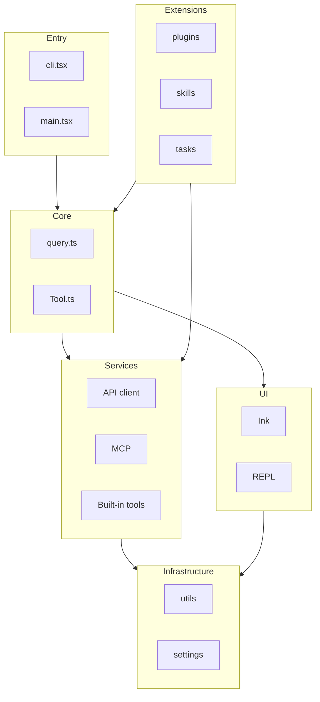

# 分层架构 / Layered Architecture

中英对照：Claude Code 概念上的六层结构（自顶向下依赖）。

**说明（zh）**：入口负责启动与路由；核心承载 Agent 循环与工具抽象；服务层对接模型与 MCP；终端 UI 基于 Ink/React；基础设施提供通用能力与配置；扩展通过插件、技能与任务接入。

**Notes (en)**: Entry boots the app; Core holds the agent loop and tool model; Services talk to LLM APIs and MCP; the TUI uses Ink/React; Infrastructure covers shared utilities and settings; Extensions plug in via plugins, skills, and tasks.
