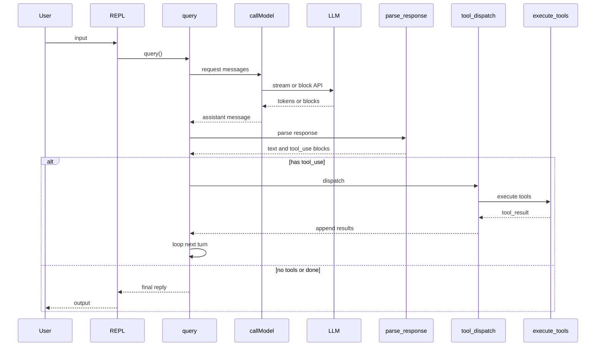

# Agent 循环单次迭代 / One Agent Loop Iteration

**说明（zh）**：一次迭代以 `query()` 为轴心：组装消息、调用模型、解析出文本与 `tool_use`；若有工具则校验、权限检查、执行并写回 `tool_result`，再进入下一轮；否则向用户返回并终止。

**Notes (en)**: Each iteration centers on `query()`: build messages, call the model, parse text and `tool_use` blocks; if tools run, validate, check permissions, execute, append `tool_result`, and continue; otherwise return to the user and stop.
