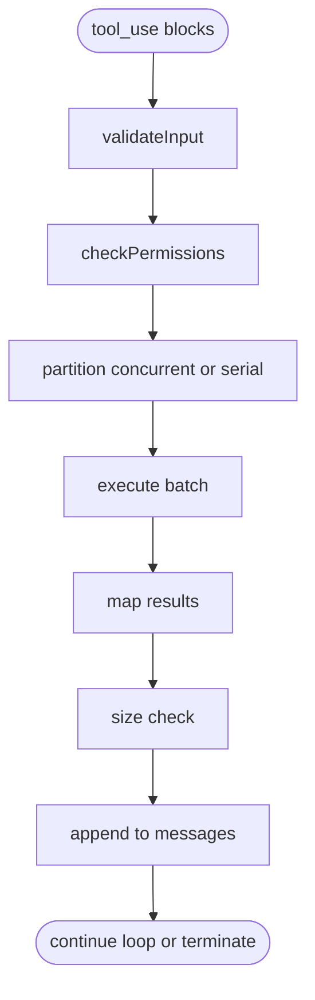

# 工具调度流水线 / Tool Dispatch Pipeline

**说明（zh）**：模型产出的 `tool_use` 块先经输入校验与权限判断，再按依赖与策略分为并发或串行批次执行；结果映射回消息角色后做体积检查，最后追加到对话历史供下一轮模型使用。

**Notes (en)**: `tool_use` blocks are validated and permission-checked, partitioned into concurrent or serial batches, executed, mapped to message shapes, size-checked, and appended for the next model turn.
