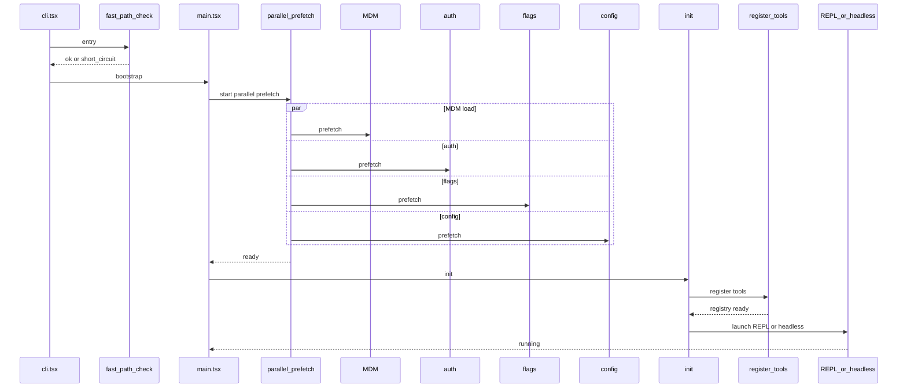

# 启动时序 / Startup Sequence

**说明（zh）**：`cli.tsx` 经快速路径判断后进入 `main.tsx`；并行预取 MDM、认证、特性开关与配置以降低首屏延迟；`init()` 完成环境初始化并注册工具；最后启动交互 REPL 或无头模式。

**Notes (en)**: After `cli.tsx` fast-path checks, `main.tsx` runs parallel prefetch for MDM, auth, flags, and config; `init()` wires the environment and tool registry; then the app launches the REPL or headless runner.
