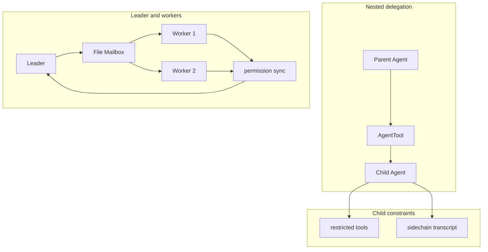

# 多 Agent 协作 / Multi-Agent Coordination

**说明（zh）**：嵌套场景下父 Agent 通过 `AgentTool` 启动子 Agent，子体使用受限工具集，侧链 transcript 与主会话隔离。Swarm 式协作中 Leader 通过文件邮箱向 Worker 分派任务，权限状态在参与者间同步。

**Notes (en)**: Nesting: the parent invokes `AgentTool` to spawn a child with a restricted tool allow-list and an isolated sidechain transcript. Swarm-style: a leader uses a file mailbox to assign work to workers, with permission state kept in sync across participants.
