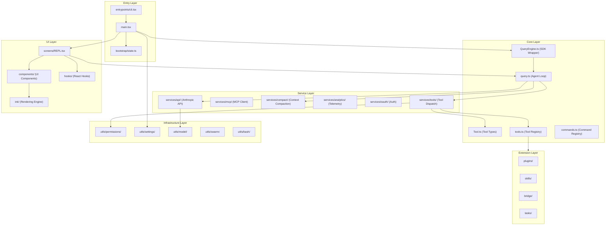
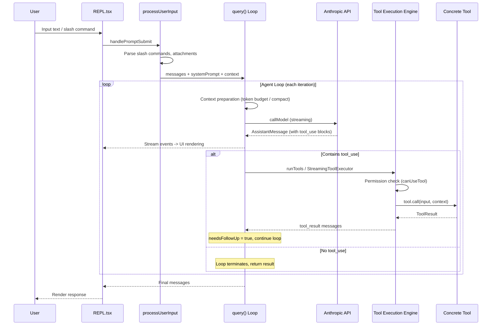

# Architecture & Module Map

## Layered Architecture

Claude Code uses a clear layered architecture, forming a complete data pipeline from user input to LLM interaction:

## `src/` Top-Level Directory Classification

### Entry Layer

| Directory/File | Files | Responsibility |
|----------------|-------|---------------|
| `entrypoints/` | 8 | Process entry: `cli.tsx` (CLI bootstrap), `init.ts` (one-time init), `mcp.ts` (MCP server mode), SDK types |
| `main.tsx` | 1 | Commander CLI setup, GrowthBook init, tool registration, REPL launch |
| `bootstrap/` | 1 | `state.ts`: global bootstrap state (telemetry, channels, settings cache) |

### Core Layer

| File | Responsibility |
|------|---------------|
| `query.ts` | **Core agent loop**: `query()` / `queryLoop()` state machine driving LLM calls -> tool execution -> result injection |
| `QueryEngine.ts` | SDK / headless mode wrapper managing per-session message lists, abort, file cache |
| `Tool.ts` | Tool interface definitions: `Tool<Input, Output>`, `ToolUseContext`, `ToolPermissionContext`, `buildTool()` |
| `tools.ts` | Tool registry: `getAllBaseTools()` returns all built-in tools, `getTools()` filters by permissions |
| `commands.ts` | Command registry: merges bundled/plugin/skill/built-in commands, sorted by priority |

### Service Layer (`services/`, 130 files)

| Subdirectory | Responsibility |
|--------------|---------------|
| `api/` | Anthropic API client construction, streaming calls, retries, file API |
| `mcp/` | MCP client connection management, tool discovery, config merging |
| `compact/` | Context compaction (full/micro/auto) |
| `analytics/` | GrowthBook feature flags, analytics events |
| `oauth/` | OAuth 2.0 authentication flow |
| `tools/` | Tool orchestration (`toolOrchestration.ts`), execution (`toolExecution.ts`), streaming executor |
| `lsp/` | Language Server Protocol integration |
| `policyLimits/` | Organization policy limits |
| `remoteManagedSettings/` | Remote managed settings (enterprise) |
| `SessionMemory/` | Session memory extraction |
| `teamMemorySync/` | Team memory synchronization |

### UI Layer

| Directory | Files | Responsibility |
|-----------|-------|---------------|
| `ink/` | 96 | Custom Ink rendering engine: React reconciler + Yoga layout + terminal cell buffer |
| `screens/` | 3 | Full-screen UIs: `REPL.tsx` (main interaction), `Doctor.tsx` (diagnostics), `ResumeConversation.tsx` |
| `components/` | 389 | Ink UI components: message display, permission dialogs, input, design system, task panels, etc. |
| `hooks/` | 104 | React hooks: tool permissions, notifications, settings changes, etc. |
| `keybindings/` | 14 | Keybinding definitions and handling (chord support) |
| `vim/` | 5 | Vim mode implementation (motions, operators, text objects) |

### Infrastructure Layer (`utils/`, 564 files)

| Subdirectory | Responsibility |
|--------------|---------------|
| `permissions/` | Core permission decision logic, rule parsing, setup |
| `settings/` | Layered config loading and merging (user/project/local/flag/policy) |
| `model/` | Model selection, provider branching, capability checks |
| `swarm/` | Multi-agent coordination: in-process teammates, tmux/iTerm backends |
| `bash/` | Bash command parsing and security classification |
| `plugins/` | Plugin loader |
| `hooks/` | Lifecycle hooks |
| `telemetry/` | Telemetry reporting |

### Extension Layer

| Directory | Files | Responsibility |
|-----------|-------|---------------|
| `plugins/` | 2 | Plugin system (built-in plugin registration) |
| `skills/` | 20 | Skill system (bundled skills, disk skill loading) |
| `bridge/` | 31 | IDE bridge (VS Code, JetBrains) |
| `tasks/` | 12 | Task framework: local/remote agent tasks, teammate tasks |

## Core Data Flow

A complete user interaction flows through:

## Next

Go to [02-startup-flow.md](02-startup-flow.md) to understand the complete startup process from command line to interactive loop.
