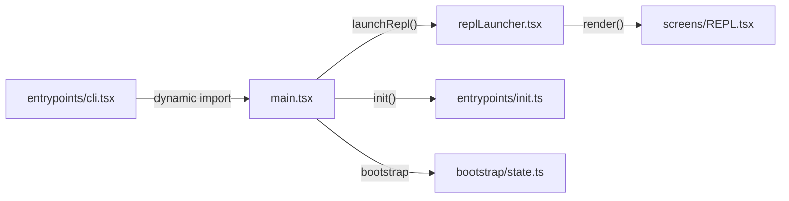
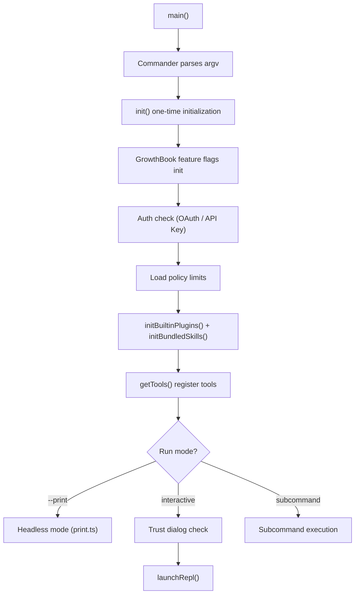

# Startup Flow: From CLI to REPL

## Startup Chain Overview



## Step 1: `entrypoints/cli.tsx` -- Thin Bootstrap Layer

`cli.tsx` is the true process entry point. Its design principle is to **load as few modules as possible**, providing zero-dependency responses for fast paths.

### Fast Path (Zero Module Loading)

```typescript
if (args[0] === '--version' || args[0] === '-v') {
    console.log(`${MACRO.VERSION} (Claude Code)`);
    return;
}
```

### Special Mode Dispatch

Before loading the full CLI, `cli.tsx` checks `process.argv` and dispatches to various special modes:

| Argument | Mode | Description |
|----------|------|-------------|
| `--claude-in-chrome-mcp` | Chrome MCP | Chrome extension MCP server |
| `--computer-use-mcp` | Computer Use MCP | Computer control MCP (feature-gated) |
| `--daemon-worker` | Daemon Worker | Background worker process (KAIROS) |
| `--bridge` | Bridge Mode | IDE bridge (VS Code/JetBrains) |
| `--template` | Template Mode | Project template generation |
| default | Full CLI | `import('../main.js').main()` |

**Key file**: `src/entrypoints/cli.tsx`

## Step 2: `main.tsx` -- Full CLI Entry

`main.tsx` is the core entry (~4600+ lines), handling Commander CLI configuration, initialization, tool registration, and REPL launch.

### Parallel Prefetch (Performance Critical)

The first lines of `main.tsx` leverage ES module side effects to **prefetch** expensive operations in parallel:

```typescript
profileCheckpoint('main_tsx_entry');
startMdmRawRead();        // Start MDM subprocess (plutil/reg query)
startKeychainPrefetch();   // Start macOS Keychain reads (OAuth + API Key, two concurrent reads)
```

This lets expensive I/O run in parallel with the subsequent ~135ms of module loading.

### Commander CLI Configuration

```typescript
const program = new CommanderCommand('claude')
    .option('-p, --print <prompt>', 'non-interactive mode')
    .option('--model <model>', 'specify model')
    .option('--permission-mode <mode>', 'permission mode')
    .option('--allowedTools <tools...>', 'allowed tool list')
    .option('--max-turns <n>', 'max loop turns')
    // ... more options
```

### Initialization Flow



**Key file**: `src/main.tsx`

## Step 3: `entrypoints/init.ts` -- One-Time Initialization

`init()` handles process-level one-time setup, called from `main()`:

| Item | Description |
|------|-------------|
| `enableConfigs()` | Enable configuration system |
| `applySafeConfigEnvironmentVariables()` | Safely apply environment variables |
| Repo detection | Find `.git`, set working directory |
| OAuth init | Set up auth context |
| Policy loading | `loadPolicyLimits()` fetches from server |
| Remote settings | `loadRemoteManagedSettings()` |
| Telemetry | Register OpenTelemetry sink |
| Shutdown hooks | `process.on('exit')` cleanup |

**Key file**: `src/entrypoints/init.ts`

## Step 4: `bootstrap/state.ts` -- Global State

`bootstrap/state.ts` provides "judicious global state" (original code comment): session ID, telemetry sinks, channel info, settings cache, model overrides, and atomic operations for token budgets and cost tracking.

**Key file**: `src/bootstrap/state.ts`

## Step 5: `replLauncher.tsx` -- REPL Launch

`replLauncher.tsx` bridges from `main.tsx` to the actual UI: dynamically loads `App` and `REPL` components, configures Ink render options, and mounts the React component tree to the terminal.

**Key file**: `src/replLauncher.tsx`

## Step 6: `screens/REPL.tsx` -- Interactive Interface

`REPL.tsx` is the **orchestration center** (~3000+ lines) managing session/query state, message lists, tool permission queues, modal dialogs, component tree assembly, keybindings, and the bridge to the `query()` loop.

See [08-terminal-ui.md](08-terminal-ui.md) for details.

**Key file**: `src/screens/REPL.tsx`

## Two Run Modes

### Interactive Mode (REPL)

```
cli.tsx -> main.tsx -> init() -> launchRepl() -> REPL.tsx -> query()
```

### Headless Mode (--print / SDK)

```
cli.tsx -> main.tsx -> init() -> runHeadlessStreaming() -> QueryEngine -> query()
```

Both modes share the same `query()` core; they differ only in how user input becomes messages and how yielded events are rendered or serialized.

## Next

Go to [03-core-loop.md](03-core-loop.md) to dive into the most important part of Claude Code -- the agent loop.

## Hands-on Experiment

This chapter has a corresponding Python experiment:

> **[Lab 02 — Startup Flow](experiments/02-startup-flow-lab.md)**
>
> Covers: CLI dispatch, parallel prefetch, lazy imports
>
> ```bash
> cd experiments && python -m exp_02_startup_flow.main --mock
> ```
