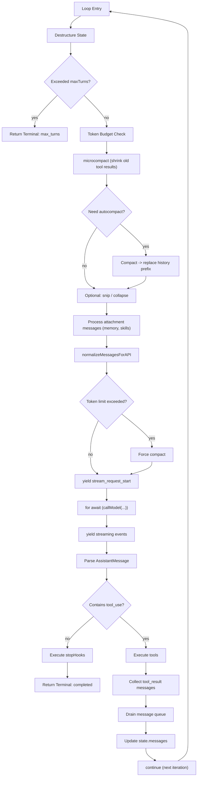

# Core Agent Loop (query loop)

This is the most important chapter. An agent is fundamentally a loop: receive messages -> call LLM -> parse tool calls -> execute tools -> inject results back into messages -> call LLM again, until the LLM stops calling tools.

## Entry Points: `query()` and `queryLoop()`

The core loop is defined in `src/query.ts`, split into two layers:

```typescript
// Outer layer: lifecycle management
export async function* query(params: QueryParams): AsyncGenerator<...> {
    const terminal = yield* queryLoop(params, consumedCommandUuids);
    for (const uuid of consumedCommandUuids) {
        notifyCommandLifecycle(uuid, 'completed');
    }
    return terminal;
}

// Inner layer: the actual while(true) state machine
async function* queryLoop(params: QueryParams): AsyncGenerator<...> {
    let state: State = { ... };
    while (true) {
        // each iteration
    }
}
```

Note that `query()` is an **async generator** -- it pushes streaming events and messages to consumers (REPL or SDK) via `yield`.

## State Machine Design

`queryLoop` maintains a mutable `State` object, destructured at the start of each iteration:

```typescript
type State = {
    messages: Message[]                           // conversation messages
    toolUseContext: ToolUseContext                 // tool execution context
    autoCompactTracking: AutoCompactTrackingState  // auto-compact tracking
    maxOutputTokensRecoveryCount: number           // max_tokens recovery count
    hasAttemptedReactiveCompact: boolean           // whether reactive compact was tried
    maxOutputTokensOverride: number | undefined    // token limit override
    pendingToolUseSummary: Promise<...> | undefined // pending tool summary
    stopHookActive: boolean | undefined            // stop hook active flag
    turnCount: number                              // current turn number
    transition: Continue | undefined               // why the previous iteration continued
}
```

Each continue site replaces the entire state object via `state = { ...state, ...changes }`, rather than modifying individual fields.

## Single Iteration Flow



## Key Steps in Detail

### 1. Context Preparation

Each iteration begins with multiple context management operations: **token budget check** (`checkTokenBudget()`), **microcompact** (incremental shrinking of old tool results), and **autocompact** (full summarization when approaching context window threshold).

### 2. LLM Call

```typescript
for await (const event of deps.callModel(messagesForQuery, {
    systemPrompt: prependUserContext(systemPrompt, userContext),
})) {
    yield event;  // pass streaming events to consumer
}
```

### 3. Tool Execution

When the assistant message contains `tool_use` blocks, either **streaming execution** (tools start executing during streaming) or **batch execution** (tools run after stream completes) is used.

### 4. State Update and Continue

```typescript
state = {
    ...state,
    messages: [...messagesForQuery, ...assistantMessages, ...toolResults],
    turnCount: state.turnCount + 1,
    transition: { reason: 'tool_use' },
};
continue;
```

## Terminal Conditions

| Reason | Condition | Description |
|--------|-----------|-------------|
| `completed` | No tool_use, normal stop_reason | Normal completion |
| `aborted_tool_use` | User cancelled tool execution | User interrupt |
| `aborted_api_request` | User cancelled API request | User interrupt |
| `max_turns` | `turnCount > maxTurns` | Max turn limit reached |
| `error` | API error or exception | Error exit |
| `max_output_tokens` | 3 consecutive max_output_tokens recovery failures | Output too long |

## `QueryDeps` Dependency Injection

External dependencies are injected via the `QueryDeps` interface for testability:

```typescript
type QueryDeps = {
    callModel: typeof queryModelWithStreaming
    microcompact: typeof microcompactMessages
    autocompact: typeof compactConversation
    uuid: () => string
}
```

Tests can inject mock dependencies without calling the actual API.

## QueryEngine vs REPL

| Feature | REPL (Interactive) | QueryEngine (SDK) |
|---------|-------------------|-------------------|
| Entry | `REPL.tsx` -> `query()` | `QueryEngine.submitMessage()` -> `query()` |
| User input | `PromptInput` component | `submitMessage()` API |
| Stream output | Ink component rendering | Event callbacks / structured IO |
| Core | Shared `query()` | Shared `query()` |

## Key Source Files

| File | Responsibility |
|------|---------------|
| `src/query.ts` | Core loop: `query()` / `queryLoop()` |
| `src/query/deps.ts` | Dependency injection interface |
| `src/query/config.ts` | Query configuration snapshot |
| `src/query/stopHooks.ts` | Post-processing hooks |
| `src/query/tokenBudget.ts` | Token budget tracking |
| `src/QueryEngine.ts` | SDK mode wrapper |

## Next

Go to [04-tool-system.md](04-tool-system.md) to learn how tools are defined, registered, and executed.

## Hands-on Experiment

This chapter has a corresponding Python experiment:

> **[Lab 03 — Core Agent Loop](experiments/03-core-agent-loop-lab.md)**
>
> Covers: async generator loop, state machine, tool dispatch
>
> ```bash
> cd experiments && python -m exp_03_core_agent_loop.main --mock
> ```
