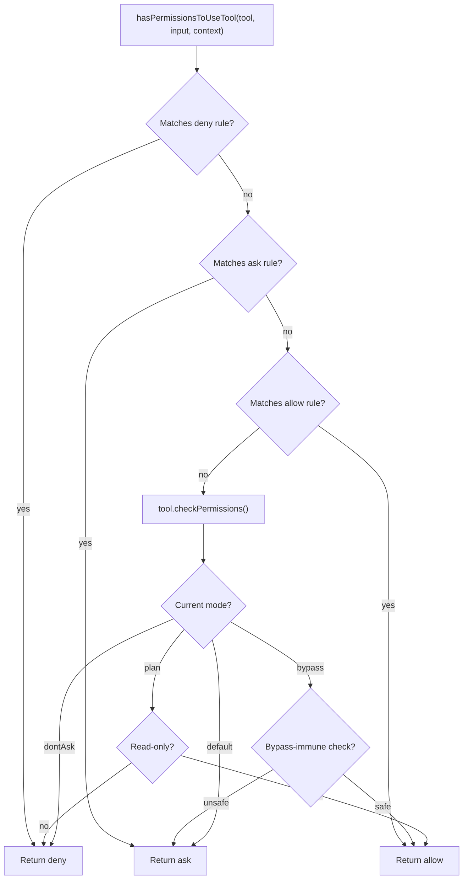

# Permission Model & Security

Claude Code's security design centers on one principle: **every tool invocation must pass a permission check**. The permission system is multi-layered -- from static rules to runtime approval to sandbox isolation.

## Permission Modes

| Mode | Description | Typical Use |
|------|-------------|-------------|
| `default` | Dangerous operations require user approval | Normal interactive use |
| `plan` | Read-only mode, write operations denied | Planning phase |
| `acceptEdits` | Auto-allow file edits, other dangerous ops still need approval | Trusted file operations |
| `bypassPermissions` | Skip most permission checks | Full trust (CI, etc.) |
| `dontAsk` | No approval dialogs, auto-deny pending prompts | Background agents |

## Rule System

Rules come in three types: **allow** (always permit), **deny** (always reject), **ask** (require user approval). Rules are sourced from multiple origins with priority: `userSettings` < `projectSettings` < `localSettings` < `flagSettings` < `policySettings` < `cliArg` < `session`.

## Permission Decision Flow



Even in `bypassPermissions` mode, certain checks remain ("bypass-immune"): directory boundary checks, network security checks.

## Sandbox

Claude Code integrates `@anthropic-ai/sandbox-runtime` for Bash command isolation. `SandboxManager` (`src/utils/sandbox/sandbox-adapter.ts`) handles filesystem read/write/network rules. When sandboxing is enabled and "auto-allow bash if sandboxed" is on, sandboxed Bash commands skip permission prompts.

## Interactive Approval

When a tool needs approval, the request is pushed to a permission queue in REPL. Components in `src/components/permissions/` render tool-specific dialogs (Bash, FileWrite, FileEdit, etc.). In swarm scenarios, teammates send permission requests via file mailbox to the leader.

## Key Source Files

| File | Responsibility |
|------|---------------|
| `src/types/permissions.ts` | PermissionMode, rule type definitions |
| `src/utils/permissions/permissions.ts` | hasPermissionsToUseTool core logic |
| `src/utils/sandbox/sandbox-adapter.ts` | SandboxManager |
| `src/hooks/useCanUseTool.tsx` | CanUseToolFn hook |
| `src/components/permissions/` | Permission approval UI components |
| `src/utils/auth.ts` | Authentication management |

## Next

Go to [06-context-prompt.md](06-context-prompt.md) to learn how the system prompt is assembled.

## Hands-on Experiment

This chapter has a corresponding Python experiment:

> **[Lab 05 — Permission Engine](experiments/05-permission-engine-lab.md)**
>
> Covers: permission modes, rule priority, decision engine
>
> ```bash
> cd experiments && python -m exp_05_permission_engine.main --mock
> ```
