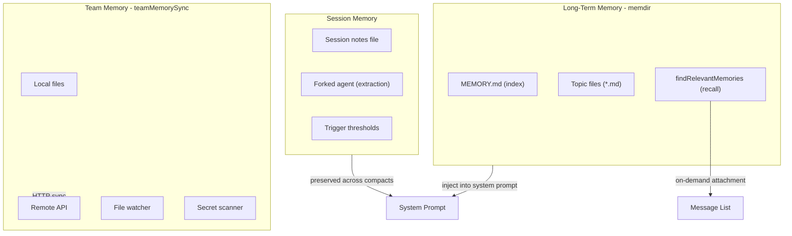

# Memory System: Session, Long-Term, and Team Memory

Claude Code implements a three-layer memory architecture for cross-session, cross-team knowledge accumulation.

## Three-Layer Overview



## Layer 1: Long-Term Memory (memdir)

Stored in the project's persistent memory directory (`.claude/memory/`). `MEMORY.md` serves as the index, always included in the system prompt via `loadMemoryPrompt()`. Topic files use frontmatter for categorization.

**Smart Recall**: `findRelevantMemories` uses a side query (Sonnet) to select up to 5 relevant files from a manifest, injected as attachment messages. Prefetched at `query()` entry via `startRelevantMemoryPrefetch()` using `using` syntax for guaranteed cleanup.

## Layer 2: Session Memory

Rolling notes for the current session, extracted by a **forked sub-agent** on token/tool-call thresholds. The main loop is never blocked. On compact, session memory is explicitly preserved/truncated to maintain consistency.

## Layer 3: Team Memory

Shared knowledge synced via HTTP API. Uses file watcher for local change detection, server-wins merge on pull, checksum-based incremental push, and secret scanning before upload.

## Key Source Files

| File | Responsibility |
|------|---------------|
| `src/memdir/memdir.ts` | Memory directory management, loadMemoryPrompt |
| `src/memdir/findRelevantMemories.ts` | Smart recall (side query) |
| `src/services/SessionMemory/sessionMemory.ts` | Session memory: forked agent extraction |
| `src/services/teamMemorySync/index.ts` | HTTP sync protocol |
| `src/services/teamMemorySync/secretScanner.ts` | Secret scanning |

## Next

Go to [08-terminal-ui.md](08-terminal-ui.md) to learn about the terminal UI rendering architecture.

## Hands-on Experiment

This chapter has a corresponding Python experiment:

> **[Lab 07 — Memory System](experiments/07-memory-system-lab.md)**
>
> Covers: three-layer memory, TF-IDF recall, memory injection
>
> ```bash
> cd experiments && python -m exp_07_memory_system.main --mock
> ```
