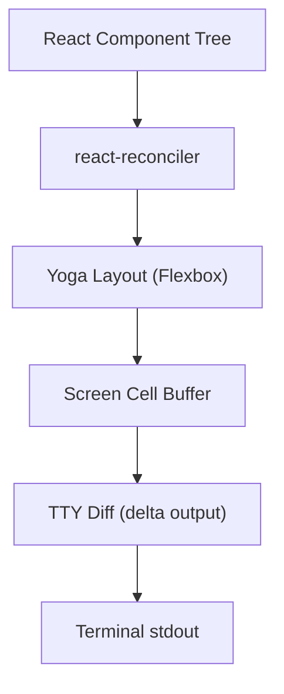
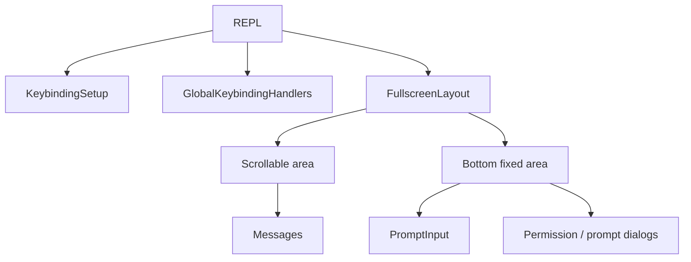

# Terminal UI: Ink/React Rendering Architecture

Claude Code builds a rich terminal UI using React + Ink -- not the community version, but a **deeply customized fork**.

## Ink Rendering Engine



The `Ink` class in `src/ink/ink.tsx` owns terminal I/O, React reconciliation, Yoga layout, a screen cell buffer (`screen.ts`), diff output, alt-screen behavior, focus management, and frame scheduling.

Layout primitives in `src/ink/components/`: `Box` (Flexbox container), `Text`, `ScrollBox`, `AlternateScreen`.

Input pipeline: `TTY stdin -> raw bytes -> parse-keypress.ts -> InputEvent -> useInput listener chain`.

## REPL.tsx -- Application Orchestrator

`src/screens/REPL.tsx` (~3000+ lines) manages session/query state, messages, modals, tool permission queues, and the full component tree.

### Component Tree



Supports two screens: main chat and transcript view (Ctrl+O toggle with search/navigation).

## Message Rendering Pipeline

```
Message[] -> Messages.tsx (filter/collapse/group) -> VirtualMessageList -> MessageRow -> Message.tsx (type dispatch) -> Specific component
```

`Message.tsx` dispatches by `message.type`: user text, assistant text, assistant tool_use, thinking, tool_result, compact boundary, attachment, etc.

`VirtualMessageList` implements virtual scrolling for performance.

## PromptInput

`src/components/PromptInput/PromptInput.tsx` manages input modes, command completion, history search, paste detection, model picker, and supports both `TextInput` (standard) and `VimTextInput` (Vim mode).

## Keybinding System

`KeybindingProviderSetup` loads default + user custom bindings. `useKeybinding` / `useKeybindings` hooks register handlers. Supports **chord** sequences (e.g., Ctrl+X Ctrl+S). Mount order in REPL ensures correct priority (scroll before cancel, so Ctrl+C copies when text is selected).

## Vim Mode

Pure logic state machine in `src/vim/` (no React dependency): `transitions.ts` dispatches by `CommandState`, `motions.ts` (w, b, e, $), `operators.ts` (d, c, y), `textObjects.ts` (iw, aw, i"). Integrated as a drop-in input state for `BaseTextInput` via `useVimInput`.

## Key Source Files

| File | Responsibility |
|------|---------------|
| `src/ink/ink.tsx` | Ink rendering core |
| `src/screens/REPL.tsx` | REPL orchestrator |
| `src/components/Messages.tsx` | Message list |
| `src/components/PromptInput/` | Input system |
| `src/keybindings/` | Keybinding system |
| `src/vim/` | Vim mode implementation |

## Next

Go to [09-mcp-integration.md](09-mcp-integration.md) to learn about MCP integration.

## Hands-on Experiment

This chapter has a corresponding Python experiment:

> **[Lab 08 — Terminal UI](experiments/08-terminal-ui-lab.md)**
>
> Covers: Rich TUI, message rendering, streaming display
>
> ```bash
> cd experiments && python -m exp_08_terminal_ui.main --mock
> ```
