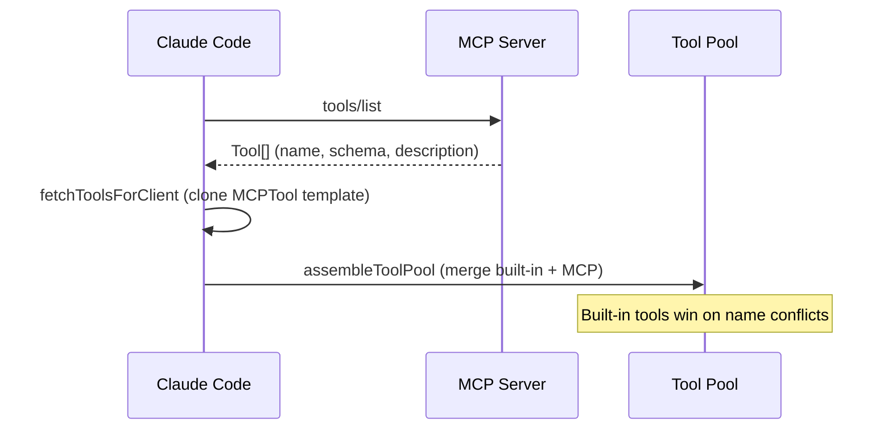

# MCP Protocol Integration

Claude Code acts as an **MCP (Model Context Protocol) client**, connecting to external MCP servers to extend its tool and resource capabilities.

## Connection Management

`src/services/mcp/client.ts` supports multiple transports: stdio, SSE (with OAuth), HTTP, WebSocket, SDK (in-process), Claude.ai proxy, and IDE-specific transports. Connections are lazy (memoized).

### Connection Flow

```typescript
connectToServer(config) -> pick transport -> create Client -> connect
// Returns: connected | failed | needs-auth
```

`useManageMCPConnections` (React hook) manages reconnection, listens for `ToolListChangedNotification`, and refreshes tools.

## Tool Discovery & Integration



Each discovered tool gets a local `Tool` object cloned from `MCPTool` template with name `mcp__serverName__toolName`, overriding description, schema, call function, and permissions.

## MCP Configuration

Configs merge from multiple sources: enterprise policy (exclusive override) -> user (`~/.claude/.mcp.json`) -> project (`.claude/.mcp.json`) -> plugins. Supports `${VAR}` environment variable expansion.

## MCP Resources & Skills

`ListMcpResourcesTool` and `ReadMcpResourceTool` handle MCP resources. When `MCP_SKILLS` feature flag is on, MCP prompts can be loaded as skills.

## Key Source Files

| File | Responsibility |
|------|---------------|
| `src/services/mcp/client.ts` | MCP client: connect, discover, call |
| `src/services/mcp/config.ts` | MCP config merging |
| `src/services/mcp/types.ts` | Type definitions |
| `src/tools/MCPTool/MCPTool.ts` | MCP tool template |

## Next

Go to [10-multi-agent.md](10-multi-agent.md) to learn about multi-agent coordination.

## Hands-on Experiment

This chapter has a corresponding Python experiment:

> **[Lab 09 — MCP Client](experiments/09-mcp-client-lab.md)**
>
> Covers: MCP protocol, tool discovery, tool pool merging
>
> ```bash
> cd experiments && python -m exp_09_mcp_client.main --mock
> ```
