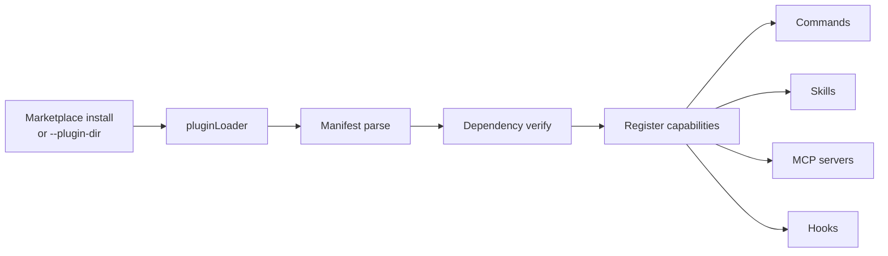

# Plugin & Skill Extension System

Claude Code offers two extension mechanisms: **plugins** for structured feature extensions, and **skills** for reusable prompt workflows.

## Plugin System

Plugins are **versioned installable packages** contributing commands, skills, MCP servers, hooks, and settings. Loaded via `pluginLoader.ts`, merged with session and enterprise sources.

### Plugin Lifecycle



Plugin commands merge into `getCommands()`, MCP servers into `getClaudeCodeMcpConfigs()`, hooks via `loadPluginHooks.ts`.

## Skill System

Skills are **model-invokable prompt workflows**, implemented as `Command` objects with `type: 'prompt'`. Not a separate runtime -- they're loaded into the command registry and executed via `SkillTool`.

### Skill Types

| Type | Source | Format |
|------|--------|--------|
| Bundled | TypeScript modules | Compiled into binary, optional disk file extraction |
| Disk | `skills/` directory | `SKILL.md` (Markdown + frontmatter) |
| Plugin | Plugin skills/ paths | Markdown files |
| MCP | MCP prompts | Synthesized commands (feature-gated) |

### SkillTool Execution

`SkillTool` finds the target skill from available commands, determines execution method (fork vs inline), and runs it.

### Command Priority Chain

```
Bundled skills > Built-in plugin skills > Disk skills > Workflows
  > Plugin commands > Plugin skills > Built-in slash commands
```

## Key Source Files

| File | Responsibility |
|------|---------------|
| `src/utils/plugins/pluginLoader.ts` | Plugin loading and merging |
| `src/skills/bundledSkills.ts` | Bundled skill definitions |
| `src/skills/loadSkillsDir.ts` | Disk skill loading |
| `src/tools/SkillTool/SkillTool.ts` | Skill execution engine |
| `src/commands.ts` | Command registry (includes skills) |

## Next

Go to [12-api-streaming.md](12-api-streaming.md) to learn about API calls and streaming.

## Hands-on Experiment

This chapter has a corresponding Python experiment:

> **[Lab 11 — Plugin/Skill System](experiments/11-plugin-skill-lab.md)**
>
> Covers: SKILL.md parsing, plugin lifecycle, command priority chain
>
> ```bash
> cd experiments && python -m exp_11_plugin_skill.main --mock
> ```
