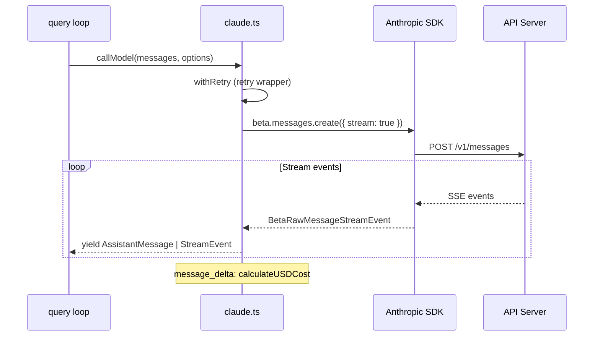

# API Calls, Streaming & Model Management

## API Client Construction

### Multi-Provider Support

```typescript
// src/services/api/client.ts
if (CLAUDE_CODE_USE_BEDROCK) return new AnthropicBedrock(...)
if (CLAUDE_CODE_USE_FOUNDRY) return new AnthropicFoundry(...)
if (CLAUDE_CODE_USE_VERTEX)  return new AnthropicVertex(...)
return new Anthropic(...)  // first-party API (default)
```

Auth varies by provider: API Key / OAuth for first-party, AWS credentials for Bedrock, GCP credentials for Vertex.

## Streaming

### Core Flow



Uses the **raw stream** (not `BetaMessageStream`) to avoid repeated partial JSON parsing on tool deltas. Events handled: `message_start`, `content_block_start/delta/stop`, `message_delta` (final usage, stop_reason, cost), `message_stop`.

## Retry & Fault Tolerance

- **withRetry**: Exponential backoff, rate limit (429) and server error (5xx) handling, fallback model support
- **Idle Watchdog**: Aborts if no chunks arrive within timeout (`CLAUDE_STREAM_IDLE_TIMEOUT_MS`)
- **Non-streaming Fallback**: Falls back to `create()` without `stream: true` on streaming failure

## Model Selection

Resolution priority: session override -> `--model` CLI arg -> `ANTHROPIC_MODEL` env -> settings -> default model. Same logical model maps to different API strings per provider via `ALL_MODEL_CONFIGS`.

## Cost Tracking

```typescript
// src/cost-tracker.ts
addToTotalSessionCost(cost, usage, model)
// 1. Accumulate per-model ModelUsage (input/output/cache tokens)
// 2. Update global cost state
// 3. Increment OpenTelemetry counters
// 4. Log analytics
// 5. Recursively process advisor sub-usage

formatTotalCost()  // CLI-style cost summary
```

Session costs are persisted to project config and restored on session resume.

## Key Source Files

| File | Responsibility |
|------|---------------|
| `src/services/api/claude.ts` | Streaming/non-streaming API call core |
| `src/services/api/client.ts` | Anthropic SDK client construction |
| `src/services/api/withRetry.ts` | Retry logic |
| `src/utils/model/model.ts` | Model selection logic |
| `src/utils/model/configs.ts` | Model config mappings |
| `src/cost-tracker.ts` | Cost tracking |

## Next

Go to [13-config-settings.md](13-config-settings.md) to learn about the configuration system.

## Hands-on Experiment

This chapter has a corresponding Python experiment:

> **[Lab 12 — Streaming API](experiments/12-streaming-api-lab.md)**
>
> Covers: SSE streaming, JSON fragment assembly, retry, idle timeout
>
> ```bash
> cd experiments && python -m exp_12_streaming_api.main --mock
> ```
