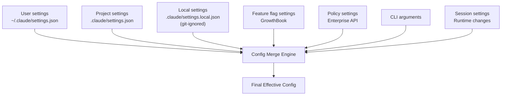

# Configuration System & Settings Management

Claude Code uses a layered configuration system supporting multi-level overrides from user to enterprise.

## Layered Architecture



Priority order (lowest to highest): `userSettings` < `projectSettings` < `localSettings` < `flagSettings` < `policySettings` < `cliArg` < `session`.

## Settings Files

| File | Location | Purpose | Git Tracked |
|------|----------|---------|-------------|
| User | `~/.claude/settings.json` | Personal preferences | N/A |
| Project | `.claude/settings.json` | Team shared config | Yes |
| Local | `.claude/settings.local.json` | Personal local overrides | No |
| Managed | `managed-settings.json` + drop-ins | Enterprise management | N/A |

## Settings Schema

Settings use Zod for type-safe validation, covering permissions (allow/deny/ask rules, defaultMode), model, theme, mcpServers, and more.

## MDM / Enterprise Settings

- **macOS**: Reads MDM config via `plutil`, prefetched in parallel with startup
- **Windows**: Reads from Windows Registry via `reg query`
- **Remote Managed Settings**: HTTP fetch from Anthropic servers for centralized enterprise management

## ConfigTool

Allows the agent to read/modify a whitelisted subset of settings at runtime.

## Key Source Files

| File | Responsibility |
|------|---------------|
| `src/utils/settings/settings.ts` | Main settings loader |
| `src/utils/settings/types.ts` | Settings schema (Zod) |
| `src/utils/settings/constants.ts` | Source priority order |
| `src/utils/config.ts` | Project/global config |
| `src/services/remoteManagedSettings/` | Remote managed settings |
| `src/tools/ConfigTool/` | Runtime config tool |

## Next

Go to [14-compact-context-mgmt.md](14-compact-context-mgmt.md) to learn about context compaction.

## Hands-on Experiment

This chapter has a corresponding Python experiment:

> **[Lab 13 — Config System](experiments/13-config-system-lab.md)**
>
> Covers: layered config, deep merge, Pydantic validation
>
> ```bash
> cd experiments && python -m exp_13_config_system.main --mock
> ```
