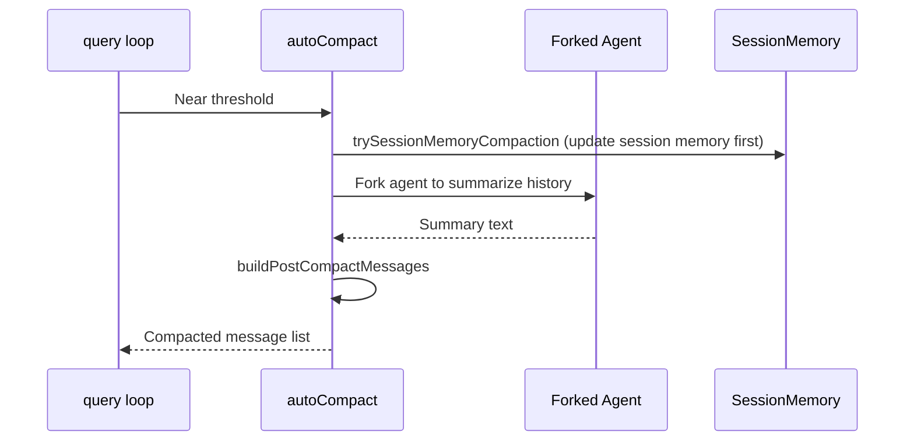

# Long Conversation Context Compaction

As conversations grow, the message list approaches the model's context window limit. Claude Code uses multi-layer compaction strategies to manage context size.

## Strategy Overview

| Strategy | Trigger | Method | Impact |
|----------|---------|--------|--------|
| **Microcompact** | Every iteration | Shrink old tool results | Incremental token reduction |
| **Autocompact** | Token threshold | Fork agent to summarize | Major token reduction |
| **Force compact** | Still over limit after normalize | Immediate compact | Prevents API errors |

## Autocompact

### Trigger

`getAutoCompactThreshold()` calculates a threshold based on context window size, with buffer to prevent `prompt_too_long` errors. `calculateTokenWarningState()` tracks usage.

### Compaction Flow



`compactConversation()` groups messages by API turns, sends to a forked summarization agent, builds post-compact messages (user summary + compact boundary marker), optionally re-attaches skills/plans/deltas with token budgets, and strips images.

## Microcompact

Lightweight incremental compaction running each iteration without calling LLM. Selectively shrinks whitelisted tool results (Bash, FileRead, etc.), preserving recent results and errors.

## Integration with Session Memory

Compact explicitly integrates with `SessionMemory`: waits for ongoing extraction to complete, preserves session notes references across compact boundaries, and clears `systemPromptSections` cache so dynamic prompt pieces refresh.

## Key Source Files

| File | Responsibility |
|------|---------------|
| `src/services/compact/autoCompact.ts` | Auto-compact triggers and thresholds |
| `src/services/compact/compact.ts` | Core: compactConversation |
| `src/services/compact/microCompact.ts` | Microcompact |
| `src/services/compact/prompt.ts` | Compact prompt template |
| `src/services/compact/sessionMemoryCompact.ts` | Session memory integration |

## Next

Go to [15-command-system.md](15-command-system.md) to learn about the slash command system.

## Hands-on Experiment

This chapter has a corresponding Python experiment:

> **[Lab 14 — Context Compaction](experiments/14-context-compaction-lab.md)**
>
> Covers: microcompact, autocompact, force compact, session memory
>
> ```bash
> cd experiments && python -m exp_14_context_compaction.main --mock
> ```
