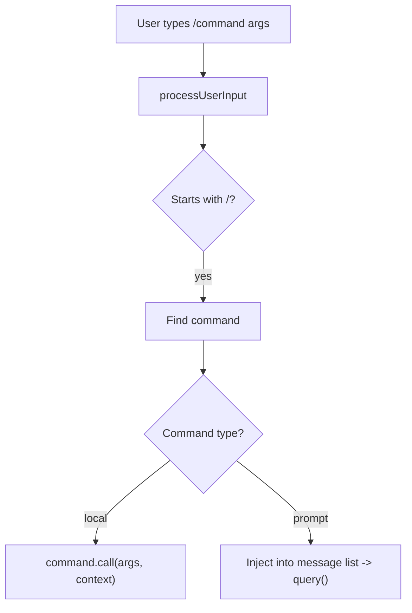

# Slash Command System

Slash commands (`/command`) let users trigger operations directly in the REPL, from `/compact` to compress context to `/memory` to manage memories.

## Command Interface

```typescript
type Command = {
    name: string
    description: string
    type: 'local' | 'prompt'
    call?(args, context): Promise<CommandResult>  // for local commands
    isEnabled?(context): boolean
    isHidden?: boolean
    aliases?: string[]
    whenToUse?: string         // for skills
    source?: 'builtin' | 'plugin' | 'skill' | ...
}
```

## Command Registration

`src/commands.ts` merges all sources by priority:

```
1. Bundled skill commands
2. Built-in plugin skill commands
3. Disk skill commands
4. Workflow commands
5. Plugin commands
6. Plugin skills
7. Built-in slash commands (/compact, /memory, etc.)
```

## Built-in Commands (~50)

| Command | Description |
|---------|-------------|
| `/compact` | Context compression |
| `/memory` | Memory management |
| `/config` | Settings management |
| `/review` | Code review |
| `/doctor` | Environment diagnostics |
| `/mcp` | MCP server management |
| `/login` / `/logout` | Authentication |
| `/clear` | Clear session |
| `/resume` | Restore previous session |
| `/plan` | Enter/exit plan mode |
| `/vim` | Toggle Vim mode |
| `/theme` | Change theme |
| `/cost` | View usage cost |
| `/diff` | View changes |
| `/tasks` | View background tasks |
| `/skills` | View available skills |

Each command lives in `src/commands/<name>/` with an `index.ts` entry.

## Execution Flow



## Command Queue

Commands can be queued during the agent loop, drained at each iteration via `getCommandsByMaxPriority()`. Command lifecycle notifications (`started` / `completed`) are tracked via `notifyCommandLifecycle()`.

## Key Source Files

| File | Responsibility |
|------|---------------|
| `src/commands.ts` | Command registry: getCommands(), priority merging |
| `src/commands/` | ~50 command implementations |
| `src/utils/messageQueueManager.ts` | Command queue management |
| `src/utils/commandLifecycle.ts` | Lifecycle notifications |

## Next

Go to [16-design-patterns.md](16-design-patterns.md) for a summary of key design patterns.

## Hands-on Experiment

This chapter has a corresponding Python experiment:

> **[Lab 15 — Command System](experiments/15-command-system-lab.md)**
>
> Covers: slash commands, command registry, command queue
>
> ```bash
> cd experiments && python -m exp_15_command_system.main --mock
> ```
