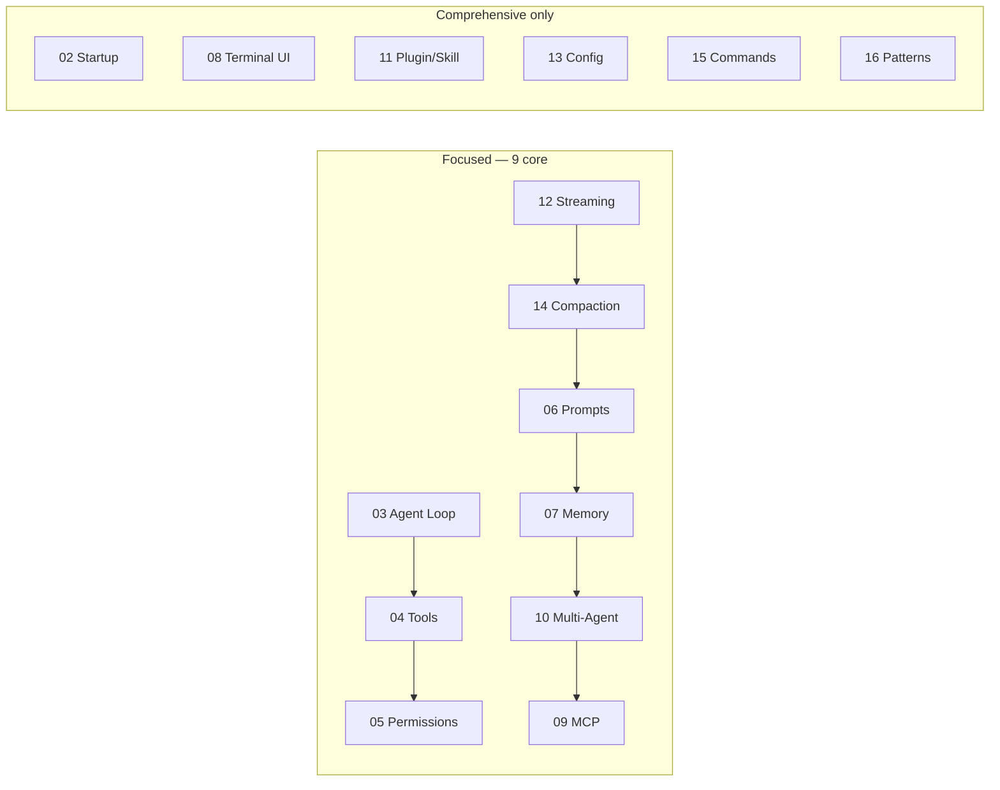

# Experiment Guide

This guide explains how to set up the Python learning environment, choose a learning track, switch LLM providers, and navigate all experiments under `experiments/`.

## Environment setup

**Requirements**

- Python **3.11+**
- A virtual environment (recommended)
- Dependencies from `experiments/requirements.txt`

**Steps**

```bash
cd experiments
python3.11 -m venv .venv
source .venv/bin/activate   # Windows: .venv\Scripts\activate
pip install -r requirements.txt
```

Run any experiment as a module from the `experiments/` directory (so `shared/` resolves correctly):

```bash
cd experiments
python -m exp_03_core_agent_loop.main --mock
```

## Two learning tracks

| Track | Experiments | Goal |
|--------|-------------|------|
| **Focused** | 9 core labs | Minimal path through agent loop, tools, permissions, prompts, memory, streaming, compaction, multi-agent, MCP |
| **Comprehensive** | All **15** numbered experiments (`exp_02`–`exp_16`) | Adds startup flow, terminal UI, plugins/skills, config, commands, and the design-patterns cookbook |



**Suggested progression (Focused):** 03 → 04 → 05 → 12 → 14 → 06 → 07 → 10 → 09.

**Comprehensive:** Run **02** early for the startup mental model; weave **08, 11, 13, 15** where convenient; finish with **16** as a recap.

## Switching providers

All experiments that call the shared client accept:

| Flag | Effect |
|------|--------|
| `--mock` | Shorthand for `--provider mock` (offline, no API keys) |
| `--provider anthropic` | Uses `ANTHROPIC_API_KEY` |
| `--provider openai` | Uses `OPENAI_API_KEY` (optional `OPENAI_BASE_URL`) |

Example:

```bash
export ANTHROPIC_API_KEY=sk-ant-...
python -m exp_03_core_agent_loop.main --provider anthropic
```

Implementation reference: `experiments/shared/llm_client.py` (`UnifiedLLMClient`).

## Full experiment listing

| ID | Module | Doc | Track |
|----|--------|-----|-------|
| 02 | `exp_02_startup_flow` | [Startup Flow Lab](./02-startup-flow-lab.md) | Comprehensive |
| 03 | `exp_03_core_agent_loop` | [Core Agent Loop Lab](./03-core-agent-loop-lab.md) | **Focused** [Core] |
| 04 | `exp_04_tool_system` | [Tool System Lab](./04-tool-system-lab.md) | **Focused** [Core] |
| 05 | `exp_05_permission_engine` | [Permission Engine Lab](./05-permission-engine-lab.md) | **Focused** [Core] |
| 06 | `exp_06_prompt_assembly` | [Prompt Assembly Lab](./06-prompt-assembly-lab.md) | **Focused** [Core] |
| 07 | `exp_07_memory_system` | [Memory System Lab](./07-memory-system-lab.md) | **Focused** [Core] |
| 08 | `exp_08_terminal_ui` | [Terminal UI Lab](./08-terminal-ui-lab.md) | Comprehensive |
| 09 | `exp_09_mcp_client` | [MCP Client Lab](./09-mcp-client-lab.md) | **Focused** [Core] |
| 10 | `exp_10_multi_agent` | [Multi-Agent Lab](./10-multi-agent-lab.md) | **Focused** [Core] |
| 11 | `exp_11_plugin_skill` | [Plugin & Skill Lab](./11-plugin-skill-lab.md) | Comprehensive |
| 12 | `exp_12_streaming_api` | [Streaming API Lab](./12-streaming-api-lab.md) | **Focused** [Core] |
| 13 | `exp_13_config_system` | [Config System Lab](./13-config-system-lab.md) | Comprehensive |
| 14 | `exp_14_context_compaction` | [Context Compaction Lab](./14-context-compaction-lab.md) | **Focused** [Core] |
| 15 | `exp_15_command_system` | [Command System Lab](./15-command-system-lab.md) | Comprehensive |
| 16 | `exp_16_design_patterns` | [Design Patterns Lab](./16-design-patterns-lab.md) | Comprehensive |

**Next:** Start with the [Core Agent Loop Lab](./03-core-agent-loop-lab.md) on the Focused track, or [Startup Flow Lab](./02-startup-flow-lab.md) on the Comprehensive track.
