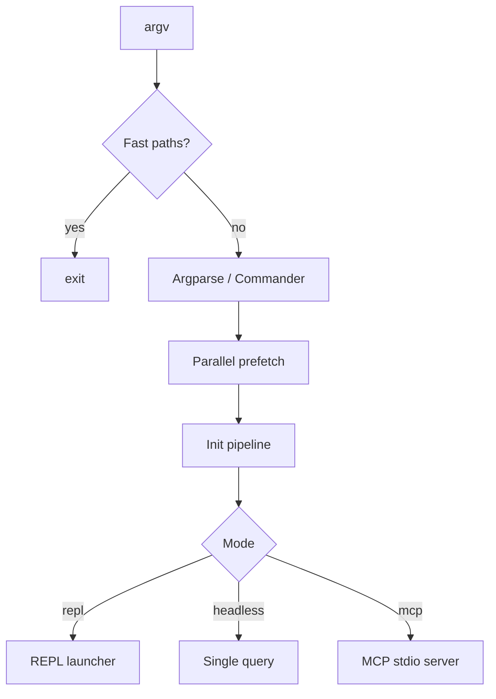

# Startup Flow Lab [Comprehensive]

**Experiment:** `experiments/exp_02_startup_flow/main.py`

## Objective

Demonstrate how a production CLI chains **fast exits**, **parallel prefetch**, **ordered initialization**, and **mode dispatch**—the same layering you see moving from thin CLI entry to full app bootstrap.

## Source mapping (Claude Code)

| Concept | TypeScript (illustrative) |
|---------|----------------------------|
| Early `--version` / help exits | `src/entrypoints/cli.tsx` |
| Commander parse, prefetch orchestration | `src/main.tsx` |
| Environment, auth, tools, MCP, telemetry ordering | `src/init.ts` |

## Architecture



## Key code walkthrough

**Fast paths** skip heavy work (mirrors CLI early returns):

```38:46:experiments/exp_02_startup_flow/main.py
def check_fast_paths(argv: list[str]) -> bool:
    """Handle flags that should exit immediately without full init."""
    if "--version" in argv:
        print("claude-code-experiment v1.0.0")
        return True
    if "--help-all" in argv:
        print("All commands: --version, --mode, --prompt, --mock")
        return True
    return False
```

**Parallel prefetch** uses a thread pool (similar to `Promise.all` in `main.tsx`):

```76:105:experiments/exp_02_startup_flow/main.py
def run_parallel_prefetch() -> dict[str, Any]:
    """
    Run all prefetch tasks in parallel using ThreadPoolExecutor.
    Mirrors the Promise.all pattern in main.tsx.
    """
    results: dict[str, Any] = {}
    tasks = {
        "mdm_settings": prefetch_mdm_settings,
        "auth_token": prefetch_auth_token,
        "feature_flags": prefetch_feature_flags,
        "config": prefetch_config,
    }
    # ... ThreadPoolExecutor + as_completed ...
```

**Mode dispatch** after `run_init()`:

```198:207:experiments/exp_02_startup_flow/main.py
    if args.mode == "headless" and args.prompt:
        await launch_headless(state, args.prompt)
    elif args.mode == "mcp":
        await launch_mcp_server(state)
    else:
        await launch_repl(state)
```

## How to run

From `experiments/`:

```bash
python -m exp_02_startup_flow.main --mock
python -m exp_02_startup_flow.main --provider anthropic
python -m exp_02_startup_flow.main --provider openai
```

Try headless and flags:

```bash
python -m exp_02_startup_flow.main --mock --mode headless -p "Hello"
python -m exp_02_startup_flow.main --version
```

## Exercises

1. Add a **lazy import** step: defer-import a heavy module only when `mode=mcp`.
2. Simulate **prefetch failure** for one task and define fallback values in `run_init()`.
3. Log **wall-clock** per init step and compare sequential vs parallel prefetch totals.

## Next experiment

Continue to **[Core Agent Loop Lab](./03-core-agent-loop-lab.md)** for the async generator loop that runs after startup.
