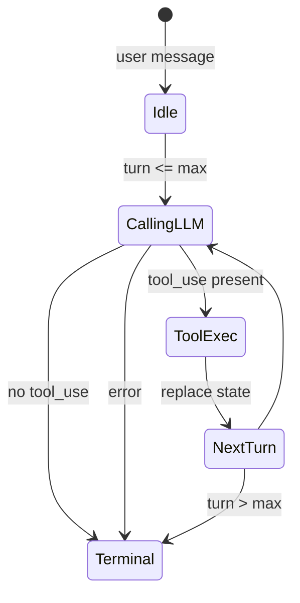

# Core Agent Loop Lab [Core]

**Experiment:** `experiments/exp_03_core_agent_loop/main.py`

This is the **most important** lab: it encodes the same **consumer-driven async generator + immutable state + tool round-trip** pattern as the production query loop.

## Objective

- Model the agent as an **`async` generator** that yields UI/API events.
- Replace state with **`dataclasses.replace`**, never mutating prior snapshots.
- Encode **terminal reasons** (completed, max turns, error) explicitly.
- Show **tool dispatch** inside the loop and **message transcript** growth.

## Source mapping (Claude Code)

| Piece | TypeScript |
|-------|------------|
| Main loop, turns, tool handling | `src/query.ts` |

## Architecture



## Key code walkthrough

**Immutable state** (frozen dataclass + `replace`):

```52:58:experiments/exp_03_core_agent_loop/main.py
@dataclass(frozen=True)
class AgentState:
    """Immutable state snapshot — replaced (not mutated) each iteration."""
    messages: tuple[dict[str, Any], ...]
    turn: int = 1
    max_turns: int = 10
    transition: TransitionReason | None = None
```

**Core loop** — LLM call, text yield, tool execution, state transition:

```113:196:experiments/exp_03_core_agent_loop/main.py
async def agent_loop(
    user_message: str,
    client: UnifiedLLMClient,
    max_turns: int = 10,
) -> AsyncIterator[AgentEvent]:
    # ...
    while True:
        if state.turn > state.max_turns:
            yield AgentEvent(type="terminal", data={"reason": TerminalReason.MAX_TURNS.value, ...})
            return
        response: LLMResponse = await client.chat(
            messages=list(state.messages),
            tools=list(TOOLS.values()),
        )
        if response.text:
            yield AgentEvent(type="text_delta", data={"text": response.text})
        if not response.has_tool_use:
            yield AgentEvent(type="terminal", data={"reason": TerminalReason.COMPLETED.value, ...})
            return
        # ... execute_tool per tool_use ...
        state = replace(
            state,
            messages=tuple(new_messages),
            turn=state.turn + 1,
            transition=TransitionReason.NEXT_TURN,
        )
```

**Consumer** (REPL) pulls events — same idea as UI subscribing to query events:

```217:231:experiments/exp_03_core_agent_loop/main.py
        async for event in agent_loop(query, client, max_turns=5):
            if event.type == "state_update":
                ...
            elif event.type == "text_delta":
                print(f"    {colored('Assistant:', 'cyan')} {event.data['text']}")
            elif event.type == "tool_use":
                ...
            elif event.type == "tool_result":
                ...
            elif event.type == "terminal":
                ...
```

**Tool-use detection** on the shared response type:

```16:25:experiments/shared/types.py
@dataclass
class LLMResponse:
    text: str = ""
    tool_uses: list[ToolUseBlock] = field(default_factory=list)
    ...
    @property
    def has_tool_use(self) -> bool:
        return len(self.tool_uses) > 0
```

## How to run

```bash
cd experiments
python -m exp_03_core_agent_loop.main --mock
python -m exp_03_core_agent_loop.main --provider anthropic
python -m exp_03_core_agent_loop.main --provider openai
```

Mock uses scenario `agent_loop_calculator` when `--mock` is set (see `main()`).

## Exercises

1. Add a **streaming** variant: drive the loop from `client.stream_chat` and forward `content_delta` / tool JSON deltas as `AgentEvent`s.
2. Introduce **`ABORTED`**: cancel the generator from the consumer and assert cleanup.
3. Serialize **`AgentState.messages`** to JSON between turns to verify **immutable** transcripts.

## Next experiment

**[Tool System Lab](./04-tool-system-lab.md)** — replace ad-hoc `execute_tool` with a validated tool protocol and orchestration.
