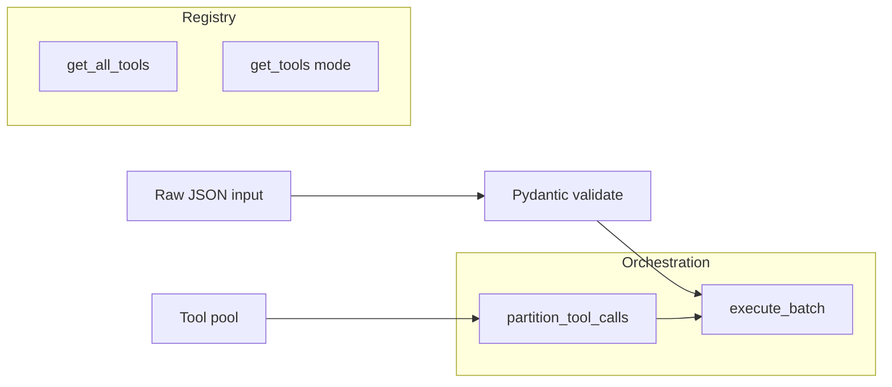

# Tool System Lab [Core]

**Experiment:** `experiments/exp_04_tool_system/main.py`

## Objective

Show the **Tool protocol**, **Pydantic validation**, **registry filtering**, **built-in + MCP pool merge**, and **batch partitioning** for concurrent vs serial execution—matching how Claude Code defines and runs tools safely at scale.

## Source mapping (Claude Code)

| Piece | TypeScript |
|-------|------------|
| Tool shape, `buildTool`, result mapping | `src/Tool.ts`, `src/tools.ts` |
| Partition batches, execute | `src/services/tools/toolOrchestration.ts` |

## Architecture



## Key code walkthrough

**Protocol + factory** (`build_tool` mirrors `buildTool`):

```45:57:experiments/exp_04_tool_system/main.py
@runtime_checkable
class Tool(Protocol):
    name: str
    description: str
    is_concurrency_safe: bool
    is_read_only: bool
    is_enabled: bool

    def validate_input(self, raw_input: dict[str, Any]) -> Any: ...
    async def call(self, validated_input: Any, context: dict[str, Any]) -> ToolResult: ...
```

```63:109:experiments/exp_04_tool_system/main.py
def build_tool(
    *,
    name: str,
    description: str,
    input_model: type[BaseModel],
    call_fn: Any,
    ...
) -> Tool:
    """Factory that builds a Tool with sensible defaults."""
    class BuiltTool:
        def validate_input(self, raw_input: dict[str, Any]) -> Any:
            return self._input_model.model_validate(raw_input)
        # map_result spills large results to disk when over max_result_chars
```

**Partitioning** consecutive safe calls into one concurrent batch:

```262:290:experiments/exp_04_tool_system/main.py
def partition_tool_calls(
    calls: list[ToolCall],
    pool: list[Tool],
) -> list[list[ToolCall]]:
    """
    Partition tool calls into batches.
    Consecutive concurrency-safe tools form one concurrent batch.
    Non-safe tools each get their own serial batch.
    Mirrors partitionToolCalls in toolOrchestration.ts.
    """
```

**Pool merge** (built-ins win on name collision):

```231:241:experiments/exp_04_tool_system/main.py
def assemble_tool_pool(
    built_ins: list[Tool],
    mcp_tools: list[Tool],
) -> list[Tool]:
    """Merge built-in and MCP tools (built-ins win on name collision)."""
```

## How to run

```bash
cd experiments
python -m exp_04_tool_system.main --mock
python -m exp_04_tool_system.main --provider anthropic
python -m exp_04_tool_system.main --provider openai
```

## Exercises

1. Add a tool with **`is_enabled=False`** and confirm it disappears from `get_tools()`.
2. Implement **true filesystem** `read_file` / `grep` behind the existing handlers (keep validation).
3. Extend **`partition_tool_calls`** to cap **parallelism** (e.g. max 3 concurrent safe calls per batch).

## Next experiment

**[Permission Engine Lab](./05-permission-engine-lab.md)** — gate `call()` with `decide()` before execution.
