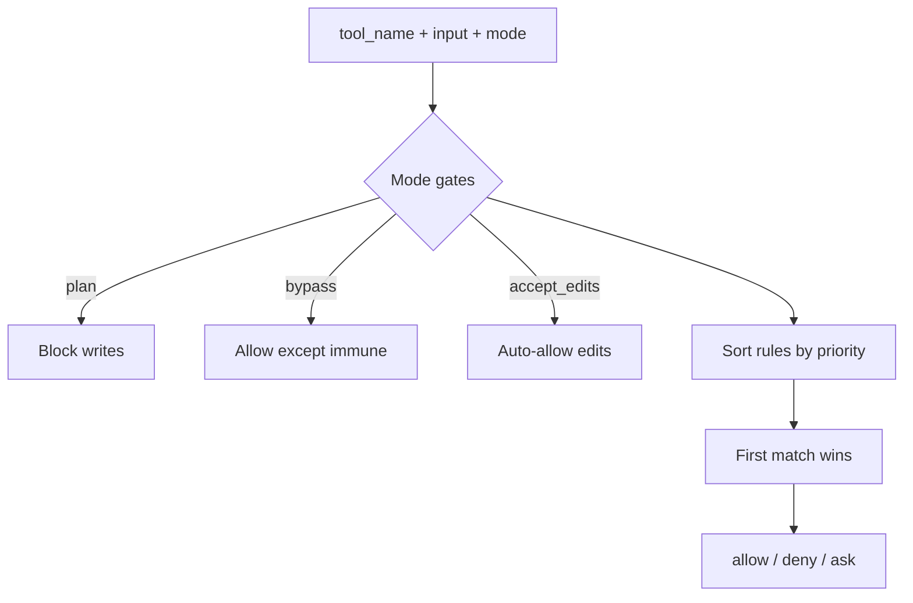

# Permission Engine Lab [Core]

**Experiment:** `experiments/exp_05_permission_engine/main.py`

## Objective

Implement a **pure decision function** over **permission modes**, **rule sources**, and **pattern matching**, including **bypass-immune** tools—mirroring the mental model of `src/permissions/`.

## Source mapping (Claude Code)

| Concept | Location |
|---------|----------|
| Modes, rules, ask/allow/deny | `src/permissions/` |

## Architecture



## Key code walkthrough

**Modes and rule priority** (lower number = higher priority in sort):

```35:76:experiments/exp_05_permission_engine/main.py
class PermissionMode(str, Enum):
    DEFAULT = "default"
    PLAN = "plan"
    ACCEPT_EDITS = "accept_edits"
    BYPASS = "bypass"

class RuleSource(str, Enum):
    SYSTEM = "system"
    PROJECT = "project"
    USER = "user"
    SESSION = "session"

RULE_PRIORITY = {
    RuleSource.SESSION: 0,
    RuleSource.USER: 1,
    RuleSource.PROJECT: 2,
    RuleSource.SYSTEM: 3,
}
```

**Pure `decide()`** — mode overrides, then sorted rules:

```94:132:experiments/exp_05_permission_engine/main.py
def decide(
    tool_name: str,
    tool_input: dict[str, Any],
    mode: PermissionMode,
    rules: list[PermissionRule],
) -> tuple[Decision, str]:
    """
    Pure function: determine whether a tool call is allowed.
    ...
    """
    if mode == PermissionMode.PLAN:
        if tool_name in ("write_file", "bash", "notebook_edit"):
            return Decision.DENY, f"Plan mode blocks write tool '{tool_name}'"
    if mode == PermissionMode.BYPASS:
        if tool_name not in BYPASS_IMMUNE_TOOLS:
            return Decision.ALLOW, "Bypass mode"
    # ... accept_edits, rule loop ...
    return Decision.ASK, "No matching rule; asking user"
```

## How to run

```bash
cd experiments
python -m exp_05_permission_engine.main --mock
python -m exp_05_permission_engine.main --provider anthropic
python -m exp_05_permission_engine.main --provider openai
```

## Exercises

1. Add **session rules** loaded from a temp JSON file with highest priority.
2. Extend **`_pattern_matches`** to support **regex** for `input_pattern`.
3. Wire **`decide()`** into **exp_04**’s `execute_batch` so each call checks permissions first.

## Concept checklist

- **Plan mode** is a coarse gate: it denies whole tool families (writes, shell) before rules run.
- **Bypass** is not absolute: immune tools still flow through **`decide()`** so dangerous categories remain governable.
- **Rules** are **total-order sorted** by `RuleSource`; first match on tool + optional input pattern wins.
- **`interactive_approve`** simulates the UI path when the engine returns **`ASK`**.

## Next experiment

**[Prompt Assembly Lab](./06-prompt-assembly-lab.md)** — how allowed tools and context become the system prompt.
