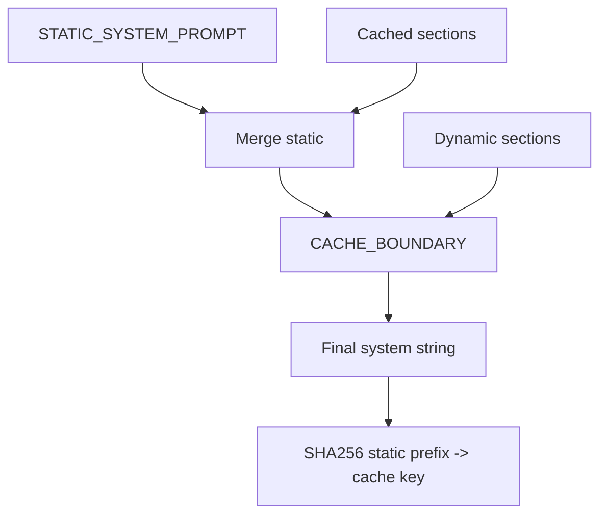

# Prompt Assembly Lab [Core]

**Experiment:** `experiments/exp_06_prompt_assembly/main.py`

## Objective

Assemble a **three-part** system prompt: **static cached prefix**, **cache boundary**, and **dynamic suffix**, plus **CLAUDE.md-style** context walking and a **cache key** derived only from the static segment—aligned with `src/constants/prompts/`.

## Source mapping (Claude Code)

| Piece | TypeScript |
|-------|------------|
| System prompt sections, caching hints | `src/constants/prompts/` |
| User context / CLAUDE.md chain (related) | `src/constants/context.ts` (referenced in experiment) |

## Architecture



## Key code walkthrough

**Boundary marker** (dynamic half goes after it):

```35:36:experiments/exp_06_prompt_assembly/main.py
CACHE_BOUNDARY = "\n\n--- SYSTEM_PROMPT_DYNAMIC_BOUNDARY ---\n\n"
```

**Section assembly**:

```69:85:experiments/exp_06_prompt_assembly/main.py
def get_system_prompt(sections: list[PromptSection]) -> str:
    """Assemble system prompt with cache boundary between static and dynamic parts."""
    static_parts = [STATIC_SYSTEM_PROMPT]
    dynamic_parts = []

    for s in sections:
        if s.cached:
            static_parts.append(s.render())
        else:
            dynamic_parts.append(s.render())

    static_text = "\n".join(static_parts)
    dynamic_text = "\n".join(dynamic_parts)

    if dynamic_text:
        return static_text + CACHE_BOUNDARY + dynamic_text
    return static_text
```

**Cache key = hash of prefix only**:

```88:92:experiments/exp_06_prompt_assembly/main.py
def compute_cache_key(system_prompt: str) -> str:
    """Hash only the static prefix (before CACHE_BOUNDARY) for prompt caching."""
    boundary_idx = system_prompt.find(CACHE_BOUNDARY)
    static_part = system_prompt[:boundary_idx] if boundary_idx >= 0 else system_prompt
    return hashlib.sha256(static_part.encode()).hexdigest()[:16]
```

**CLAUDE.md chain** starts in `get_user_context()` (walks directories; see full file).

**Why the boundary matters:** providers can cache long static prefixes. Everything **after** `CACHE_BOUNDARY` should be treated as **high churn** (cwd listing, git status, retrieved memories). Keeping that split explicit prevents accidental cache invalidation of your core policy text.

**Full request assembly** (system + synthetic context turns + user):

```162:189:experiments/exp_06_prompt_assembly/main.py
def assemble_messages(
    system_prompt: str,
    user_context: str,
    system_context: str,
    user_message: str,
) -> dict[str, Any]:
    """Assemble the complete API request structure."""
    messages = []

    if user_context and user_context != "(no CLAUDE.md files found)":
        messages.append({
            "role": "user",
            "content": f"[User Context]\n{user_context}",
        })
        messages.append({
            "role": "assistant",
            "content": "I've read your project context. How can I help?",
        })

    messages.append({"role": "user", "content": user_message})

    if system_context:
        messages[-1]["content"] += f"\n\n[System Context]\n{system_context}"

    return {
        "system": system_prompt,
        "messages": messages,
    }
```

The demo in `main()` prints **token counts** for static vs dynamic halves and proves **cache keys** stay stable when only dynamic sections change.

## How to run

```bash
cd experiments
python -m exp_06_prompt_assembly.main --mock
python -m exp_06_prompt_assembly.main --provider anthropic
python -m exp_06_prompt_assembly.main --provider openai
```

## Exercises

1. Add an **uncached** section for `git status` output and verify the **cache key** stays stable when only that section changes.
2. Implement **max depth** for CLAUDE.md walking to avoid huge monorepos.
3. Emit **token counts** per section using `count_tokens()` from `shared/utils.py`.

## Next experiment

**[Memory System Lab](./07-memory-system-lab.md)** — inject recalled memories into the dynamic system suffix.
