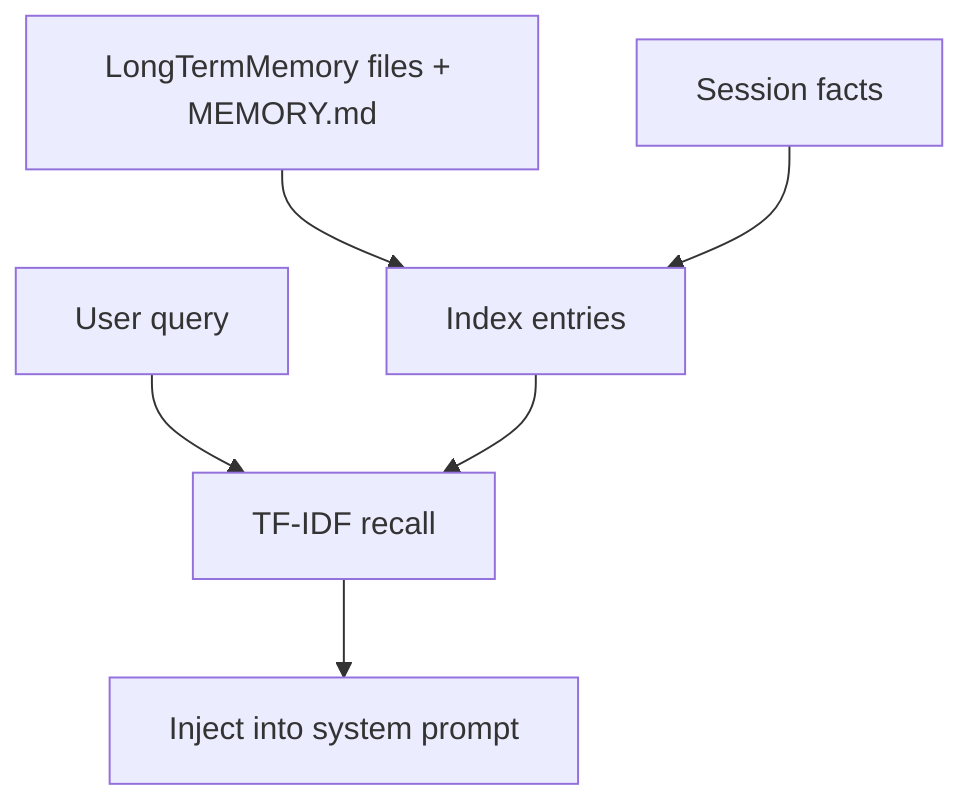

# Memory System Lab [Core]

**Experiment:** `experiments/exp_07_memory_system/main.py`

## Objective

Model **three-layer memory** (long-term files, session extraction, recall), **TF-IDF-style scoring**, and **prompt injection** with deduplication—parallel to `src/utils/memory/`.

## Source mapping (Claude Code)

| Piece | TypeScript |
|-------|------------|
| Memory index, recall, injection | `src/utils/memory/` |

## Architecture



## Key code walkthrough

**Long-term store** writes topic files and maintains `MEMORY.md`:

```66:98:experiments/exp_07_memory_system/main.py
class LongTermMemory:
    """File-based memory store using MEMORY.md index and topic files."""

    def __init__(self, base_dir: str):
        self.base_dir = Path(base_dir)
        self.base_dir.mkdir(parents=True, exist_ok=True)
        self.index = MemoryIndex()
        self._load_index()
    # write() creates filename from topic, updates index markdown
```

**Session layer** heuristically extracts preference-like sentences:

```131:153:experiments/exp_07_memory_system/main.py
    def extract_from_messages(
        self,
        messages: list[dict[str, Any]],
        client: UnifiedLLMClient | None = None,
    ) -> list[str]:
        """
        Extract key facts from conversation messages.
        In production, this uses a forked LLM call. Here we use simple heuristics.
        """
        new_facts = []
        for msg in messages:
            content = msg.get("content", "")
            if not isinstance(content, str):
                continue
            for sentence in re.split(r"[.!?\n]", content):
                sentence = sentence.strip()
                if len(sentence) < 10:
                    continue
                if any(kw in sentence.lower() for kw in ["prefer", "always", "never", "use", "important"]):
                    if sentence not in self.facts:
                        self.facts.append(sentence)
                        new_facts.append(sentence)
        return new_facts
```

**TF-IDF recall** scores topic documents against the user query:

```170:217:experiments/exp_07_memory_system/main.py
def _compute_tfidf(query_tokens: list[str], documents: dict[str, str]) -> list[tuple[str, float]]:
    """Simple TF-IDF scoring of documents against query."""
    if not documents:
        return []
    # ... document frequency + score per topic ...

def find_relevant_memories(
    query: str,
    memory: LongTermMemory,
    top_k: int = 3,
    min_score: float = 0.01,
) -> list[tuple[str, str, float]]:
    """Find memories most relevant to a query using TF-IDF."""
    query_tokens = _tokenize(query)
    all_contents = memory.all_contents()
    scored = _compute_tfidf(query_tokens, all_contents)
    # ...
```

**Injection** appends retrieved topics and session facts to the system string (see `inject_memories()` in the same file).

## How to run

```bash
cd experiments
python -m exp_07_memory_system.main --mock
python -m exp_07_memory_system.main --provider anthropic
python -m exp_07_memory_system.main --provider openai
```

## Exercises

1. Persist **session memory** to a JSON file between runs.
2. Replace TF-IDF with **embedding similarity** (optional dependency) behind the same `recall_memories` interface.
3. Add **rate limits** on injection (max N chars) and log what was **skipped**.

## Next experiment

**[Terminal UI Lab](./08-terminal-ui-lab.md)** (Comprehensive) shows how recalled content would render in a Rich-based console.
