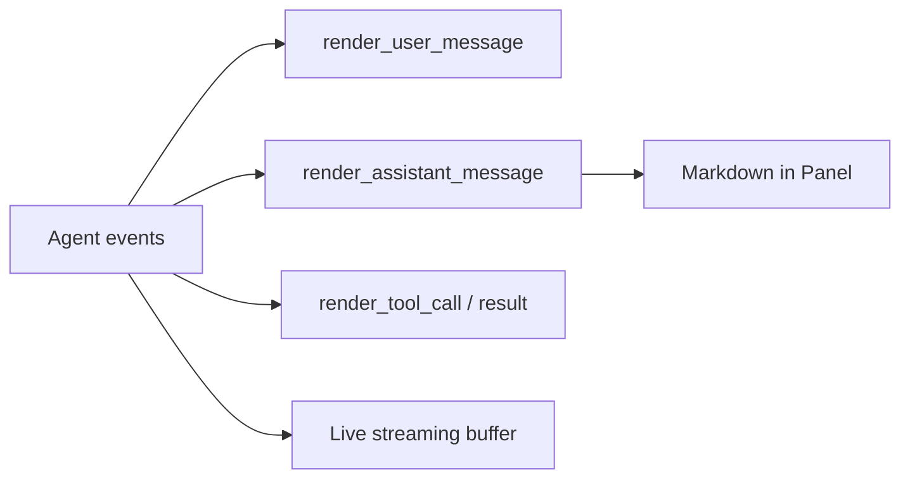

# Terminal UI Lab [Comprehensive]

**Experiment:** `experiments/exp_08_terminal_ui/main.py`

## Objective

Use **Rich** panels, markdown rendering, and **Live** updates to approximate Ink-style **message rendering** and **streaming** in the terminal—inspired by `src/ink/` and REPL screens.

## Source mapping (Claude Code)

| Piece | TypeScript |
|-------|------------|
| React/Ink components, layout | `src/ink/` |
| REPL screen composition | `src/screens/REPL.tsx` |

## Architecture



## Key code walkthrough

**Structured message panels** (user / assistant / tool):

```45:74:experiments/exp_08_terminal_ui/main.py
def render_user_message(console: Any, content: str) -> None:
    console.print(Panel(
        Text(content, style="white"),
        title="[bold blue]User[/bold blue]",
        border_style="blue",
        padding=(0, 1),
    ))


def render_assistant_message(console: Any, content: str) -> None:
    try:
        md = Markdown(content)
        console.print(Panel(
            md,
            title="[bold green]Assistant[/bold green]",
            border_style="green",
            padding=(0, 1),
        ))
```

**Simulated streaming** uses `rich.live.Live` (see `simulate_streaming_output` in the same file).

**Ink analogy:** In Claude Code, React components subscribe to model updates. Here, **functions** take a `Console` and imperative `print` calls stand in for re-rendering a component tree. The important parallel is the **separation of concerns**: parsing/agent events vs presentation.

**Failure mode:** If Rich is missing, `HAS_RICH` gates imports—mirror this pattern when optional UI dependencies ship in a CLI.

## How to run

```bash
cd experiments
python -m exp_08_terminal_ui.main --mock
python -m exp_08_terminal_ui.main --provider anthropic
python -m exp_08_terminal_ui.main --provider openai
```

## Exercises

1. Pipe **`exp_03` `AgentEvent`** stream into these render functions (single process).
2. Add **keyboard interrupt** handling that leaves the terminal in a clean state after `Live`.
3. Prototype a **Textual** full-screen layout alongside Rich for comparison.

## Debugging tips

- Force **width** on `Console(width=100)` to reproduce wrapped markdown panels in CI logs.
- Capture **ANSI-free** output with `Console(record=True)` and `export_text()` for snapshot tests.

## Mapping events to widgets (mental model)

| Event kind | Rich equivalent | Ink equivalent |
|------------|-----------------|----------------|
| User turn | `Panel` + blue border | User message component |
| Assistant text | `Markdown` inside `Panel` | Assistant bubble |
| Tool call | `Panel` with JSON args | Tool invocation row |
| Stream delta | `Live` refresh / `Text` append | Incremental text node |

You do not need feature parity—only **consistent routing** from the agent loop to renderers.

## Smoke test

After `pip install -r requirements.txt`, run the module once with `--mock` and confirm **no ImportError** for Rich. If Rich is missing, install it explicitly: `pip install rich`.

## Related dependencies

`experiments/requirements.txt` also lists **Textual** for future full-screen layouts. This lab only imports Rich directly; Textual is optional for the exercises.

**Performance:** Prefer incremental `Live` updates over rebuilding huge Markdown trees every token in production UIs.

## Next experiment

**[MCP Client Lab](./09-mcp-client-lab.md)** — discover remote tools and merge them into the tool pool shown in the UI.
