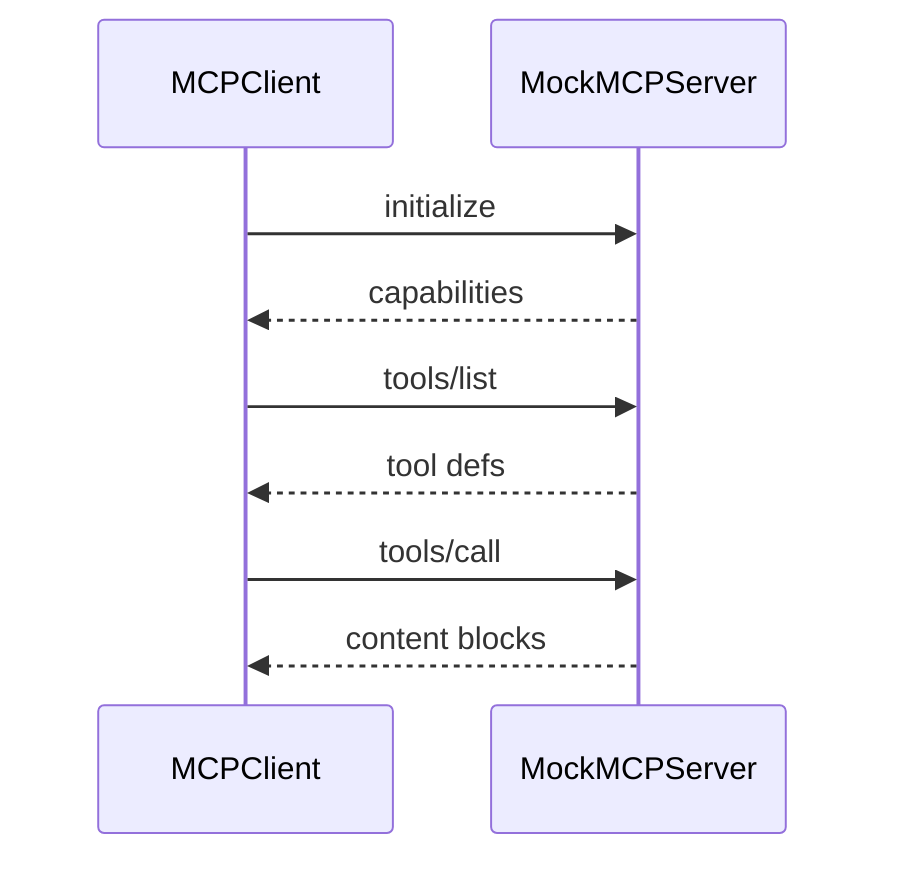

# MCP Client Lab [Core]

**Experiment:** `experiments/exp_09_mcp_client/main.py`

## Objective

Simulate **JSON-RPC over stdio**: **initialize**, **tools/list**, **tools/call**, **qualified tool names** (`mcp__server__tool`), and **merging** MCP tools with built-ins—matching concepts in `src/services/mcp/client.ts`.

## Source mapping (Claude Code)

| Piece | TypeScript |
|-------|------------|
| MCP client, discovery, calls | `src/services/mcp/client.ts` |

## Architecture



## Key code walkthrough

**JSON-RPC helpers**:

```39:53:experiments/exp_09_mcp_client/main.py
def make_request(method: str, params: dict[str, Any] | None = None) -> dict[str, Any]:
    return {
        "jsonrpc": "2.0",
        "id": str(uuid.uuid4())[:8],
        "method": method,
        "params": params or {},
    }
```

**Server handles `initialize`, `tools/list`, `tools/call`**:

```67:101:experiments/exp_09_mcp_client/main.py
    async def handle_request(self, request: dict[str, Any]) -> dict[str, Any]:
        method = request.get("method", "")
        ...
        if method == "tools/list":
            tool_list = [
                {
                    "name": t["name"],
                    "description": t.get("description", ""),
                    "inputSchema": t.get("input_schema", {"type": "object", "properties": {}}),
                }
                for t in self._tools.values()
            ]
            return make_response(req_id, {"tools": tool_list})
```

**Client** maps server tools to qualified names (see `MCPClient` / `discover_tools` in the remainder of the file).

**Naming collision policy:** When merging into a unified pool, **built-ins win** on duplicate bare names; MCP tools typically carry a **`mcp__server__tool`** prefix to avoid clashes—same spirit as `exp_04` `assemble_tool_pool`.

**Transport note:** Production MCP uses **stdio JSON-RPC** with a long-lived subprocess. This lab keeps the server **in-process** so you can read the protocol without daemon management.

## Minimal protocol surface

| Method | Purpose |
|--------|---------|
| `initialize` | Capability negotiation |
| `tools/list` | Discovery |
| `tools/call` | Execute with JSON arguments |

Anything beyond this (resources, prompts) extends the same JSON-RPC envelope—study `MockMCPServer.handle_request` before adding methods.

**Correlation IDs:** Production clients should log `id` on every request/response pair; the experiment generates short UUID prefixes for readability.

**Error shape:** JSON-RPC errors use `{code, message}`; map transport failures separately from `-32602` invalid params vs `-32601` unknown method.

**Versioning:** `initialize` returns `protocolVersion`; clients should assert compatibility before calling `tools/list`.

## How to run

```bash
cd experiments
python -m exp_09_mcp_client.main --mock
python -m exp_09_mcp_client.main --provider anthropic
python -m exp_09_mcp_client.main --provider openai
```

## Exercises

1. Spawn a **real** MCP server subprocess and replace `MockMCPServer` with stdio pipes.
2. Add **reconnect** with backoff when the child process dies.
3. Feed discovered tools into **`exp_04` `assemble_tool_pool`** and print the merged list.

## Next experiment

**[Multi-Agent Lab](./10-multi-agent-lab.md)** — delegate work across agents that may each own different MCP tool subsets.
