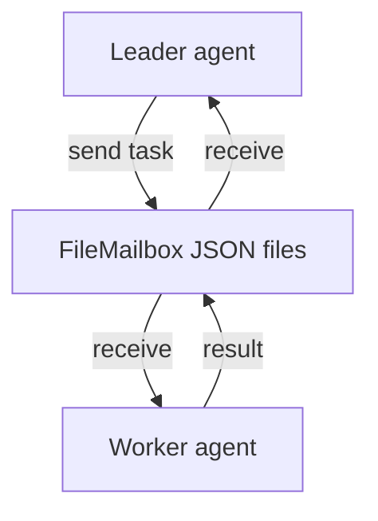

# Multi-Agent Lab [Core]

**Experiment:** `experiments/exp_10_multi_agent/main.py`

## Objective

Demonstrate **nested agents** with **restricted tool pools**, a **file-based mailbox** for inter-agent messages, and a **leader–worker** style handoff—mirroring `AgentTool` and `teammateMailbox` patterns.

## Source mapping (Claude Code)

| Piece | TypeScript |
|-------|------------|
| Nested agent tool | `src/tools/AgentTool/` |
| File mailbox / teammate comms | `src/utils/teammateMailbox.ts` |

## Architecture



## Key code walkthrough

**Mailbox** writes one JSON file per message under `inboxes/<agent_id>/`:

```49:77:experiments/exp_10_multi_agent/main.py
class FileMailbox:
    """File-based mailbox using JSON files with simple locking."""

    def __init__(self, base_dir: str, agent_id: str):
        self.agent_id = agent_id
        self._inbox_dir = Path(base_dir) / "inboxes" / agent_id
        self._inbox_dir.mkdir(parents=True, exist_ok=True)
        self._msg_counter = 0

    def send(self, recipient: str, msg_type: str, content: str, base_dir: str) -> None:
        """Write a message to the recipient's inbox."""
        recipient_dir = Path(base_dir) / "inboxes" / recipient
        recipient_dir.mkdir(parents=True, exist_ok=True)
        # ... write json file ...
```

**Nested agent** enforces **allowed tool names**:

```113:150:experiments/exp_10_multi_agent/main.py
async def run_nested_agent(
    config: AgentConfig,
    task: str,
    client: UnifiedLLMClient,
) -> dict[str, Any]:
    """
    Run a child agent with restricted tool pool.
    The child operates on a sidechain transcript (separate from parent).
    """
    transcript: list[dict[str, Any]] = []
    transcript.append({"role": "user", "content": task})
    # ...
        for tu in response.tool_uses:
            if tu.name not in config.tools:
                transcript.append({
                    "role": "tool_result",
                    "tool_use_id": tu.id,
                    "content": f"Error: Tool '{tu.name}' not available in this agent's tool pool",
                })
```

## How to run

```bash
cd experiments
python -m exp_10_multi_agent.main --mock
python -m exp_10_multi_agent.main --provider anthropic
python -m exp_10_multi_agent.main --provider openai
```

## Exercises

1. Add **file locking** (e.g. `fcntl` / `portalocker`) for concurrent writers.
2. Implement **permission_request** messages where the worker asks the leader to approve a tool.
3. Limit **mailbox size** and archive old messages to a rotating log.

## Operational notes

- **Inbox draining** deletes JSON files after read—at-least-once delivery requires an **ack** protocol this demo skips.
- **AgentConfig.tools** is a **whitelist**: anything outside it becomes an error `tool_result`, which is how you keep sub-agents narrow.

**Temp directories:** The demo uses `tempfile` for mailbox roots; point `base_dir` at a real folder when debugging multi-process races.

**Leader fan-out:** Schedule multiple `run_nested_agent` tasks with `asyncio.create_task` when simulating a swarm; join on all tasks before deleting the mailbox directory.

## Next experiment

**[Plugin & Skill Lab](./11-plugin-skill-lab.md)** (Comprehensive) extends extensibility with manifests and SKILL.md.
