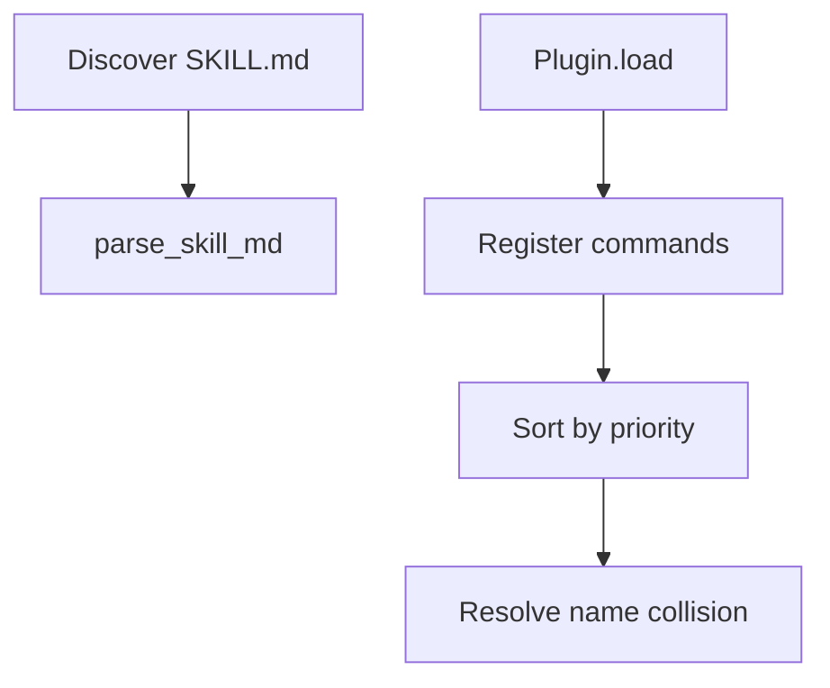

# Plugin & Skill Lab [Comprehensive]

**Experiment:** `experiments/exp_11_plugin_skill/main.py`

## Objective

Parse **SKILL.md** frontmatter, model **plugin manifests** and **lifecycle hooks**, and resolve **command priority** across built-in, plugin, and skill sources—aligned with `src/services/plugins/` and `src/services/skills/`.

## Source mapping (Claude Code)

| Piece | TypeScript |
|-------|------------|
| Plugin loading, capabilities | `src/services/plugins/` |
| Skill discovery and execution | `src/services/skills/` |

## Architecture



## Key code walkthrough

**Skill model + source priority**:

```38:49:experiments/exp_11_plugin_skill/main.py
@dataclass
class Skill:
    name: str
    description: str
    content: str
    source: str  # "bundled", "disk", "plugin", "mcp"
    path: str | None = None

    @property
    def priority(self) -> int:
        priorities = {"bundled": 0, "disk": 1, "plugin": 2, "mcp": 3}
        return priorities.get(self.source, 99)
```

**Frontmatter parsing**:

```52:77:experiments/exp_11_plugin_skill/main.py
def parse_skill_md(path: str) -> Skill | None:
    """Parse a SKILL.md file with YAML-like frontmatter."""
    ...
    frontmatter_match = re.match(r"^---\s*\n(.*?)\n---\s*\n(.*)$", content, re.DOTALL)
```

**Plugin lifecycle**:

```100:108:experiments/exp_11_plugin_skill/main.py
    def load(self) -> None:
        """Simulate plugin loading and lifecycle init."""
        self.is_loaded = True
        if "on_load" in self.hooks:
            self.hooks["on_load"]()
```

**Command priority** (`built-in` < `plugin` < `skill` in numeric order — see `Command.priority` in the same file).

**Skill vs plugin:** A **skill** is primarily **prompt content** loaded from disk; a **plugin** bundles **manifest metadata**, optional hooks, and may contribute commands/tools. The experiment keeps both minimal so you can see how **resolution order** prevents shadowing surprises.

## How to run

```bash
cd experiments
python -m exp_11_plugin_skill.main --mock
python -m exp_11_plugin_skill.main --provider anthropic
python -m exp_11_plugin_skill.main --provider openai
```

## Exercises

1. Use a real **YAML** parser for frontmatter instead of line scanning.
2. Load **multiple plugins** from a `plugins/` directory and print the **resolved** command table.
3. Emit a **merged** prompt snippet that appends skill `content` when `/skill foo` runs.

## Security note

Skills and plugins execute **user-supplied instructions** from disk. In a real CLI you should:

- Sandbox or sign plugins
- Limit filesystem search roots
- Audit **hooks** (`on_load` / `on_unload`) for side effects

The experiment uses tempfile fixtures—treat that as **trusted** data only.

## Extension points

| Hook | Typical use |
|------|-------------|
| `on_load` | Register commands, warm caches |
| `on_unload` | Close connections, flush telemetry |
| Skill `content` | Inject long instructions for niche workflows |

Document every hook’s **side effects** in real plugins so operators know what runs implicitly.

## Next experiment

**[Streaming API Lab](./12-streaming-api-lab.md)** — how tokens and tool JSON arrive over the wire before plugins inject prompts.
