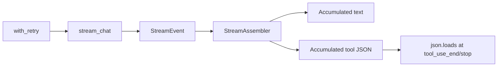

# Streaming API Lab [Core]

**Experiment:** `experiments/exp_12_streaming_api/main.py`

## Objective

Exercise **event-sourced streaming**: accumulate **text deltas** and **tool JSON fragments**, **assemble** a final message, add **retry with backoff**, and sketch an **idle watchdog**—patterns reflected in `src/services/api/claude.ts`.

## Source mapping (Claude Code)

| Piece | TypeScript |
|-------|------------|
| Stream handling, assembly, retries | `src/services/api/claude.ts` |

## Architecture



## Key code walkthrough

**Assembler** mirrors `content_block_*` style events:

```54:111:experiments/exp_12_streaming_api/main.py
class StreamAssembler:
    """
    Assembles a complete assistant message from streaming events.
    Mirrors the content_block_start/delta/stop handling in claude.ts.
    """

    def process_event(self, event: StreamEvent) -> str | None:
        """Process one stream event. Returns text delta if any."""
        if event.type == "content_delta":
            self._text_parts.append(event.text)
            return event.text

        elif event.type == "tool_use_start":
            tu = event.tool_use
            if tu:
                self._blocks[event.index] = PartialContentBlock(
                    index=event.index,
                    block_type="tool_use",
                    tool_id=tu.id,
                    tool_name=tu.name,
                )
            return None

        elif event.type == "tool_use_delta":
            block = self._blocks.get(event.index)
            if block:
                block.input_json_str += event.partial_json
            return None
        # ...
    def assemble(self) -> AssembledMessage:
        """Finalize the assembled message."""
        msg = AssembledMessage(text="".join(self._text_parts))

        for block in sorted(self._blocks.values(), key=lambda b: b.index):
            if block.block_type == "tool_use":
                try:
                    parsed_input = json.loads(block.input_json_str) if block.input_json_str else {}
                except json.JSONDecodeError:
                    parsed_input = {"_raw": block.input_json_str}
                msg.tool_uses.append({
                    "id": block.tool_id,
                    "name": block.tool_name,
                    "input": parsed_input,
                })

        return msg
```

**Retry wrapper**:

```127:148:experiments/exp_12_streaming_api/main.py
async def with_retry(
    fn: Any,
    config: RetryConfig,
    *args: Any,
    **kwargs: Any,
) -> Any:
    """Execute a function with exponential backoff retry."""
    last_error = None
    delay = config.initial_delay

    for attempt in range(1, config.max_retries + 1):
        try:
            return await fn(*args, **kwargs)
        except config.retryable_errors as e:
            last_error = e
            if attempt == config.max_retries:
                break
            warn(f"  Attempt {attempt} failed: {e}. Retrying in {delay:.1f}s...")
            await asyncio.sleep(delay)
            delay = min(delay * config.backoff_multiplier, config.max_delay)

    raise last_error  # type: ignore[misc]
```

The demo drives `client.stream_chat(...)` and logs the event sequence (see `main()` in the same file). Mock scenario: `streaming_demo`.

## How to run

```bash
cd experiments
python -m exp_12_streaming_api.main --mock
python -m exp_12_streaming_api.main --provider anthropic
python -m exp_12_streaming_api.main --provider openai
```

## Exercises

1. Implement **`stream_with_watchdog`** with `asyncio.wait_for` per iteration and cancellation on idle.
2. Add **idempotent** retry for **HTTP 429** using `Retry-After` headers (Anthropic client).
3. Feed assembled tool calls into **`exp_04` `execute_batch`** for an end-to-end stream→tools path.

## Next experiment

**[Config System Lab](./13-config-system-lab.md)** (Comprehensive) layers runtime settings that affect streaming thresholds and model choice.
