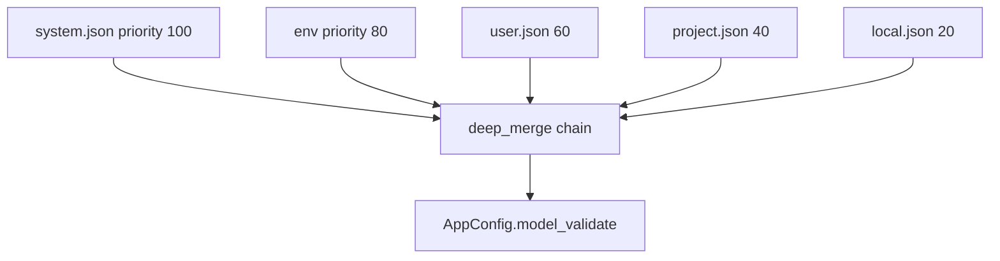

# Config System Lab [Comprehensive]

**Experiment:** `experiments/exp_13_config_system/main.py`

## Objective

Show **layered configuration**: multiple **sources** with numeric **priority**, **deep merge** for nested dicts, **environment overrides**, and **Pydantic** validation—modeled on `src/utils/settings.ts`.

## Source mapping (Claude Code)

| Piece | TypeScript |
|-------|------------|
| Settings load/merge/validate | `src/utils/settings.ts` |

## Architecture



## Key code walkthrough

**Schema** (nested models):

```39:62:experiments/exp_13_config_system/main.py
class ModelConfig(BaseModel):
    name: str = "claude-sonnet-4-20250514"
    max_tokens: int = 4096
    temperature: float = 0.7
...
class AppConfig(BaseModel):
    model: ModelConfig = Field(default_factory=ModelConfig)
    permissions: PermissionsConfig = Field(default_factory=PermissionsConfig)
    ui: UIConfig = Field(default_factory=UIConfig)
    verbose: bool = False
    telemetry: bool = True
```

**Immutable deep merge**:

```69:80:experiments/exp_13_config_system/main.py
def deep_merge(base: dict[str, Any], override: dict[str, Any]) -> dict[str, Any]:
    """
    Recursively merge override into base (immutable — returns new dict).
    Override values win; nested dicts are merged recursively.
    """
    result = copy.deepcopy(base)
    for key, value in override.items():
        if key in result and isinstance(result[key], dict) and isinstance(value, dict):
            result[key] = deep_merge(result[key], value)
        else:
            result[key] = copy.deepcopy(value)
    return result
```

**ConfigManager.resolve()** merges from lowest priority upward, then validates:

```148:155:experiments/exp_13_config_system/main.py
    def resolve(self) -> AppConfig:
        """Merge all sources by priority and validate."""
        self._merged = {}
        for source in reversed(self._sources):
            self._merged = deep_merge(self._merged, source.data)

        self._config = AppConfig.model_validate(self._merged)
        return self._config
```

**Provenance** via `explain(dotted_path)` helps debug which layer set a value.

**Priority direction:** Higher **priority numbers** are merged **first** in `add_source` sorting, but `resolve()` iterates **`reversed`** so that **lower-numbered sources win** in the demo’s table—study `ConfigManager` closely before changing precedence in your fork.

## How to run

```bash
cd experiments
python -m exp_13_config_system.main --mock
python -m exp_13_config_system.main --provider anthropic
python -m exp_13_config_system.main --provider openai
```

## Exercises

1. Add a **CLI source** (`argparse`) with priority between env and user file.
2. Support **`.env`** loading before `load_env_config()`.
3. Serialize **`AppConfig`** back to JSON after merge for a `/config export` command (see exp_15).

## Next experiment

**[Context Compaction Lab](./14-context-compaction-lab.md)** — token thresholds from config drive autocompact behavior.
