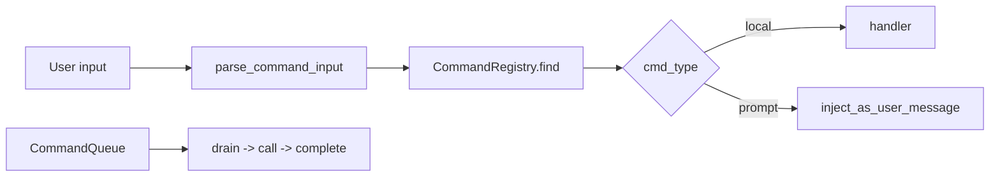

# Command System Lab [Comprehensive]

**Experiment:** `experiments/exp_15_command_system/main.py`

## Objective

Implement **slash commands** with a **registry**, **aliases**, **local vs prompt** execution, **parsing**, and a **command queue** lifecycle—analogous to `src/commands/`.

## Source mapping (Claude Code)

| Piece | TypeScript |
|-------|------------|
| Command definitions and dispatch | `src/commands/` |

## Architecture



## Key code walkthrough

**Command model** with dual behaviors:

```42:61:experiments/exp_15_command_system/main.py
@dataclass
class Command:
    name: str
    description: str
    cmd_type: str  # "local" (run directly) or "prompt" (inject into agent loop)
    aliases: list[str] = field(default_factory=list)
    is_enabled: Callable[[], bool] = field(default=lambda: True)
    handler: Callable[..., Awaitable[CommandResult]] | None = None
    prompt_template: str = ""

    async def call(self, args: str, context: dict[str, Any]) -> CommandResult:
        if self.cmd_type == "local" and self.handler:
            return await self.handler(args, context)
        elif self.cmd_type == "prompt":
            injected = self.prompt_template.replace("{args}", args).strip()
            return CommandResult(
                output=f"Injecting prompt for /{self.name}",
                inject_as_user_message=injected,
            )
        return CommandResult(output=f"No handler for /{self.name}")
```

**Registry + completions**:

```117:142:experiments/exp_15_command_system/main.py
class CommandRegistry:
    def __init__(self):
        self._commands: dict[str, Command] = {}

    def register(self, command: Command) -> None:
        self._commands[command.name] = command
        for alias in command.aliases:
            self._commands[alias] = command
    # find(), get_enabled_commands(), get_completions(prefix)
```

**Queue lifecycle**:

```176:196:experiments/exp_15_command_system/main.py
class CommandQueue:
    def __init__(self):
        self._queue: deque[QueuedCommand] = deque()
        self._history: list[QueuedCommand] = []

    def enqueue(self, name: str, args: str) -> QueuedCommand:
        cmd = QueuedCommand(id=str(uuid.uuid4())[:8], name=name, args=args)
        self._queue.append(cmd)
        return cmd
    # drain(), complete()
```

## How to run

```bash
cd experiments
python -m exp_15_command_system.main --mock
python -m exp_15_command_system.main --provider anthropic
python -m exp_15_command_system.main --provider openai
```

## Exercises

1. Add **`/model`** as a local command that mutates context and validates against **`AppConfig`** (exp_13).
2. Support **`/` escaping** so `/not-a-command` inside code blocks is ignored.
3. Persist **queue history** to disk for crash recovery.

## Next experiment

**[Design Patterns Lab](./16-design-patterns-lab.md)** distills cross-cutting patterns from the experiments you completed.
