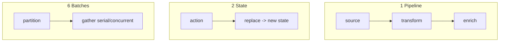

# Design Patterns Lab [Comprehensive]

**Experiment:** `experiments/exp_16_design_patterns/main.py`

## Objective

A **cookbook** of six patterns that appear throughout Claude Code and the other experiments: **async generator pipelines**, **immutable state machines**, **dependency injection**, **factories with defaults**, **layered config merge**, and **concurrent batch partitioning**.

## Source mapping (Claude Code)

Cross-cutting references (illustrative):

| Pattern | Where it shows up |
|---------|-------------------|
| Async generators | `src/query.ts` event/query loop |
| Immutable state | `AgentState`-style replacements |
| DI / protocols | Services swapping API, tools, storage |
| `buildTool` factory | `src/Tool.ts` |
| Layered settings | `src/utils/settings.ts` |
| Batch partition | `src/services/tools/toolOrchestration.ts` |

## Architecture



## Key code walkthrough

**Pattern 1 — async generator composition**:

```37:68:experiments/exp_16_design_patterns/main.py
async def source(items: list[str]) -> AsyncIterator[str]:
    """Source generator: emits raw items."""
    for item in items:
        await asyncio.sleep(0.01)
        yield item


async def transform(upstream: AsyncIterator[str]) -> AsyncIterator[str]:
    """Transform: uppercase and filter."""
    async for item in upstream:
        if len(item) > 3:
            yield item.upper()
```

**Pattern 2 — immutable transitions**:

```77:92:experiments/exp_16_design_patterns/main.py
@dataclass(frozen=True)
class AppState:
    counter: int = 0
    status: str = "idle"
    history: tuple[str, ...] = ()


def transition(state: AppState, action: str) -> AppState:
    """Pure function: state + action -> new state (never mutates)."""
    if action == "start":
        return replace(state, status="running", history=(*state.history, "started"))
```

**Pattern 3 — dependency injection container**:

```134:146:experiments/exp_16_design_patterns/main.py
@dataclass
class AgentDeps:
    """Dependency container — swap implementations without changing agent logic."""
    llm: LLMProvider
    tools: ToolExecutor
    max_turns: int = 5


async def run_agent(deps: AgentDeps, query: str) -> str:
    """Agent logic that depends on abstractions, not concrete implementations."""
    response = await deps.llm.complete(query)
    tool_result = await deps.tools.run("search", {"q": query})
    return f"{response} | {tool_result}"
```

**Pattern 6 — partitioning for concurrency** (same idea as exp_04):

```249:263:experiments/exp_16_design_patterns/main.py
def partition(tasks: list[Task]) -> list[list[Task]]:
    """Split tasks: consecutive safe tasks form concurrent batches, unsafe run alone."""
    batches: list[list[Task]] = []
    current: list[Task] = []
    for task in tasks:
        if task.is_safe:
            current.append(task)
        else:
            if current:
                batches.append(current)
                current = []
            batches.append([task])
    if current:
        batches.append(current)
    return batches
```

## How to run

```bash
cd experiments
python -m exp_16_design_patterns.main --mock
python -m exp_16_design_patterns.main --provider anthropic
python -m exp_16_design_patterns.main --provider openai
```

## Exercises

1. Add **pattern 7**: a **small event bus** (publish/subscribe) for UI vs core decoupling.
2. Refactor **`exp_03` `agent_loop`** to accept **`AgentDeps`** from pattern 3.
3. Write **property tests** for `deep_merge` associativity on nested dicts.

## Next experiment

Return to the **[Experiment Guide](./00-experiment-guide.md)** to pick another track or re-run the Focused path with real providers.
