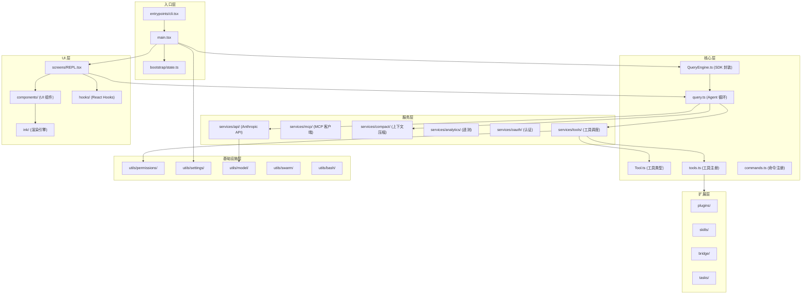
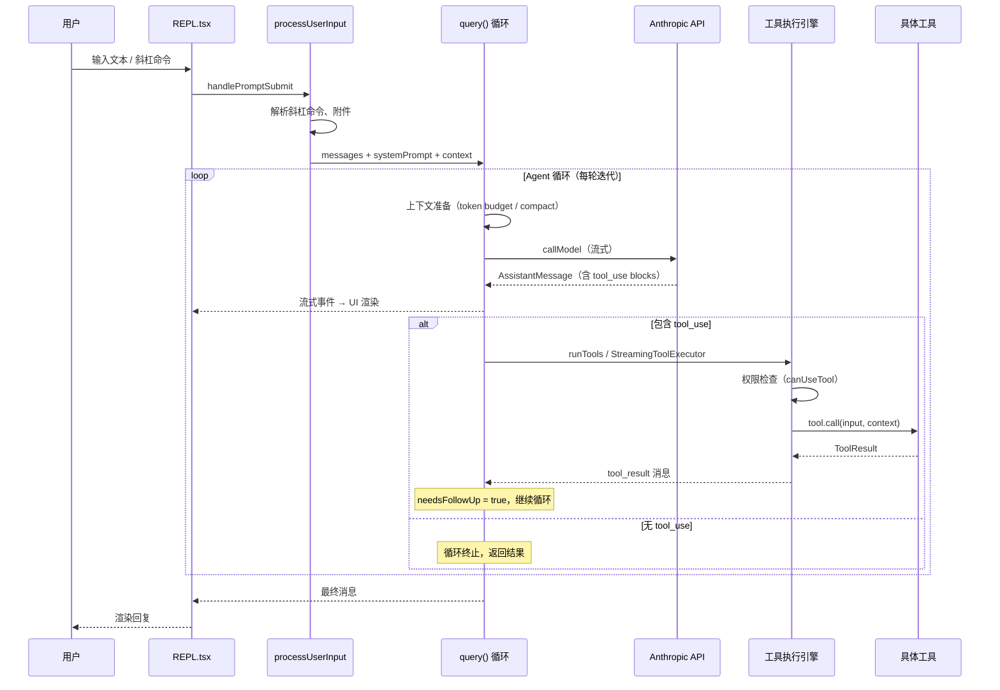
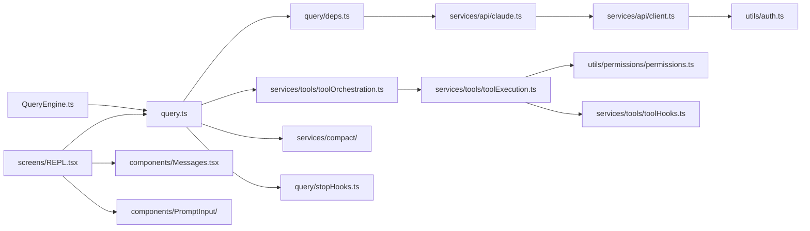

# 整体架构与模块地图

## 分层架构

Claude Code 采用清晰的分层架构，从用户输入到 LLM 交互形成完整的数据管道：

## `src/` 顶层目录分类

### 入口层

| 目录/文件 | 文件数 | 职责 |
|-----------|--------|------|
| `entrypoints/` | 8 | 进程入口：`cli.tsx`（CLI 引导）、`init.ts`（一次性初始化）、`mcp.ts`（MCP 服务器模式）、SDK 类型 |
| `main.tsx` | 1 | Commander CLI 设置、GrowthBook 初始化、工具注册、启动 REPL |
| `bootstrap/` | 1 | `state.ts`：全局启动状态（遥测、频道、设置缓存） |

### 核心层

| 文件 | 职责 |
|------|------|
| `query.ts` | **核心 Agent 循环**：`query()` / `queryLoop()` 状态机，驱动 LLM 调用 → 工具执行 → 结果回注 |
| `QueryEngine.ts` | SDK / 无头模式封装，管理会话级消息列表、abort、文件缓存 |
| `Tool.ts` | 工具接口定义：`Tool<Input, Output>`、`ToolUseContext`、`ToolPermissionContext`、`buildTool()` |
| `tools.ts` | 工具注册表：`getAllBaseTools()` 返回全部内置工具，`getTools()` 按权限过滤 |
| `commands.ts` | 命令注册表：合并 bundled/plugin/skill/built-in 命令，按优先级排序 |

### 服务层 (`services/`，130 文件)

| 子目录 | 职责 |
|--------|------|
| `api/` | Anthropic API 客户端构建、流式调用、重试、文件 API |
| `mcp/` | MCP 客户端连接管理、工具发现、配置合并 |
| `compact/` | 上下文压缩（全量/微量/自动） |
| `analytics/` | GrowthBook 特性开关、分析事件 |
| `oauth/` | OAuth 2.0 认证流程 |
| `tools/` | 工具编排（`toolOrchestration.ts`）、工具执行（`toolExecution.ts`）、流式执行器 |
| `lsp/` | Language Server Protocol 集成 |
| `policyLimits/` | 组织策略限制 |
| `remoteManagedSettings/` | 远程管理设置（企业） |
| `SessionMemory/` | 会话记忆提取 |
| `teamMemorySync/` | 团队记忆同步 |
| `extractMemories/` | 自动记忆提取 |

### UI 层

| 目录 | 文件数 | 职责 |
|------|--------|------|
| `ink/` | 96 | 自定义 Ink 渲染引擎：React reconciler + Yoga 布局 + 终端 cell buffer |
| `screens/` | 3 | 全屏 UI：`REPL.tsx`（主交互）、`Doctor.tsx`（诊断）、`ResumeConversation.tsx` |
| `components/` | 389 | Ink UI 组件：消息展示、权限对话框、输入框、设计系统、任务面板等 |
| `hooks/` | 104 | React Hooks：工具权限、通知、设置变更等 |
| `keybindings/` | 14 | 快捷键定义与处理（支持 chord 组合键） |
| `vim/` | 5 | Vim 模式实现（运动、操作符、文本对象） |

### 基础设施层 (`utils/`，564 文件)

| 子目录 | 职责 |
|--------|------|
| `permissions/` | 权限判定核心逻辑、规则解析、设置 |
| `settings/` | 分层配置加载与合并（user/project/local/flag/policy） |
| `model/` | 模型选择、Provider 分支、能力检查 |
| `swarm/` | 多 Agent 协作：进程内 teammate、tmux/iTerm 后端 |
| `bash/` | Bash 命令解析与安全分类 |
| `plugins/` | 插件加载器 |
| `hooks/` | 生命周期钩子 |
| `telemetry/` | 遥测上报 |

### 扩展层

| 目录 | 文件数 | 职责 |
|------|--------|------|
| `plugins/` | 2 | 插件系统（内置插件注册） |
| `skills/` | 20 | 技能系统（bundled 技能、磁盘技能加载） |
| `bridge/` | 31 | IDE 桥接（VS Code、JetBrains） |
| `tasks/` | 12 | 任务框架：本地/远程 Agent 任务、Teammate 任务 |

## 核心数据流

一次完整的用户交互，数据流经以下路径：

## 关键依赖关系

## 下一步

前往 [02-startup-flow.md](02-startup-flow.md) 了解程序从命令行启动到进入交互循环的完整过程。
