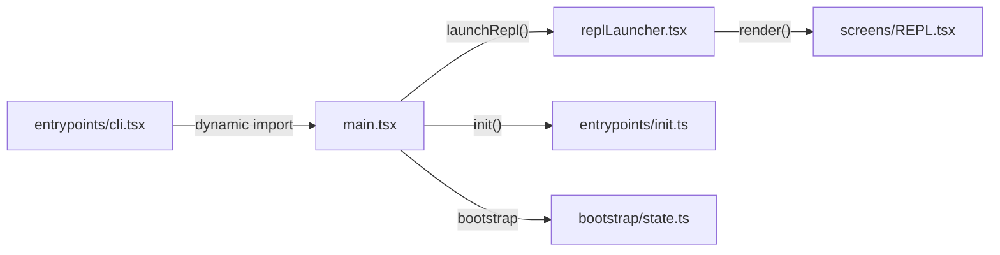
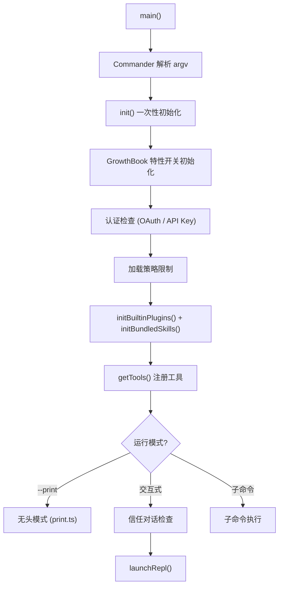

# 启动流程：从 CLI 到 REPL

## 启动链概览



## 第一步：`entrypoints/cli.tsx` — 薄引导层

`cli.tsx` 是进程的真正入口，其设计原则是**尽可能少加载模块**，为快速路径提供零依赖的响应。

### 快速路径（零模块加载）

```typescript
// --version 直接输出，不加载任何模块
if (args[0] === '--version' || args[0] === '-v') {
    console.log(`${MACRO.VERSION} (Claude Code)`);
    return;
}
```

### 特殊模式分发

在加载完整 CLI 之前，`cli.tsx` 通过 `process.argv` 检查并分发到各种特殊模式：

| 参数 | 模式 | 说明 |
|------|------|------|
| `--claude-in-chrome-mcp` | Chrome MCP | Chrome 浏览器扩展 MCP 服务器 |
| `--computer-use-mcp` | 计算机使用 MCP | 计算机操作 MCP（feature-gated） |
| `--daemon-worker` | Daemon Worker | 后台工作进程（KAIROS） |
| `--bridge` | Bridge 模式 | IDE 桥接（VS Code/JetBrains） |
| `--template` | 模板模式 | 项目模板生成 |
| 默认 | 完整 CLI | `import('../main.js').main()` |

### 环境预处理

```typescript
// 禁用 corepack 自动 pinning
process.env.COREPACK_ENABLE_AUTO_PIN = '0';

// CCR 容器环境设置堆大小
if (process.env.CLAUDE_CODE_REMOTE === 'true') {
    process.env.NODE_OPTIONS = '--max-old-space-size=8192';
}
```

**关键文件**: `src/entrypoints/cli.tsx`

## 第二步：`main.tsx` — 完整 CLI 入口

`main.tsx` 是 Claude Code 的核心入口，约 4600+ 行，负责 Commander CLI 配置、初始化、工具注册和 REPL 启动。

### 并行预取（性能关键）

`main.tsx` 的前几行利用 ES 模块的副作用执行来**并行预取**耗时操作：

```typescript
// 这些 side-effect 在所有 import 之前执行
profileCheckpoint('main_tsx_entry');

// 1. 启动 MDM 设置读取（macOS plutil / Windows reg query 子进程）
startMdmRawRead();

// 2. 启动 macOS Keychain 预取（OAuth + API Key，两个并发读取）
startKeychainPrefetch();
```

这种设计让耗时的 I/O 操作与后续约 135ms 的模块加载并行执行。

### Commander CLI 配置

`main.tsx` 使用 Commander.js 定义完整的命令行接口：

```typescript
const program = new CommanderCommand('claude')
    .option('-p, --print <prompt>', '非交互模式')
    .option('--model <model>', '指定模型')
    .option('--permission-mode <mode>', '权限模式')
    .option('--allowedTools <tools...>', '允许的工具列表')
    .option('--max-turns <n>', '最大循环轮数')
    // ... 更多选项
```

### 初始化流程

`main()` 函数的执行流程：



### 工具注册

```typescript
const tools = getTools({
    mode: permissionMode,
    // ... 权限规则
});
```

`getTools()` 在 `tools.ts` 中过滤工具列表：应用 deny 规则、检查 `isEnabled()`、过滤 REPL-only 工具。

**关键文件**: `src/main.tsx`

## 第三步：`entrypoints/init.ts` — 一次性初始化

`init()` 负责进程级别的一次性设置，在 `main()` 中被调用：

| 初始化项 | 说明 |
|----------|------|
| `enableConfigs()` | 启用配置系统 |
| `applySafeConfigEnvironmentVariables()` | 安全地应用环境变量 |
| 仓库检测 | 查找 `.git`、设置工作目录 |
| OAuth 初始化 | 设置认证上下文 |
| 策略加载 | `loadPolicyLimits()` 从服务器获取策略 |
| 远程设置 | `loadRemoteManagedSettings()` |
| 遥测 | 注册 OpenTelemetry sink |
| 关闭钩子 | `process.on('exit')` 清理 |

**关键文件**: `src/entrypoints/init.ts`

## 第四步：`bootstrap/state.ts` — 全局状态

`bootstrap/state.ts` 是"审慎使用的全局状态"（代码注释原文），提供进程级别的可变状态：

- 会话 ID
- 遥测 sink
- 频道信息
- 设置缓存
- 模型覆盖
- Token 预算和成本追踪的原子操作

设计意图是将不可避免的全局状态集中管理，而非分散在模块中。

**关键文件**: `src/bootstrap/state.ts`

## 第五步：`replLauncher.tsx` — REPL 启动

`replLauncher.tsx` 是从 `main.tsx` 到实际 UI 的桥梁：

1. 动态加载 `App` 组件和 `REPL` 屏幕
2. 配置 Ink 渲染选项
3. 调用 `render()` 将 React 组件树挂载到终端

```typescript
export async function launchRepl(options: LaunchOptions) {
    const { App } = await import('./components/App.js');
    const { REPL } = await import('./screens/REPL.js');
    // ... 渲染到终端
}
```

**关键文件**: `src/replLauncher.tsx`

## 第六步：`screens/REPL.tsx` — 交互式界面

`REPL.tsx` 是整个应用的**编排中心**（约 3000+ 行），管理：

- 会话/查询状态和消息列表
- 工具权限队列
- 模态对话框
- 组件树组装
- 快捷键绑定
- 与 `query()` 循环的桥接

详见 [08-terminal-ui.md](08-terminal-ui.md)。

**关键文件**: `src/screens/REPL.tsx`

## 两种运行模式

### 交互模式（REPL）

```
cli.tsx → main.tsx → init() → launchRepl() → REPL.tsx → query()
```

用户通过终端 UI 输入，消息通过 `handlePromptSubmit` 提交到 `query()` 循环。

### 无头模式（--print / SDK）

```
cli.tsx → main.tsx → init() → runHeadlessStreaming() → QueryEngine → query()
```

通过 `--print` 参数或 SDK 调用，`QueryEngine` 封装 `query()` 循环，输出到 stdout 或结构化 IO。

## 下一步

前往 [03-core-loop.md](03-core-loop.md) 深入理解 Claude Code 最核心的部分——Agent 循环。

## 动手实验

本章有对应的 Python 实验，通过编码复现上述概念：

> **[实验 02 — 启动流程](experiments/02-启动流程实验.md)**
>
> 涵盖内容：CLI 分发、并行预取、懒加载
>
> ```bash
> cd experiments && python -m exp_02_startup_flow.main --mock
> ```
