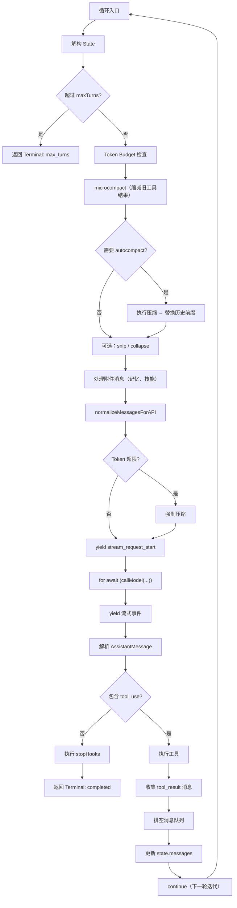

# 核心 Agent 循环（query loop）

这是 Claude Code 最核心的章节。Agent 的本质是一个循环：接收消息 → 调用 LLM → 解析工具调用 → 执行工具 → 将结果回注消息列表 → 再次调用 LLM，直到 LLM 不再需要调用工具为止。

## 入口：`query()` 和 `queryLoop()`

核心循环定义在 `src/query.ts` 中，分为两层：

```typescript
// 外层：生命周期管理
export async function* query(params: QueryParams): AsyncGenerator<...> {
    const terminal = yield* queryLoop(params, consumedCommandUuids);
    // 通知已消费命令的生命周期完成
    for (const uuid of consumedCommandUuids) {
        notifyCommandLifecycle(uuid, 'completed');
    }
    return terminal;
}

// 内层：实际的 while(true) 状态机
async function* queryLoop(params: QueryParams): AsyncGenerator<...> {
    let state: State = { ... };
    while (true) {
        // 每轮迭代
    }
}
```

注意 `query()` 是一个 **async generator**——它通过 `yield` 向消费者（REPL 或 SDK）推送流式事件和消息。

## 状态机设计

`queryLoop` 维护一个可变的 `State` 对象，在每轮迭代开始时解构：

```typescript
type State = {
    messages: Message[]                           // 会话消息列表
    toolUseContext: ToolUseContext                 // 工具执行上下文
    autoCompactTracking: AutoCompactTrackingState  // 自动压缩追踪
    maxOutputTokensRecoveryCount: number           // max_tokens 恢复计数
    hasAttemptedReactiveCompact: boolean           // 是否尝试过反应式压缩
    maxOutputTokensOverride: number | undefined    // token 上限覆盖
    pendingToolUseSummary: Promise<...> | undefined // 待完成的工具摘要
    stopHookActive: boolean | undefined            // 停止钩子是否激活
    turnCount: number                              // 当前轮次
    transition: Continue | undefined               // 上一轮的继续原因
}
```

每个 continue 站点（循环继续的地方）都通过 `state = { ...state, ...changes }` 整体替换状态，而非逐字段修改。

## 单轮迭代流程



## 关键步骤详解

### 1. 上下文准备

每轮迭代开始时，循环执行多项上下文管理操作：

**Token 预算检查**：`checkTokenBudget()` 评估输出 token 是否超过递减回报阈值，决定是否继续。

**微压缩（microcompact）**：对历史工具结果做增量缩减，减少 token 占用而不丢失上下文。

**自动压缩（autocompact）**：当 token 用量接近上下文窗口阈值时，触发全量压缩——用分叉 agent 摘要历史，替换为精简的摘要消息。

### 2. 调用 LLM

```typescript
for await (const event of deps.callModel(messagesForQuery, {
    systemPrompt: prependUserContext(systemPrompt, userContext),
    // ... 配置
})) {
    yield event;  // 将流式事件传递给消费者
}
```

`deps.callModel` 指向 `queryModelWithStreaming`（见 [12-api-streaming.md](12-api-streaming.md)），返回 `AssistantMessage` 和流式事件。

### 3. 工具执行

当 assistant message 包含 `tool_use` blocks 时，进入工具执行阶段：

```typescript
// 流式工具执行（特性开关控制）
if (streamingToolExecutor) {
    // 工具在流式传输过程中就开始执行
    results = streamingToolExecutor.getCompletedResults();
} else {
    // 批量执行：流完成后统一执行
    results = yield* runTools(toolUseBlocks, toolUseContext, canUseTool);
}
```

两种模式详见 [04-tool-system.md](04-tool-system.md)。

### 4. 消息队列排空

在工具执行后、下一轮 LLM 调用前，循环会检查并消费**消息队列**中的待处理命令（如中间插入的斜杠命令、附件消息）：

```typescript
const queuedCommands = getCommandsByMaxPriority();
for (const cmd of queuedCommands) {
    // 处理排队的命令，生成附件消息
}
```

### 5. 状态更新与继续

```typescript
state = {
    ...state,
    messages: [...messagesForQuery, ...assistantMessages, ...toolResults],
    turnCount: state.turnCount + 1,
    transition: { reason: 'tool_use' },
}
continue;  // 进入下一轮迭代
```

## 终止条件

循环可以通过多种方式终止，返回 `Terminal` 类型：

| 终止原因 | 条件 | 说明 |
|----------|------|------|
| `completed` | assistant 无 tool_use 且 stop_reason 正常 | 正常完成 |
| `aborted_tool_use` | 用户取消了工具执行 | 用户中断 |
| `aborted_api_request` | 用户取消了 API 请求 | 用户中断 |
| `max_turns` | `turnCount > maxTurns` | 达到最大轮次限制 |
| `error` | API 错误或异常 | 错误退出 |
| `max_output_tokens` | 连续 3 次 max_output_tokens 恢复失败 | 输出过长 |

## `QueryDeps` 依赖注入

循环的外部依赖通过 `QueryDeps` 接口注入，便于测试：

```typescript
// src/query/deps.ts
export type QueryDeps = {
    callModel: typeof queryModelWithStreaming    // LLM 调用
    microcompact: typeof microcompactMessages   // 微压缩
    autocompact: typeof compactConversation     // 自动压缩
    uuid: () => string                          // UUID 生成
}

// 生产环境
export const productionDeps = (): QueryDeps => ({
    callModel: queryModelWithStreaming,
    microcompact: microcompactMessages,
    autocompact: compactConversation,
    uuid: crypto.randomUUID,
})
```

测试可以注入 mock 依赖，无需真正调用 API。

## `QueryConfig` 不可变配置

在循环入口处，`buildQueryConfig()` 快照当前的配置状态：

```typescript
// src/query/config.ts
const config = buildQueryConfig();
// config.sessionId, config.gates (特性开关), ...
```

这确保整个循环过程中配置不变，避免中途切换导致的不一致。

## `stopHooks` 后处理

当循环正常完成（无 tool_use）时，执行 `handleStopHooks()`：

- 保存缓存安全参数
- 运行作业分类器（feature-gated）
- 生成提示建议
- 提取记忆
- 自动做梦（auto-dream）
- 执行用户定义的停止钩子

如果 stopHooks 产生了新消息（如用户钩子输出），这些消息会被 yield 出去。

## QueryEngine vs REPL

| 特性 | REPL（交互模式） | QueryEngine（SDK 模式） |
|------|------------------|------------------------|
| 入口 | `REPL.tsx` → `query()` | `QueryEngine.submitMessage()` → `query()` |
| 用户输入 | 通过 `PromptInput` 组件 | 通过 `submitMessage()` API |
| 流式输出 | Ink 组件渲染 | 事件回调 / 结构化 IO |
| 消息管理 | REPL state | `mutableMessages` 列表 |
| 会话持久化 | REPL 管理 | `recordTranscript` |
| 核心 | 共享同一个 `query()` | 共享同一个 `query()` |

两种模式的核心区别仅在于用户输入如何变成 `messages`、以及 `yield` 出的事件如何被渲染或序列化。

## 关键源文件

| 文件 | 职责 |
|------|------|
| `src/query.ts` | 核心循环：`query()` / `queryLoop()` |
| `src/query/deps.ts` | 依赖注入接口 |
| `src/query/config.ts` | 查询配置快照 |
| `src/query/stopHooks.ts` | 后处理钩子 |
| `src/query/tokenBudget.ts` | Token 预算追踪 |
| `src/query/transitions.ts` | Terminal / Continue 类型定义 |
| `src/QueryEngine.ts` | SDK 模式封装 |
| `src/utils/handlePromptSubmit.ts` | REPL 模式的提交处理 |
| `src/utils/processUserInput/processUserInput.ts` | 用户输入 → 消息转换 |

## 下一步

前往 [04-tool-system.md](04-tool-system.md) 了解工具是如何定义、注册和执行的。

## 动手实验

本章有对应的 Python 实验，通过编码复现上述概念：

> **[实验 03 — 核心 Agent 循环](experiments/03-核心Agent循环实验.md)**
>
> 涵盖内容：async generator 循环、状态机、工具调度
>
> ```bash
> cd experiments && python -m exp_03_core_agent_loop.main --mock
> ```
