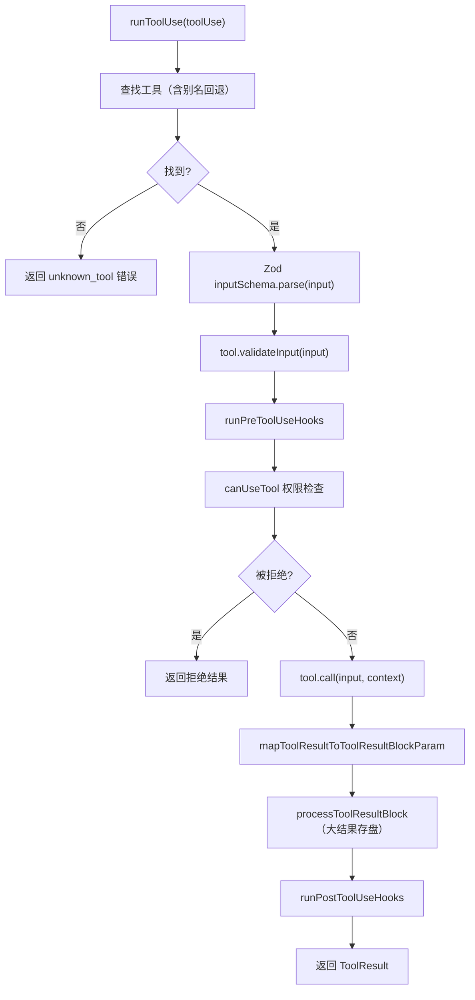

# 工具系统：定义、注册、调度、执行

工具是 Agent 与外部世界交互的"手"。Claude Code 的工具系统设计精巧，覆盖了从定义到权限到执行的完整生命周期。

## Tool 接口

所有工具共享统一的 `Tool<Input, Output>` 接口，定义在 `src/Tool.ts`：

```typescript
type Tool<Input, Output, P = unknown> = {
    // 基本信息
    name: string
    description?: string
    
    // 输入验证
    inputSchema: z.ZodType<Input>          // Zod schema（运行时验证）
    inputJSONSchema?: ToolInputJSONSchema  // JSON Schema（供 MCP 使用）
    
    // 核心执行
    call(
        input: Input,
        context: ToolUseContext,
        canUseTool: CanUseToolFn,
        parentMessage: AssistantMessage,
        onProgress?: (data: ToolProgressData) => void,
    ): Promise<ToolResult<Output>>
    
    // 权限检查
    checkPermissions(
        input: Input,
        context: ToolPermissionContext,
        workingDir: string,
    ): Promise<PermissionResult>
    
    // 输入验证（在 Zod 之后的语义验证）
    validateInput?(input: Input): ValidationResult
    
    // 结果映射（将 Output 转为 API 格式）
    mapToolResultToToolResultBlockParam(
        result: ToolResult<Output>,
        context: ToolUseContext,
    ): ToolResultBlockParam
    
    // UI 渲染
    renderToolUseMessage?(input: Input, output: Output): React.ReactNode
    renderToolResultMessage?(result: ToolResult<Output>): React.ReactNode
    
    // 元信息
    isConcurrencySafe?: boolean           // 是否可并发执行
    isReadOnly?: () => boolean             // 是否只读
    isMcp?: boolean                        // 是否来自 MCP
    isEnabled?: (context: ToolUseContext) => boolean  // 动态启用/禁用
    maxResultSizeChars?: number            // 结果最大字符数
}
```

### `ToolResult<T>` 结构

```typescript
type ToolResult<T> = {
    data: T                                // 工具输出数据
    newMessages?: Message[]                 // 附加消息（如错误提示）
    contextModifier?: (ctx: ToolUseContext) => ToolUseContext  // 上下文修改
    mcpMeta?: { ... }                       // MCP 元信息
}
```

## `buildTool()` 工厂函数

每个工具通过 `buildTool()` 构建，它合并 `TOOL_DEFAULTS` 提供安全的默认值：

```typescript
const TOOL_DEFAULTS = {
    checkPermissions: () => ({ result: 'allow' }),  // 默认允许
    isConcurrencySafe: false,                       // 默认不可并发
    isReadOnly: () => false,                        // 默认非只读
    // ...
}

export function buildTool<I, O>(def: ToolDef<I, O>): Tool<I, O> {
    return { ...TOOL_DEFAULTS, ...def };
}
```

### 工具实现示例

以 `GlobTool` 为例：

```typescript
// src/tools/GlobTool/GlobTool.ts
export const GlobTool = buildTool({
    name: 'Glob',
    inputSchema: z.object({
        pattern: z.string(),
        path: z.string().optional(),
    }),
    isConcurrencySafe: true,
    isReadOnly: () => true,
    
    async call(input, context) {
        const results = await glob(input.pattern, input.path);
        return { data: results };
    },
    
    mapToolResultToToolResultBlockParam(result) {
        return { type: 'tool_result', content: JSON.stringify(result.data) };
    },
});
```

## `ToolUseContext` 运行时上下文

`ToolUseContext` 是传递给每个工具调用的丰富上下文对象：

```typescript
type ToolUseContext = {
    options: {
        commands: Command[]              // 可用命令列表
        tools: Tools                     // 可用工具列表
        mainLoopModel: string            // 当前模型
        mcpClients: MCPServerConnection[] // MCP 连接
        thinkingConfig: ThinkingConfig   // 思考配置
        // ...
    }
    abortController: AbortController     // 取消控制
    readFileState: FileStateCache        // 文件状态缓存
    getAppState(): AppState              // 应用状态
    setAppState(f): void                 // 更新应用状态
    messages: Message[]                  // 当前消息列表
    // ...
}
```

## 工具注册

### `getAllBaseTools()`

`src/tools.ts` 中的 `getAllBaseTools()` 返回所有内置工具的完整列表：

```typescript
export function getAllBaseTools(): Tools {
    return [
        AgentTool,
        BashTool,
        FileEditTool,
        FileReadTool,
        FileWriteTool,
        GlobTool,
        GrepTool,
        NotebookEditTool,
        WebFetchTool,
        WebSearchTool,
        SkillTool,
        TodoWriteTool,
        // ... 以及条件加载的工具
        ...(SleepTool ? [SleepTool] : []),
        ...(cronTools),
        // ...
    ];
}
```

### Feature-gated 工具

许多工具通过 `bun:bundle` 的 `feature()` 或环境变量条件加载，在编译期消除死代码：

```typescript
const SleepTool = feature('PROACTIVE') || feature('KAIROS')
    ? require('./tools/SleepTool/SleepTool.js').SleepTool
    : null;
```

### `getTools()` 过滤

`getTools(permissionContext)` 在 `getAllBaseTools()` 基础上过滤：

1. 应用 deny 规则
2. 移除 REPL-only 工具（在非交互模式下）
3. 检查 `isEnabled()` 动态条件
4. 应用 "simple" 模式限制

### `assembleToolPool()` 合并 MCP 工具

```typescript
export function assembleToolPool(builtInTools, mcpTools) {
    // 内置工具优先（名称冲突时内置工具胜出）
    // MCP 工具以 mcp__serverName__toolName 命名
    return [...builtInTools, ...filteredMcpTools];
}
```

## 内置工具清单

### 文件操作

| 工具 | 说明 | 并发安全 |
|------|------|----------|
| `FileReadTool` | 读取文件（支持图片、PDF、notebook） | 是 |
| `FileWriteTool` | 创建/覆盖文件 | 否 |
| `FileEditTool` | 部分修改文件（字符串替换） | 否 |
| `NotebookEditTool` | Jupyter notebook 编辑 | 否 |
| `GlobTool` | 文件名模式匹配 | 是 |
| `GrepTool` | 基于 ripgrep 的内容搜索 | 是 |

### Shell 执行

| 工具 | 说明 |
|------|------|
| `BashTool` | Shell 命令执行（带沙箱选项） |
| `PowerShellTool` | PowerShell 执行（Windows） |

### 网络

| 工具 | 说明 |
|------|------|
| `WebFetchTool` | 获取 URL 内容 |
| `WebSearchTool` | 网络搜索 |

### Agent 与任务

| 工具 | 说明 |
|------|------|
| `AgentTool` | 子 Agent 生成（嵌套 query 循环） |
| `TaskCreateTool` | 创建后台任务 |
| `TaskGetTool` / `TaskListTool` | 查询任务 |
| `TaskUpdateTool` / `TaskStopTool` | 管理任务 |
| `TaskOutputTool` | 获取任务输出 |
| `SendMessageTool` | 向其他 Agent 发消息 |
| `TeamCreateTool` / `TeamDeleteTool` | 创建/删除 Teammate |

### 其他

| 工具 | 说明 |
|------|------|
| `SkillTool` | 执行技能 |
| `MCPTool` | 调用 MCP 服务器工具 |
| `LSPTool` | Language Server 操作 |
| `TodoWriteTool` | 任务清单管理 |
| `EnterPlanModeTool` / `ExitPlanModeTool` | 计划模式切换 |
| `ConfigTool` | 运行时配置修改 |
| `BriefTool` | 切换简洁输出模式 |
| `ToolSearchTool` | 延迟工具发现 |

## 工具调度流水线

### `toolOrchestration.ts` — 编排层

```typescript
// src/services/tools/toolOrchestration.ts
export async function* runTools(toolUseBlocks, context, canUseTool) {
    // 1. 分区：并发安全 vs 串行
    const batches = partitionToolCalls(toolUseBlocks);
    
    for (const batch of batches) {
        if (batch.concurrent) {
            // 并发执行（上限 CLAUDE_CODE_MAX_TOOL_USE_CONCURRENCY）
            const results = await Promise.all(
                batch.tools.map(t => runToolUse(t, context, canUseTool))
            );
        } else {
            // 串行执行
            for (const tool of batch.tools) {
                yield* runToolUse(tool, context, canUseTool);
            }
        }
    }
}
```

`partitionToolCalls` 将工具调用分为：
- **并发安全批次**（`isConcurrencySafe: true`）：如 FileRead、Glob、Grep
- **串行批次**（`isConcurrencySafe: false`）：如 FileWrite、BashTool

### `toolExecution.ts` — 执行层

单个工具的执行流程：



### `StreamingToolExecutor` — 流式执行器

当特性开关 `tengu_streaming_tool_execution2` 开启时，工具在 LLM 流式响应的同时就开始执行：

```typescript
// 工具参数在流式传输中逐步完成
// 一旦工具的输入完整，立即开始执行
class StreamingToolExecutor {
    addTool(toolUse: ToolUseBlock) {
        if (tool.isConcurrencySafe) {
            // 立即并发启动
            this.runConcurrently(toolUse);
        } else {
            // 排队等待前面的工具完成
            this.queueForSerial(toolUse);
        }
    }
    
    getCompletedResults(): MessageUpdate[] { ... }
}
```

## 工具结果处理

### 大结果存盘

当工具结果超过 `maxResultSizeChars` 阈值时，`processToolResultBlock` 将完整结果写入磁盘，在消息中只保留预览 + 文件路径：

```typescript
// src/utils/toolResultStorage.ts
// 超过阈值的结果保存到：session/tool-results/<id>.txt
// 消息中替换为：[PERSISTED_OUTPUT_TAG] 预览 + 路径
```

### 结果预算

`applyToolResultBudget` 在每轮迭代开始时，对历史工具结果施加 token 预算，确保不超出上下文窗口。

## 关键源文件

| 文件 | 职责 |
|------|------|
| `src/Tool.ts` | Tool 接口、ToolUseContext、buildTool() |
| `src/tools.ts` | 工具注册表：getAllBaseTools()、getTools()、assembleToolPool() |
| `src/services/tools/toolOrchestration.ts` | 工具编排：partitionToolCalls、runTools |
| `src/services/tools/toolExecution.ts` | 工具执行：runToolUse、checkPermissionsAndCallTool |
| `src/services/tools/StreamingToolExecutor.ts` | 流式并发执行器 |
| `src/services/tools/toolHooks.ts` | 工具前/后置钩子 |
| `src/utils/toolResultStorage.ts` | 大结果存盘与预算管理 |
| `src/constants/tools.ts` | 工具常量（子 Agent 禁用列表等） |

## 下一步

前往 [05-permission-security.md](05-permission-security.md) 了解工具执行前的权限检查机制。

## 动手实验

本章有对应的 Python 实验，通过编码复现上述概念：

> **[实验 04 — 工具系统](experiments/04-工具系统实验.md)**
>
> 涵盖内容：Tool 协议、Pydantic 验证、注册表、批量执行
>
> ```bash
> cd experiments && python -m exp_04_tool_system.main --mock
> ```
