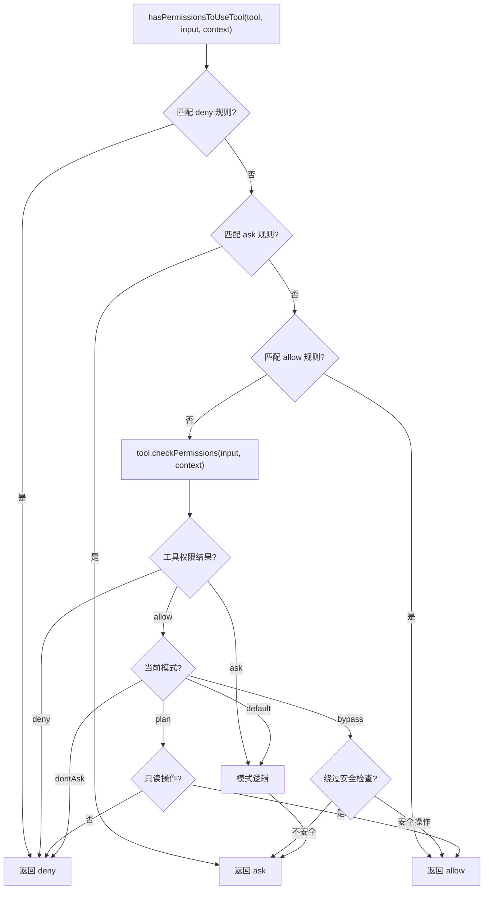
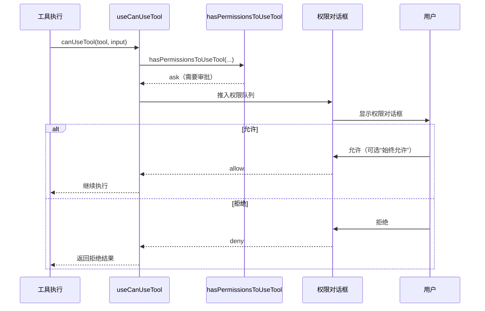

# 权限模型与安全机制

Claude Code 的安全设计围绕一个核心原则：**每次工具调用都必须经过权限检查**。权限系统是多层的——从静态规则到运行时审批到沙箱隔离。

## 权限模式（PermissionMode）

系统定义了五种权限模式，控制工具执行时的默认行为：

| 模式 | 说明 | 典型场景 |
|------|------|----------|
| `default` | 危险操作需要用户审批 | 正常交互使用 |
| `plan` | 只读模式，写操作被拒绝 | 规划阶段 |
| `acceptEdits` | 自动允许文件编辑，其他危险操作仍需审批 | 信任文件操作时 |
| `bypassPermissions` | 跳过大部分权限检查 | 完全信任（CI 等） |
| `dontAsk` | 不弹出审批对话框，自动拒绝需审批的操作 | 后台 Agent |

另有实验性的 `auto` 模式，使用分类器自动判断是否允许。

## 规则体系

### 规则类型

权限规则分为三类：

- **allow**：始终允许（不弹审批）
- **deny**：始终拒绝
- **ask**：需要用户审批（在 `default` 模式下）

### 规则格式

```typescript
type PermissionRule = {
    toolName: string       // 工具名称（如 "Bash"、"FileWrite"）
    ruleContent?: string   // 可选的具体规则内容（如命令模式 "npm *"）
}
```

### 规则来源与优先级

规则来自多个来源，按优先级排列：

```typescript
const SETTING_SOURCES = [
    'userSettings',      // ~/.claude/settings.json（用户级）
    'projectSettings',   // .claude/settings.json（项目级）
    'localSettings',     // .claude/settings.local.json（本地，git 忽略）
    'flagSettings',      // 特性开关设置
    'policySettings',    // 企业策略设置
    'cliArg',            // 命令行参数
    'command',           // 命令触发
    'session',           // 会话级临时设置
]
```

### `ToolPermissionContext`

权限上下文汇聚了所有规则来源：

```typescript
type ToolPermissionContext = {
    mode: PermissionMode
    alwaysAllowRules: ToolPermissionRulesBySource  // 按来源分组的 allow 规则
    alwaysDenyRules: ToolPermissionRulesBySource   // 按来源分组的 deny 规则
    alwaysAskRules: ToolPermissionRulesBySource    // 按来源分组的 ask 规则
    isBypassPermissionsModeAvailable: boolean
    isAutoModeAvailable?: boolean
    shouldAvoidPermissionPrompts?: boolean          // 后台 Agent 标记
    additionalWorkingDirectories: Map<string, AdditionalWorkingDirectory>
}
```

## 权限判定流程

`hasPermissionsToUseTool` 是权限判定的核心函数：



### bypass 模式的安全边界

即使在 `bypassPermissions` 模式下，某些检查仍然执行（"bypass-immune"）：

- 目录越权检查（不允许操作工作目录之外的文件）
- 网络安全检查
- 其他 bypass 免疫的安全规则

## Sandbox 机制

### `@anthropic-ai/sandbox-runtime`

Claude Code 集成了 Anthropic 的沙箱运行时，为 Bash 命令执行提供隔离环境：

```typescript
// src/utils/sandbox/sandbox-adapter.ts
class SandboxManager {
    // 从设置初始化沙箱配置
    initFromSettings(settings) { ... }
    
    // 包装命令在沙箱中执行
    wrapCommand(command) { ... }
    
    // 文件系统规则
    fsReadConfig: { ... }
    fsWriteConfig: { ... }
    networkConfig: { ... }
    
    // 违规处理
    onViolation(violation) { ... }
}
```

### Bash 沙箱决策

```typescript
// src/tools/BashTool/shouldUseSandbox.ts
function shouldUseSandbox(command, settings): boolean {
    // excludedCommands 只是便利性，不是安全边界
    // 安全边界是沙箱权限系统本身
}
```

当沙箱启用且"sandbox 内自动允许 Bash"设置开启时，在沙箱中运行的 Bash 命令可以自动跳过权限审批。

## 交互式权限审批

### 审批流程



### 权限 UI 组件

`src/components/permissions/` 下有针对不同工具的权限审批 UI：

| 组件 | 场景 |
|------|------|
| `BashPermissionRequest` | Bash 命令审批 |
| `FileWritePermissionRequest` | 文件写入审批 |
| `FileEditPermissionRequest` | 文件编辑审批 |
| `NotebookEditPermissionRequest` | Notebook 编辑审批 |
| `PowerShellPermissionRequest` | PowerShell 命令审批 |
| `SkillPermissionRequest` | 技能执行审批 |
| `WebFetchPermissionRequest` | URL 获取审批 |
| `FilesystemPermissionRequest` | 文件系统操作审批 |

## Swarm 场景的权限同步

当多个 Agent（leader + teammates）协作时，权限需要同步：

- `src/utils/swarm/permissionSync.ts`：权限同步协议
- `src/utils/swarm/leaderPermissionBridge.ts`：leader 权限桥接
- `src/utils/teammateMailbox.ts`：权限请求/响应通过文件邮箱传递

Teammate 可以通过邮箱向 leader 请求权限审批，leader 的审批结果会传播给 teammate。

## 认证与 API Key

认证由 `src/utils/auth.ts` 统一管理：

| 认证方式 | 说明 |
|----------|------|
| API Key | `ANTHROPIC_API_KEY` 环境变量 |
| OAuth（Claude.ai） | OAuth 2.0 流程，token 存储在 keychain |
| Bedrock | AWS 凭证 |
| Vertex | GCP 凭证 |
| Foundry | Foundry 认证 |

安全存储使用 `src/utils/secureStorage/`（macOS Keychain 集成）。

## 关键源文件

| 文件 | 职责 |
|------|------|
| `src/types/permissions.ts` | PermissionMode、规则类型定义 |
| `src/utils/permissions/permissions.ts` | hasPermissionsToUseTool 核心逻辑 |
| `src/utils/permissions/permissionSetup.ts` | 权限上下文初始化 |
| `src/utils/permissions/permissionsLoader.ts` | 规则加载 |
| `src/utils/permissions/PermissionRule.ts` | 规则解析 |
| `src/utils/sandbox/sandbox-adapter.ts` | SandboxManager |
| `src/tools/BashTool/bashPermissions.ts` | Bash 工具权限逻辑 |
| `src/hooks/useCanUseTool.tsx` | CanUseToolFn Hook |
| `src/hooks/toolPermission/` | 权限处理器（交互/协调/swarm） |
| `src/components/permissions/` | 权限审批 UI 组件 |
| `src/utils/auth.ts` | 认证管理 |

## 下一步

前往 [06-context-prompt.md](06-context-prompt.md) 了解 System Prompt 是如何组装的。

## 动手实验

本章有对应的 Python 实验，通过编码复现上述概念：

> **[实验 05 — 权限引擎](experiments/05-权限引擎实验.md)**
>
> 涵盖内容：权限模式、规则优先级、决策引擎
>
> ```bash
> cd experiments && python -m exp_05_permission_engine.main --mock
> ```
