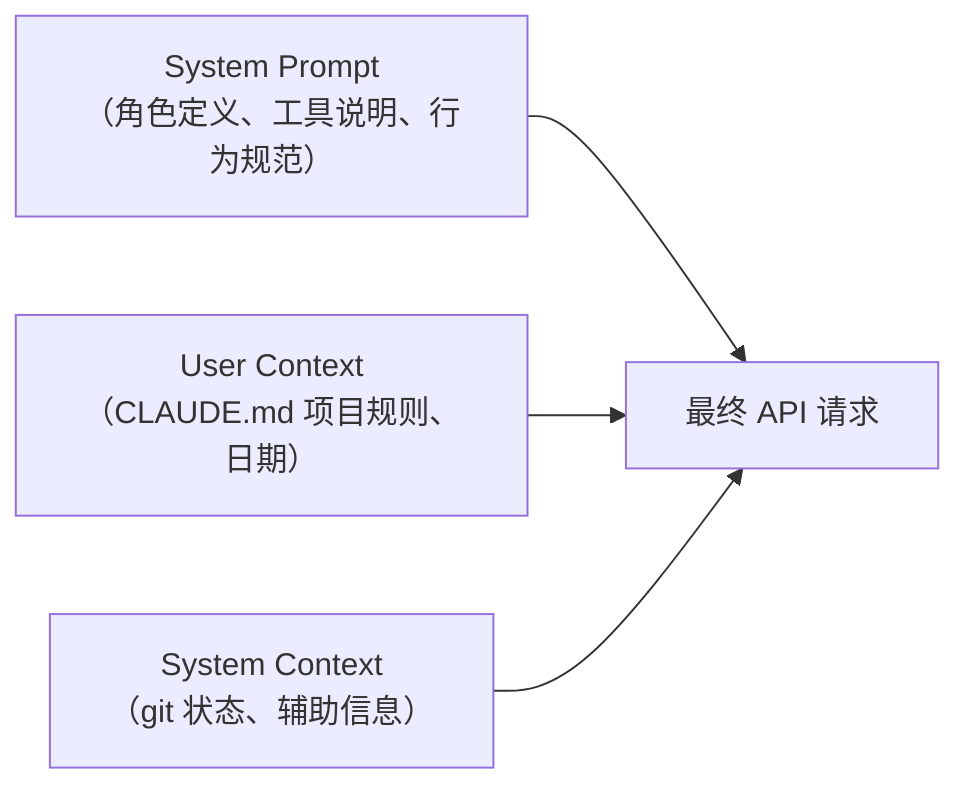

# 上下文组装与 System Prompt 工程

Claude Code 发送给 LLM 的每个请求由三部分上下文组成。这套上下文组装系统是 Agent 表现的关键——它决定了 LLM "知道什么"、"怎么行动"。

## 三部分上下文结构



这三部分由 `src/utils/queryContext.ts` 中的 `fetchSystemPromptParts` 并行加载：

```typescript
// src/utils/queryContext.ts
export async function fetchSystemPromptParts(tools, model) {
    const [systemPrompt, userContext, systemContext] = await Promise.all([
        getSystemPrompt(tools, model),
        getUserContext(),
        getSystemContext(),
    ]);
    return { systemPrompt, userContext, systemContext };
}
```

## System Prompt 组装

### `getSystemPrompt()` — 主系统提示

定义在 `src/constants/prompts.ts`，是最核心的提示词组装函数。

### 组装结构

System Prompt 分为**静态前缀**和**动态分节**两部分，中间由缓存边界标记分隔：

```
┌─────────────────────────────────────────────┐
│ 静态前缀（可缓存）                            │
│  - 角色定义：你是 Claude，一个 AI 助手...      │
│  - 工具说明：你可以使用以下工具...              │
│  - 行为规范：输出风格、安全规则、代码规范       │
│  - 工具专项指南：每个工具的使用说明             │
├─────── SYSTEM_PROMPT_DYNAMIC_BOUNDARY ──────┤
│ 动态分节（每次可能不同）                       │
│  - 记忆指令                                   │
│  - 环境信息                                   │
│  - 语言偏好                                   │
│  - MCP 服务器说明                             │
│  - 输出风格设置                               │
│  - 其他 feature-gated 分节                    │
└─────────────────────────────────────────────┘
```

### 缓存边界的设计意图

`SYSTEM_PROMPT_DYNAMIC_BOUNDARY` 的存在是为了优化 Anthropic API 的 **prompt caching**：

- 边界之前的静态内容在多轮对话中保持不变，可以利用 API 的 cache_control
- 边界之后的动态内容每次可能变化，不参与缓存
- 这样避免了因动态内容变化而导致整个 system prompt 缓存失效

### 动态分节系统

```typescript
// src/constants/systemPromptSections.ts
export function systemPromptSection(
    key: string,
    compute: () => Promise<string | null>,
): SystemPromptSectionDescriptor {
    // 带会话级缓存的分节
    // 计算一次后缓存，直到 /clear 或 compact 时清除
}

export function DANGEROUS_uncachedSystemPromptSection(
    key: string,
    compute: () => Promise<string | null>,
): SystemPromptSectionDescriptor {
    // 不缓存，每次都重新计算
}
```

分节注册在 `getSystemPrompt()` 中：

```typescript
const sections = [
    systemPromptSection('memory_instructions', () => loadMemoryPrompt()),
    systemPromptSection('environment', () => getEnvironmentInfo()),
    systemPromptSection('language', () => getLanguagePreference()),
    systemPromptSection('mcp_instructions', () => getMcpInstructions()),
    // ...
];

const resolvedSections = await resolveSystemPromptSections(sections);
```

当 `/clear` 命令或 compact 执行时，`clearSystemPromptSections()` 清除所有缓存，让动态分节在下次请求时重新计算。

## User Context

### `getUserContext()` — 用户/项目上下文

定义在 `src/context.ts`，返回一个 `{ [key: string]: string }` 字典。

主要内容：

1. **CLAUDE.md 链式加载**：通过 `getClaudeMds()` 从多个位置加载项目规则文件
2. **当前日期**：注入 `currentDate` 供 LLM 感知时间

### CLAUDE.md 发现机制

```
优先级（从高到低）：
1. 工作目录下的 CLAUDE.md
2. 项目根目录的 CLAUDE.md
3. 父目录链中的 CLAUDE.md
4. ~/.claude/CLAUDE.md（全局）
```

这些文件的内容被合并后作为 user context 注入到 API 请求中。

### 记忆文件过滤

`getUserContext()` 会过滤掉已经通过记忆系统注入的文件，避免重复。

## System Context

### `getSystemContext()` — 系统辅助上下文

同样定义在 `src/context.ts`，返回 `{ [key: string]: string }`。

主要内容：

| Key | 内容 |
|-----|------|
| git 状态 | 当前 branch、status（feature-gated） |
| 缓存破坏器 | 内部使用的缓存标记 |

## 上下文注入到 API 请求

在 `query.ts` 的循环中，三部分上下文被组装到 API 请求：

```typescript
// src/query.ts 循环内部
const messagesForAPI = normalizeMessagesForAPI(messages);

deps.callModel(messagesForAPI, {
    systemPrompt: prependUserContext(systemPrompt, userContext),
    // systemContext 通过 appendSystemContext 追加
    ...appendSystemContext(systemContext),
});
```

- `prependUserContext`：将 user context 前置到 system prompt
- `appendSystemContext`：将 system context 追加

## 上下文大小管理

上下文大小直接影响 API 成本和性能：

- **Token 估算**：`tokenCountWithEstimation()` 快速估算消息 token 数
- **上下文窗口**：`getContextWindowForModel()` 获取模型的上下文窗口大小
- **自动压缩**：当接近上下文窗口时触发（详见 [14-compact-context-mgmt.md](14-compact-context-mgmt.md)）
- **工具结果预算**：`applyToolResultBudget()` 限制历史工具结果的大小

## 关键源文件

| 文件 | 职责 |
|------|------|
| `src/constants/prompts.ts` | `getSystemPrompt()`：主系统提示组装 |
| `src/constants/systemPromptSections.ts` | 动态分节系统（缓存、解析） |
| `src/context.ts` | `getUserContext()` / `getSystemContext()` |
| `src/utils/queryContext.ts` | `fetchSystemPromptParts()`：并行加载三部分上下文 |
| `src/utils/systemPromptType.ts` | SystemPrompt 类型定义 |
| `src/utils/api.ts` | `prependUserContext` / `appendSystemContext` |

## 下一步

前往 [07-memory-system.md](07-memory-system.md) 了解记忆系统如何跨会话保持知识。

## 动手实验

本章有对应的 Python 实验，通过编码复现上述概念：

> **[实验 06 — 提示词组装](experiments/06-提示词组装实验.md)**
>
> 涵盖内容：三段式组装、缓存边界、CLAUDE.md 链
>
> ```bash
> cd experiments && python -m exp_06_prompt_assembly.main --mock
> ```
