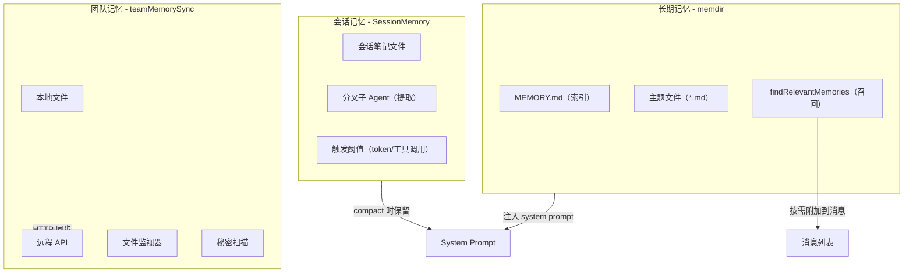
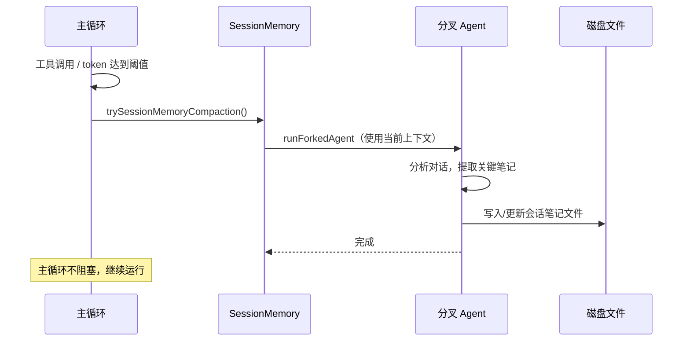
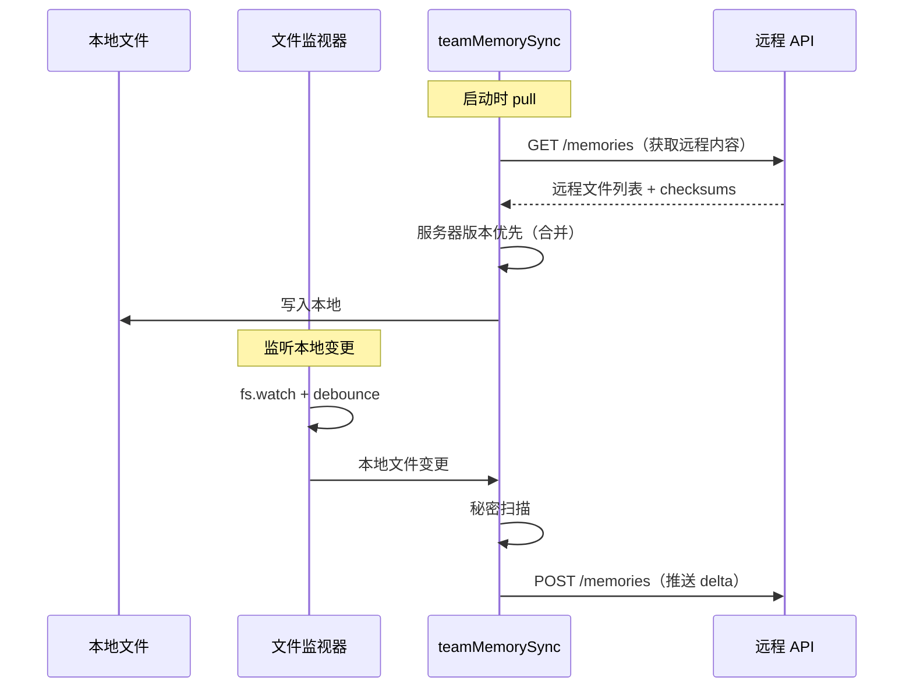

# 记忆系统：会话记忆、长期记忆、团队记忆

Claude Code 实现了三层记忆架构，让 Agent 能够跨会话、跨团队持续学习和积累知识。

## 三层记忆架构概览



## 第一层：长期记忆（memdir）

长期记忆存储在项目的持久化记忆目录中，跨会话保持。

### 目录结构

```
.claude/memory/
├── MEMORY.md          # 索引文件（始终包含在 system prompt 中）
├── coding-style.md    # 主题文件：编码风格偏好
├── project-arch.md    # 主题文件：项目架构笔记
├── api-patterns.md    # 主题文件：API 使用模式
└── ...
```

### 记忆写入

通过 `/memory` 命令或 Agent 自动提取（`extractMemories`），记忆被写入主题文件。每个文件使用 frontmatter 标记分类：

```typescript
// src/memdir/memoryTypes.ts
// 记忆类型分类，指导 Agent 如何组织记忆
```

### 记忆加载

`loadMemoryPrompt()` 将 `MEMORY.md` 的内容作为 system prompt 的一个动态分节加载：

```typescript
// src/memdir/memdir.ts
export async function loadMemoryPrompt(): Promise<string | null> {
    await ensureMemoryDirExists();
    // 读取 MEMORY.md，截断到 token 上限
    // 构建记忆指令文本
    return buildMemoryPrompt(content);
}
```

### 智能召回（findRelevantMemories）

当用户发送消息时，系统使用侧查询（side query）从记忆文件中召回最相关的内容：

```typescript
// src/memdir/findRelevantMemories.ts
// 1. 扫描记忆目录，获取文件清单（含 header）
// 2. 向 Sonnet 发送侧查询，让它选择最多 5 个相关文件
// 3. 将选中文件内容作为附件消息注入

export function startRelevantMemoryPrefetch(messages, context) {
    // 在 query 循环入口处异步启动
    // 结果在循环需要时 poll（从不阻塞）
}
```

这个预取在 `query()` 循环入口时启动，使用 `using` 语法确保在任何退出路径上正确清理。

## 第二层：会话记忆（SessionMemory）

会话记忆是当前会话的滚动笔记，由独立的子 Agent 定期提取。

### 工作机制



### 触发条件

```typescript
// src/services/SessionMemory/sessionMemoryUtils.ts
// 触发阈值：
// - token 使用量达到一定比例
// - 工具调用次数达到阈值
// - compact 时强制更新
```

### 与 Compact 的集成

当全量压缩（compact）发生时，会话记忆被特殊处理：

```typescript
// src/services/compact/sessionMemoryCompact.ts
// 1. 等待正在进行的记忆提取完成
// 2. 在 compact 边界保留/截断会话笔记
// 3. compact 后的摘要消息中包含记忆引用
```

### 分叉 Agent 的提取 Prompt

```typescript
// src/services/SessionMemory/prompts.ts
// buildSessionMemoryUpdatePrompt：指导分叉 Agent
// - 提取关键决策和上下文
// - 保留重要的技术细节
// - 更新而非重写已有笔记
```

## 第三层：团队记忆（teamMemorySync）

团队记忆允许多个用户或会话共享知识，通过 HTTP API 双向同步。

### 同步协议



### 秘密扫描

上传前会扫描内容中的敏感信息：

```typescript
// src/services/teamMemorySync/secretScanner.ts
// 扫描 API keys、密码、tokens 等
// 发现秘密时阻止上传

// src/services/teamMemorySync/teamMemSecretGuard.ts
// 额外的安全守卫
```

### 同步规则

```typescript
// src/services/teamMemorySync/index.ts
// - Pull：服务器版本优先（server wins）
// - Push：基于 checksum 的增量推送
// - 大小/批次限制
// - debounced 推送（本地编辑后延迟同步）
```

## 记忆注入到 System Prompt

记忆在 system prompt 中的注入路径：

```
getSystemPrompt()
  └─ systemPromptSection('memory_instructions', () => loadMemoryPrompt())
       └─ 读取 MEMORY.md → buildMemoryPrompt()
       
getUserContext()
  └─ getClaudeMds() → 过滤掉记忆文件避免重复
  
query() 循环
  └─ startRelevantMemoryPrefetch() → 侧查询召回
  └─ getAttachmentMessages() → 将召回结果作为附件消息
```

## 记忆类型分类

```typescript
// src/utils/memory/types.ts
type MemoryType = 
    | 'coding_style'      // 编码风格
    | 'project_structure'  // 项目结构
    | 'api_patterns'       // API 模式
    | 'debugging_notes'    // 调试笔记
    | 'workflow'           // 工作流程
    | ...
```

## 关键源文件

| 文件 | 职责 |
|------|------|
| `src/memdir/memdir.ts` | 记忆目录管理、loadMemoryPrompt |
| `src/memdir/paths.ts` | 记忆路径定义 |
| `src/memdir/memoryTypes.ts` | 记忆类型分类 |
| `src/memdir/memoryScan.ts` | 记忆文件扫描 |
| `src/memdir/findRelevantMemories.ts` | 智能召回（侧查询） |
| `src/memdir/teamMemPaths.ts` | 团队记忆路径 |
| `src/services/SessionMemory/sessionMemory.ts` | 会话记忆核心：分叉 agent 提取 |
| `src/services/SessionMemory/prompts.ts` | 提取 prompt |
| `src/services/SessionMemory/sessionMemoryUtils.ts` | 配置、阈值 |
| `src/services/teamMemorySync/index.ts` | HTTP 同步协议 |
| `src/services/teamMemorySync/watcher.ts` | 文件监视器 |
| `src/services/teamMemorySync/secretScanner.ts` | 秘密扫描 |
| `src/utils/memory/types.ts` | MemoryType 类型 |
| `src/services/extractMemories/` | 自动记忆提取 |

## 下一步

前往 [08-terminal-ui.md](08-terminal-ui.md) 了解终端 UI 的渲染架构。

## 动手实验

本章有对应的 Python 实验，通过编码复现上述概念：

> **[实验 07 — 记忆系统](experiments/07-记忆系统实验.md)**
>
> 涵盖内容：三层记忆、TF-IDF 召回、记忆注入
>
> ```bash
> cd experiments && python -m exp_07_memory_system.main --mock
> ```
