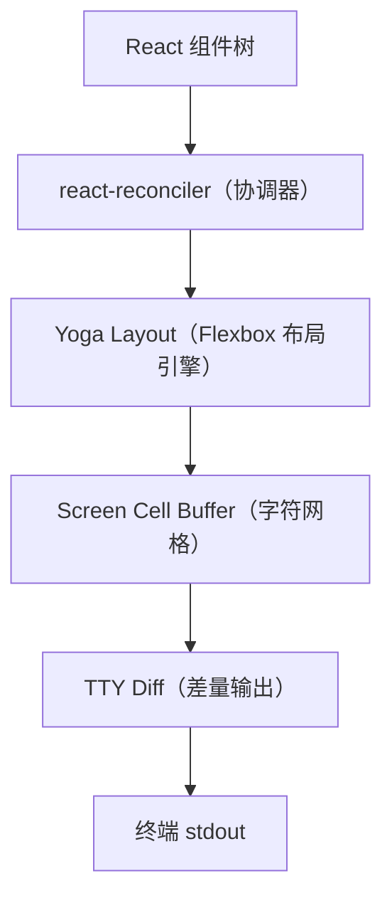
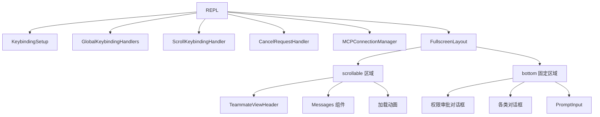
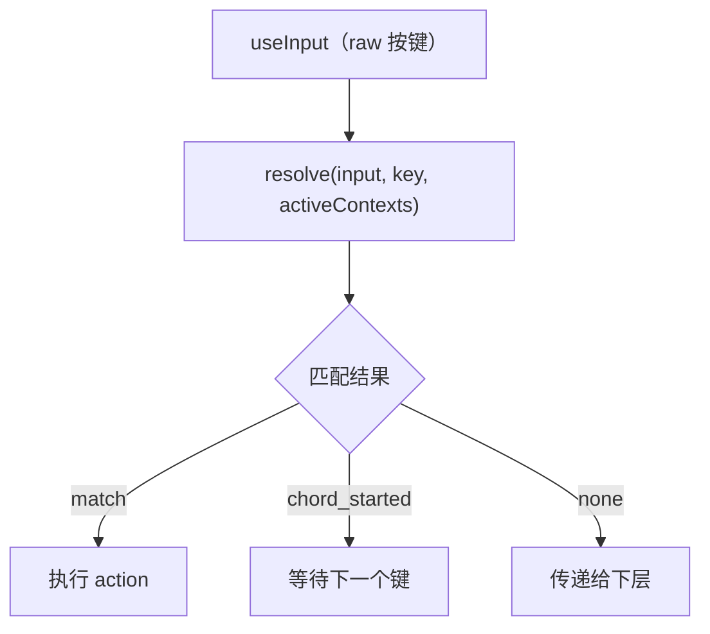

# 终端 UI：Ink/React 渲染架构

Claude Code 使用 React + Ink 构建了一个功能丰富的终端用户界面。但 Ink 层并非直接使用社区版本——它是一个**深度自定义的 fork**。

## Ink 渲染引擎

### 架构概览



### 关键组件

`src/ink/ink.tsx` 中的 `Ink` 类是渲染核心：

- **React Reconciler**：使用 `react-reconciler` 将 React 组件映射到自定义的终端节点
- **Yoga Layout**：Facebook 的 Flexbox 布局引擎，计算每个组件在终端中的位置
- **Screen Cell Buffer**：`screen.ts` 维护一个二维字符网格
- **Diff 输出**：只将变化的部分输出到 TTY，避免全屏重绘
- **Alt Screen**：支持备用屏幕缓冲区（`AlternateScreen`）
- **焦点管理**：组件焦点系统
- **帧调度**：控制渲染频率

### 布局原语

`src/ink/components/` 提供终端布局原语：

| 组件 | 说明 |
|------|------|
| `Box` | Flexbox 容器（类似 div） |
| `Text` | 文本渲染（支持样式） |
| `ScrollBox` | 可滚动容器 |
| `AlternateScreen` | 备用屏幕缓冲区 |

### 输入处理

`src/ink/hooks/use-input.ts` 中的 `useInput` 是输入处理的基础 Hook：

- 在 layout effect 中开启 raw mode（确保第一帧正确）
- 注册稳定的监听器（`stopImmediatePropagation` 顺序可预测）
- 支持 active/inactive 切换

输入事件管道：

```
TTY stdin → raw bytes → parse-keypress.ts → InputEvent → useInput 监听器链
```

## REPL.tsx — 应用编排中心

`src/screens/REPL.tsx` 是最大的单文件（约 3000+ 行），它是整个 TUI 的编排器。

### 组件树结构



### 双屏幕模式

REPL 支持两种屏幕：

1. **主聊天屏幕**：正常的对话交互界面
2. **对话历史（transcript）屏幕**：`Ctrl+O` 切换，全屏查看历史消息

```typescript
if (screen === 'transcript') {
    // 对话历史模式：支持搜索（/）、导航（n/N）、退出（q）
    return <AlternateScreen>
        <VirtualMessageList ... />
    </AlternateScreen>;
}

// 主聊天模式
return <FullscreenLayout
    scrollable={/* Messages + spinners */}
    bottom={/* PromptInput + dialogs */}
/>;
```

### 全屏布局

当 `isFullscreenEnvEnabled()` 时，整个界面在备用屏幕缓冲区中渲染，高度固定，滚动由 `ScrollBox` 管理。

## 消息渲染流水线

### Messages.tsx → MessageRow → Message


### Messages.tsx 的数据处理

`Messages.tsx` 对原始消息列表做大量预处理：

- **折叠**：连续的 compact 边界、brief 模式下的详情、hook/bash/teammate 输出
- **过滤**：移除不可见消息
- **分组**：将关联的 assistant + tool_result 分组显示
- **裁剪**：非虚拟模式下限制渲染行数

### Message.tsx 类型分派

`Message.tsx` 根据 `message.type` 分派到具体的消息组件：

| 类型 | 组件 | 说明 |
|------|------|------|
| `user` | `UserTextMessage` | 用户输入 |
| `assistant` (text) | `AssistantTextMessage` | 助手文本回复 |
| `assistant` (tool_use) | `AssistantToolUseMessage` | 工具调用展示 |
| `assistant` (thinking) | `AssistantThinkingMessage` | 思考过程 |
| `user` (tool_result) | `UserToolResultMessage/` | 工具结果展示 |
| `system` (compact) | `CompactBoundaryMessage` | 压缩边界标记 |
| `attachment` | 附件消息 | 记忆、技能附件 |

### 虚拟滚动

`VirtualMessageList` 实现了虚拟滚动优化：只挂载可见区域的消息组件，大幅减少 React 节点数量。

## PromptInput — 输入系统

### 核心组件

`src/components/PromptInput/PromptInput.tsx` 管理用户输入的方方面面：

- **输入模式**：`PromptInputMode`（正常、命令队列、建议等）
- **文本输入**：`TextInput`（标准）或 `VimTextInput`（Vim 模式）
- **命令补全**：斜杠命令自动补全
- **历史搜索**：`Ctrl+R` 搜索历史
- **粘贴处理**：大文本粘贴检测
- **模型切换**：模型选择器对话框

### TextInput vs VimTextInput

```typescript
// 标准模式
<TextInput value={text} onChange={setText} onSubmit={handleSubmit} />

// Vim 模式（用户配置启用）
<VimTextInput value={text} onChange={setText} onSubmit={handleSubmit} />
```

### Footer 提示

`PromptInputFooter` 显示可用的快捷键提示和状态信息。

## 快捷键系统

### 架构



### 关键组件

| 文件 | 职责 |
|------|------|
| `KeybindingProviderSetup.tsx` | 加载默认 + 用户自定义键绑定 |
| `KeybindingContext.tsx` | 提供 `resolve`、`registerHandler`、`invokeAction` |
| `useKeybinding.ts` | 单个绑定注册 Hook |
| `useKeybindings.ts` | 批量绑定注册 Hook |

### Chord 支持

支持组合键序列（如 `Ctrl+X Ctrl+S`）：

1. 第一个键按下 → 进入 chord 等待状态
2. 在超时内按下第二个键 → 匹配完整组合键
3. 超时或按下不匹配的键 → 取消 chord

### 绑定挂载顺序

REPL 中的绑定按特定顺序挂载，确保正确的优先级：

```
GlobalKeybindingHandlers → ScrollKeybindingHandler → CancelRequestHandler → PromptInput
```

滚动处理在取消处理之前，这样选中文本时 `Ctrl+C` 执行复制而非取消。

## Vim 模式

`src/vim/` 实现了纯逻辑的 Vim 状态机（无 React 依赖）：

### 状态机

```typescript
// src/vim/types.ts
type VimState = 
    | { type: 'INSERT', insertedText: string }
    | { type: 'NORMAL', command: CommandState }

// CommandState：idle / count / operator / operatorFind / textObject / g / replace / indent / ...
```

### 核心模块

| 文件 | 职责 |
|------|------|
| `transitions.ts` | `transition(state, input, ctx)` — 状态转移函数 |
| `motions.ts` | 移动命令（`w`, `b`, `e`, `$`, `0` 等） |
| `operators.ts` | 操作符（`d`, `c`, `y` 等） |
| `textObjects.ts` | 文本对象（`iw`, `aw`, `i"` 等） |

### 与 Ink 的集成

```
useVimInput → 构建 OperatorContext → transition() → 更新 inputState → BaseTextInput
```

Vim 模式是 `BaseTextInput` 的一个 drop-in 替代输入状态。

## 关键源文件

| 文件 | 职责 |
|------|------|
| `src/ink/ink.tsx` | Ink 渲染核心 |
| `src/ink/hooks/use-input.ts` | 输入 Hook |
| `src/ink/components/` | 布局原语 |
| `src/screens/REPL.tsx` | REPL 编排器 |
| `src/components/Messages.tsx` | 消息列表 |
| `src/components/Message.tsx` | 消息类型分派 |
| `src/components/messages/` | 各类消息组件 |
| `src/components/PromptInput/PromptInput.tsx` | 输入系统 |
| `src/keybindings/` | 快捷键系统 |
| `src/vim/` | Vim 模式实现 |

## 下一步

前往 [09-mcp-integration.md](09-mcp-integration.md) 了解 MCP 协议集成。

## 动手实验

本章有对应的 Python 实验，通过编码复现上述概念：

> **[实验 08 — 终端 UI](experiments/08-终端UI实验.md)**
>
> 涵盖内容：Rich TUI、消息渲染、流式显示
>
> ```bash
> cd experiments && python -m exp_08_terminal_ui.main --mock
> ```
