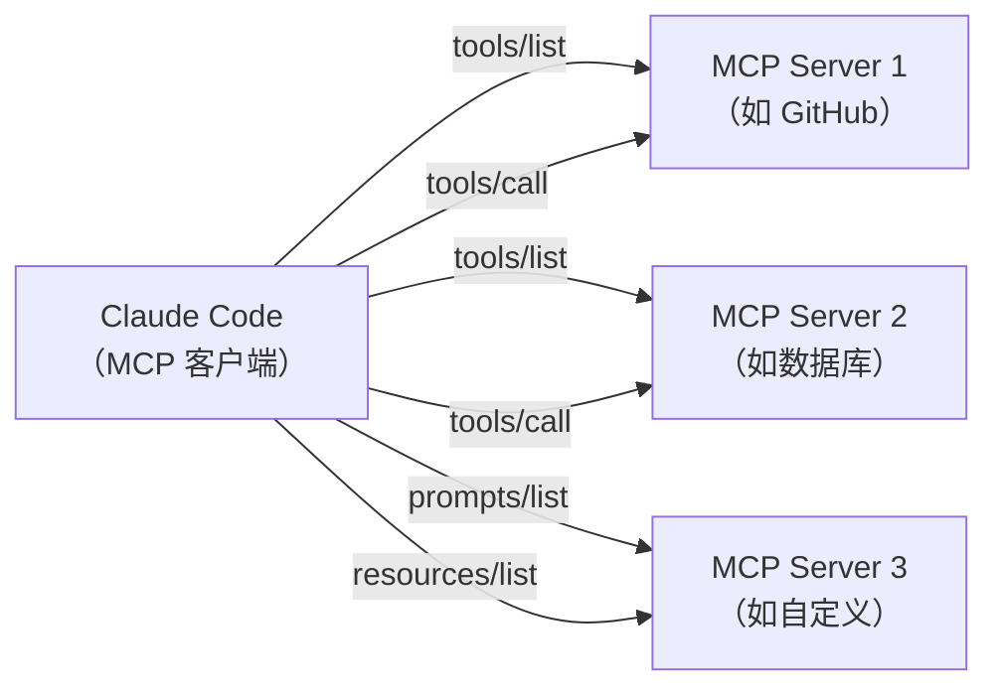
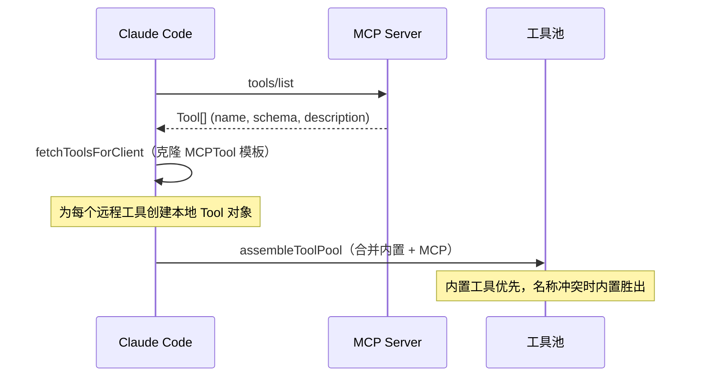
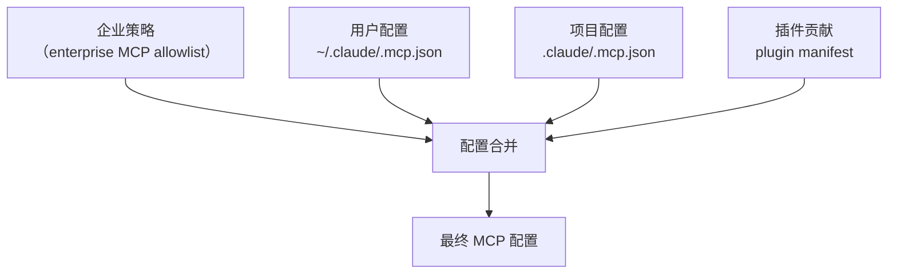

# MCP 协议集成

Claude Code 作为 **MCP（Model Context Protocol）客户端**，可以连接外部 MCP 服务器来扩展其工具和资源能力。

## MCP 在 Claude Code 中的角色



Claude Code **不是** MCP 服务器（虽然有一个 `entrypoints/mcp.ts` 提供了 MCP 服务器模式，但主要流程是客户端角色）。

## 连接管理

### 传输层

`src/services/mcp/client.ts` 支持多种传输协议：

| 传输类型 | 配置 `type` | 说明 |
|----------|-------------|------|
| stdio | `stdio` | 本地进程通信（最常用） |
| SSE | `sse` | Server-Sent Events（支持 OAuth） |
| HTTP | `http` | Streamable HTTP |
| WebSocket | `ws` | WebSocket 连接 |
| SDK | `sdk` | 进程内 SDK 桥接 |
| Claude.ai Proxy | `claudeai-proxy` | 通过 Claude.ai 代理 |
| IDE | 各种 | IDE 特定传输 |

### 连接流程

```typescript
// src/services/mcp/client.ts
export async function connectToServer(
    config: McpServerConfig,
    options: ConnectOptions,
): Promise<MCPServerConnection> {
    // 1. 根据 config.type 选择传输层
    // 2. 创建 @modelcontextprotocol/sdk Client
    // 3. 建立连接
    // 4. 返回 connected | failed | needs-auth 状态
}
```

连接是**惰性**的（通过 memoize），只在首次需要时建立。

### 连接状态

```typescript
// src/services/mcp/types.ts
type MCPServerConnection = 
    | { status: 'connected', client: Client, tools: Tool[], ... }
    | { status: 'failed', error: Error }
    | { status: 'needs-auth', authUrl: string }
    | ...
```

### React Hook 管理

`src/services/mcp/useManageMCPConnections.ts` 提供 React Hook 管理连接生命周期：

- 自动重连
- 监听 `ToolListChangedNotification` 刷新工具列表
- 切换服务器开关

## 工具发现与集成

### 发现流程



### MCPTool 克隆

`src/tools/MCPTool/MCPTool.ts` 定义了 MCP 工具的基础模板。对每个发现的远程工具，`fetchToolsForClient` 克隆这个模板并覆盖关键属性：

```typescript
// 每个 MCP 工具的名称格式
const toolName = buildMcpToolName(serverName, remoteTool.name);
// 例如：mcp__github__create_issue

// 克隆后覆盖
const localTool = {
    ...MCPToolTemplate,
    name: toolName,
    description: remoteTool.description,
    inputJSONSchema: remoteTool.inputSchema,
    call: (input) => callMCPToolWithUrlElicitationRetry(server, remoteTool, input),
    checkPermissions: (input, ctx) => { /* MCP 特定权限逻辑 */ },
};
```

### 工具池合并

```typescript
// src/tools.ts
export function assembleToolPool(builtInTools, mcpTools) {
    // 内置工具在前，MCP 工具在后
    // 同名时内置工具优先
    // MCP 工具应用 deny 规则过滤
    // 稳定排序保证一致性
}
```

## MCP 配置

### 配置来源

MCP 服务器配置从多个来源合并：



```typescript
// src/services/mcp/config.ts
export function getClaudeCodeMcpConfigs(): McpServerConfig[] {
    // 1. 加载企业策略 MCP（exclusive 时覆盖其他）
    // 2. 合并用户/项目/本地配置
    // 3. 加载插件 MCP（通过 loadAllPluginsCacheOnly + getPluginMcpServers）
    // 4. 应用 allowlist 过滤
}
```

### 配置文件格式

```json
// .claude/.mcp.json
{
    "mcpServers": {
        "github": {
            "type": "stdio",
            "command": "npx",
            "args": ["-y", "@modelcontextprotocol/server-github"],
            "env": {
                "GITHUB_TOKEN": "${GITHUB_TOKEN}"
            }
        }
    }
}
```

### 环境变量展开

`src/services/mcp/envExpansion.ts` 支持在配置中使用 `${VAR}` 语法引用环境变量。

## MCP 资源

除了工具，Claude Code 也支持 MCP 资源（resources）：

```typescript
// src/tools/ListMcpResourcesTool/  — 列出服务器资源
// src/tools/ReadMcpResourceTool/   — 读取资源内容
```

### MCP 技能（feature-gated）

当 `MCP_SKILLS` 特性开关启用时，MCP 服务器的 prompts 可以被当作技能加载：

```typescript
// src/services/mcp/client.ts
function fetchMcpSkillsForClient(client, serverName) {
    // 将 MCP prompts 转为 skill commands
}
```

## MCP 认证

### OAuth 流程

对于需要认证的 MCP 服务器（如 SSE 类型），支持 OAuth 2.0 认证：

```typescript
// src/services/mcp/auth.ts — OAuth token 管理
// src/tools/McpAuthTool/McpAuthTool.ts — 认证占位工具
```

### Elicitation

MCP 支持 URL elicitation（-32042 错误码），当工具调用需要用户授权 URL 时：

```typescript
// src/services/mcp/elicitationHandler.ts
// 处理 MCP 服务器返回的 elicitation 请求
// 在 REPL 模式下通过 UI 队列展示
// 在 SDK 模式下通过 structuredIO 处理
```

## MCP 连接管理 UI

`src/services/mcp/MCPConnectionManager.tsx` 提供 React Context：

- `reconnectMcpServer(serverName)` — 重新连接
- `toggleMcpServer(serverName)` — 切换开关

`src/components/mcp/` 下有 MCP 相关的 UI 组件。

## 关键源文件

| 文件 | 职责 |
|------|------|
| `src/services/mcp/client.ts` | MCP 客户端：连接、工具发现、调用 |
| `src/services/mcp/types.ts` | MCP 类型定义（配置、连接状态） |
| `src/services/mcp/config.ts` | MCP 配置合并 |
| `src/services/mcp/useManageMCPConnections.ts` | 连接管理 Hook |
| `src/services/mcp/MCPConnectionManager.tsx` | 连接管理 Context |
| `src/services/mcp/InProcessTransport.ts` | 进程内传输 |
| `src/services/mcp/auth.ts` | MCP 认证 |
| `src/services/mcp/elicitationHandler.ts` | Elicitation 处理 |
| `src/services/mcp/envExpansion.ts` | 环境变量展开 |
| `src/tools/MCPTool/MCPTool.ts` | MCP 工具模板 |
| `src/tools/ListMcpResourcesTool/` | 列出 MCP 资源 |
| `src/tools/ReadMcpResourceTool/` | 读取 MCP 资源 |
| `src/tools/McpAuthTool/` | MCP 认证工具 |

## 下一步

前往 [10-multi-agent.md](10-multi-agent.md) 了解多 Agent 协作机制。

## 动手实验

本章有对应的 Python 实验，通过编码复现上述概念：

> **[实验 09 — MCP 客户端](experiments/09-MCP客户端实验.md)**
>
> 涵盖内容：MCP 协议、工具发现、工具池合并
>
> ```bash
> cd experiments && python -m exp_09_mcp_client.main --mock
> ```
