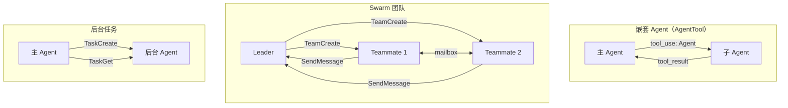
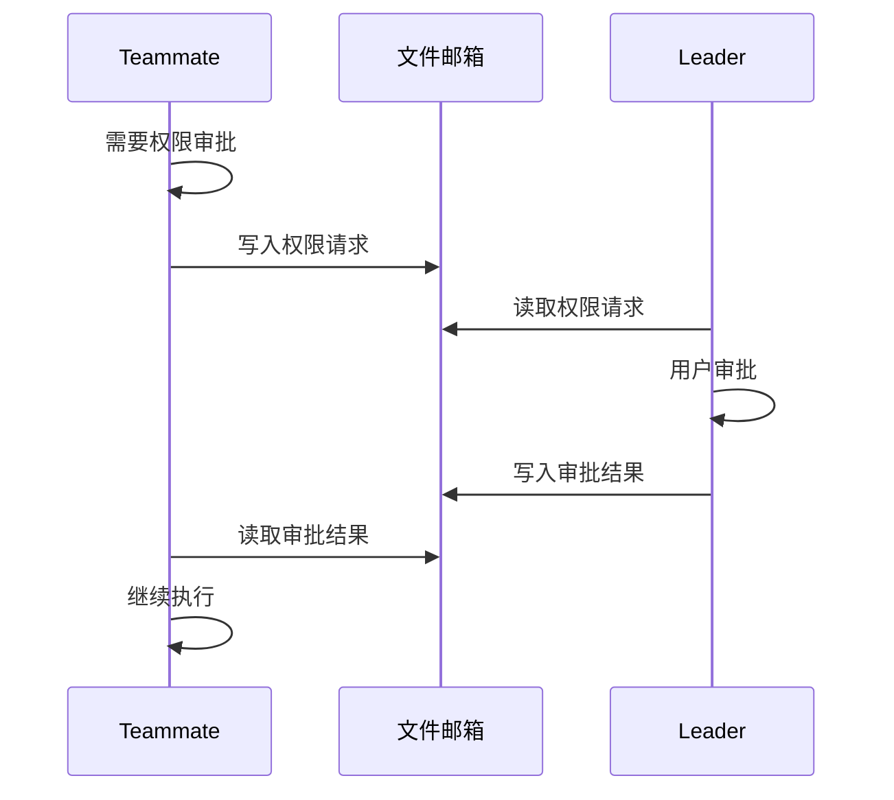
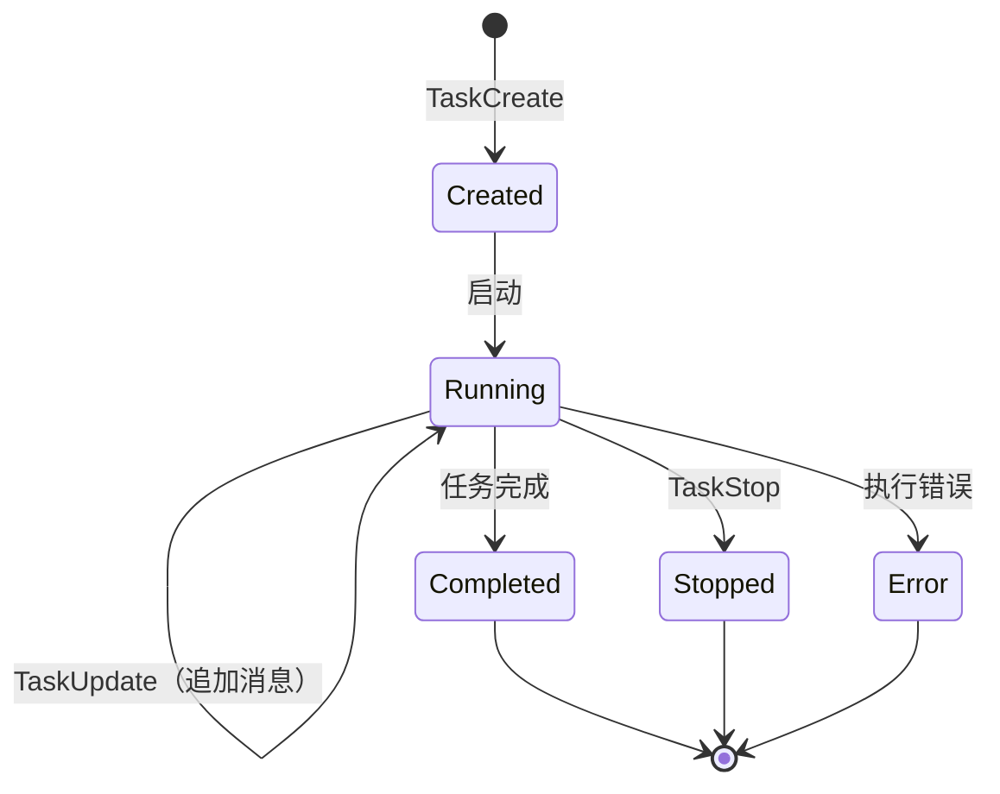

# 多 Agent 协作（Swarm / Tasks）

Claude Code 支持多种多 Agent 协作模式：从简单的子 Agent 嵌套到完整的 Swarm 团队协作。

## 协作模式概览



## 第一层：AgentTool — 嵌套子 Agent

`AgentTool` 是最基础的多 Agent 机制。它在当前进程内生成一个约束的子 Agent，复用 `query()` 循环。

### 工作原理

```typescript
// src/tools/AgentTool/runAgent.ts
export async function* runAgent(
    prompt: string,
    context: ToolUseContext,
    options: RunAgentOptions,
): AsyncGenerator<...> {
    // 1. 构建约束的工具池（排除 ALL_AGENT_DISALLOWED_TOOLS）
    // 2. 构建子 Agent 的 system prompt
    // 3. 调用 query()（相同的核心循环）
    // 4. 记录 sidechain transcript
    // 5. yield 消息和事件给调用者
}
```

### 工具池约束

子 Agent 不能使用所有工具。`ALL_AGENT_DISALLOWED_TOOLS` 排除了：

- `AgentTool` 本身（防止无限嵌套，除非深度允许）
- `TeamCreateTool` / `TeamDeleteTool`（团队管理只在顶层）
- 其他不适合子 Agent 的工具

### Transcript 记录

子 Agent 的对话记录被记录为 sidechain transcript，可以被用户在 UI 中查看。

## 第二层：Swarm 团队

Swarm 是更高级的协作模式，允许多个 Agent 作为"队友"并行工作。

### 两种运行模式

#### 1. 进程内 Teammate（In-Process）

```typescript
// src/utils/swarm/inProcessRunner.ts
export async function runInProcessTeammate(
    prompt: string,
    context: TeammateContext,
) {
    // 在同一进程的 AsyncLocalStorage 中运行
    // 使用 runWithTeammateContext 隔离上下文
    // 循环调用 runAgent() 直到完成或中止
}
```

进程内 teammate 使用 `AsyncLocalStorage`（`runWithTeammateContext`）来隔离上下文，确保并发的 teammate 之间不会互相干扰。

#### 2. 外部进程 Teammate

```typescript
// src/utils/swarm/spawnUtils.ts
// 构建 CLI 参数和环境变量，在新进程中启动 teammate

// src/utils/swarm/backends/
// tmux.ts  — tmux 后端
// iterm.ts — iTerm 后端
// inProcessBackend.ts — 进程内后端
```

外部进程 teammate 通过 tmux 或 iTerm 窗口运行独立的 Claude Code 实例。

### 通信：文件邮箱

Teammate 之间通过文件系统的 JSON 邮箱通信：

```typescript
// src/utils/teammateMailbox.ts
// 文件路径：.claude/teams/<session>/inboxes/<agent-id>.json

export function sendMessage(targetAgentId, message) {
    // 写入目标 agent 的 inbox 文件
    // 使用文件锁保证并发安全
}

export function readMessages(agentId) {
    // 读取自己的 inbox 文件
}
```

邮箱消息类型包括：
- 工作分配
- 进度报告
- 权限请求/响应
- 完成通知

### 权限同步



相关文件：
- `src/utils/swarm/permissionSync.ts` — 权限同步协议
- `src/utils/swarm/leaderPermissionBridge.ts` — Leader 端权限桥接

### TeamCreate / TeamDelete 工具

```typescript
// src/tools/TeamCreateTool/ — 创建 teammate
// 参数：agent 类型、prompt、模型等
// 结果：teammate ID

// src/tools/TeamDeleteTool/ — 删除 teammate
```

### SendMessage 工具

```typescript
// src/tools/SendMessageTool/ — 向指定 agent 发送消息
// 通过邮箱系统传递
```

## 第三层：任务框架

任务框架统一了"与主会话并行运行的东西"的生命周期管理。

### 任务类型

| 类型 | 文件 | 说明 |
|------|------|------|
| `LocalAgentTask` | `tasks/LocalAgentTask/` | 本地后台子 Agent |
| `InProcessTeammateTask` | `tasks/InProcessTeammateTask/` | 进程内 Teammate |
| `LocalMainSessionTask` | `tasks/LocalMainSessionTask.ts` | 后台主会话（Ctrl+B） |
| `RemoteAgentTask` | `tasks/RemoteAgentTask/` | 远程 Agent 任务 |
| `DreamTask` | `tasks/DreamTask/` | 自动做梦任务 |
| `LocalShellTask` | `tasks/LocalShellTask/` | 本地 Shell 任务 |

### Task 工具

| 工具 | 说明 |
|------|------|
| `TaskCreateTool` | 创建后台任务 |
| `TaskGetTool` | 获取任务状态 |
| `TaskListTool` | 列出所有任务 |
| `TaskUpdateTool` | 更新任务（追加消息） |
| `TaskStopTool` | 停止任务 |
| `TaskOutputTool` | 获取任务输出 |

### 任务生命周期



### InProcessTeammateTask 特点

```typescript
// src/tasks/InProcessTeammateTask/InProcessTeammateTask.tsx
// - 支持 kill
// - 支持追加消息（inject user message）
// - 限制消息列表大小（capped）
// - 保留 toolUseResult（用户可查看 transcript）

// src/tasks/InProcessTeammateTask/types.ts
// Teammate 状态：包含 capped 消息列表
```

## Agent 定义（Agent Types）

除了运行时动态创建，Agent 也支持预定义类型：

```typescript
// src/tools/AgentTool/loadAgentsDir.ts
// 从 .claude/agents/ 目录加载 agent 定义
// 支持内置 agent 和自定义 agent

type AgentDefinition = {
    name: string
    description: string
    systemPrompt: string
    tools: string[]      // 允许使用的工具
    model?: string       // 指定模型
    color?: AgentColorName
}
```

### 内置 Agent

```typescript
// src/tools/AgentTool/built-in/
// 内置的 agent 类型定义
```

## 关键源文件

| 文件 | 职责 |
|------|------|
| `src/tools/AgentTool/AgentTool.ts` | AgentTool 定义 |
| `src/tools/AgentTool/runAgent.ts` | 子 Agent 执行循环 |
| `src/tools/AgentTool/loadAgentsDir.ts` | Agent 类型定义加载 |
| `src/utils/swarm/inProcessRunner.ts` | 进程内 Teammate 运行器 |
| `src/utils/swarm/spawnUtils.ts` | 进程 spawn 工具 |
| `src/utils/swarm/backends/` | 执行后端（tmux/iTerm/in-process） |
| `src/utils/teammateMailbox.ts` | 文件邮箱通信 |
| `src/utils/swarm/permissionSync.ts` | 权限同步 |
| `src/tasks/` | 任务框架 |
| `src/tools/TaskCreateTool/` | 任务创建 |
| `src/tools/SendMessageTool/` | 消息发送 |
| `src/tools/TeamCreateTool/` | 团队创建 |
| `src/constants/tools.ts` | Agent 工具限制列表 |

## 下一步

前往 [11-plugin-skill.md](11-plugin-skill.md) 了解插件与技能扩展系统。

## 动手实验

本章有对应的 Python 实验，通过编码复现上述概念：

> **[实验 10 — 多 Agent 协作](experiments/10-多Agent协作实验.md)**
>
> 涵盖内容：嵌套 Agent、文件邮箱、Leader-Worker 模式
>
> ```bash
> cd experiments && python -m exp_10_multi_agent.main --mock
> ```
