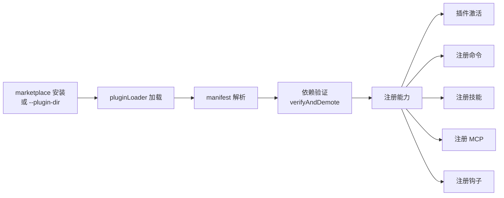
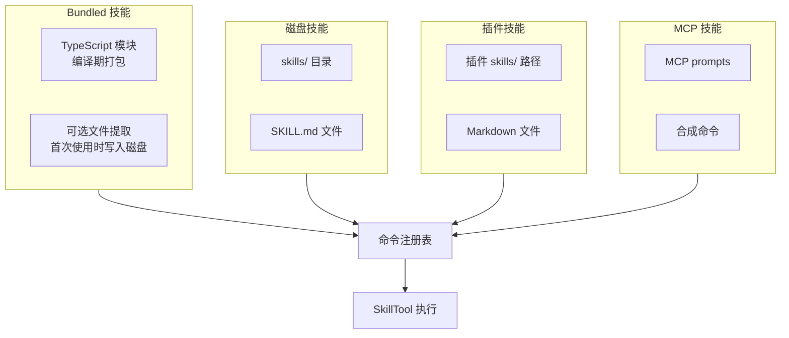

# 插件与技能扩展系统

Claude Code 提供两种扩展机制：**插件**（Plugins）用于结构化的功能扩展，**技能**（Skills）用于可复用的提示工作流。

## 插件系统

### 插件是什么

插件是**版本化的可安装包**，可以贡献命令、技能、MCP 服务器、钩子、设置等能力。

### LoadedPlugin 结构

```typescript
// src/types/plugin.ts
type LoadedPlugin = {
    name: string
    version: string
    path: string           // 安装路径
    
    // 贡献点
    commands?: Command[]   // 命令
    skills?: string[]      // 技能路径
    mcpServers?: McpServerConfig[]  // MCP 服务器
    hooks?: HookDef[]      // 生命周期钩子
    agents?: AgentDefinition[]  // Agent 定义
    settings?: object      // 设置 schema
    
    // 元信息
    errors?: string[]      // 加载错误
    source: 'marketplace' | 'session' | 'managed'
}
```

### 插件生命周期



### 插件加载

```typescript
// src/utils/plugins/pluginLoader.ts

export async function loadAllPlugins(): Promise<PluginLoadResult> {
    // 1. 从 marketplace 加载已安装插件
    // 2. 合并 session 插件（--plugin-dir）
    // 3. 合并企业管理的插件
    // 4. mergePluginSources — 会话覆盖 > marketplace（企业锁除外）
    // 5. verifyAndDemote — 检查依赖
    // 6. 返回 LoadedPlugin[]
}

// 缓存版本（不触发网络请求）
export async function loadAllPluginsCacheOnly(): Promise<PluginLoadResult> { ... }
```

### 插件能力注册

| 能力 | 注册位置 | 说明 |
|------|----------|------|
| 命令 | `commands.ts` → `getPluginCommands()` | 作为斜杠命令注册 |
| 技能 | `commands.ts` → `getPluginSkills()` | 作为 SkillTool 可用技能 |
| MCP | `services/mcp/config.ts` → `getPluginMcpServers()` | 作为 MCP 服务器连接 |
| 钩子 | `utils/plugins/loadPluginHooks.ts` | 生命周期钩子 |

### 内置插件

```typescript
// src/plugins/builtinPlugins.ts
registerBuiltinPlugin(name, plugin)  // 注册内置插件
getBuiltinPlugins()                  // 获取所有内置插件

// src/plugins/bundled/index.ts
export function initBuiltinPlugins() {
    // 当前为空壳架构（scaffolding）
}
```

### 插件管理

`/plugin` 斜杠命令提供用户交互式的插件管理：

```typescript
// src/commands/plugin/ — 17 个文件
// install, uninstall, list, update, info, ...
```

## 技能系统

### 技能是什么

技能是**模型可调用的提示工作流**，实现为带有 `type: 'prompt'` 的 `Command` 对象。它们不是独立的运行时——它们被加载到命令注册表中，通过 `SkillTool` 执行。

### 技能类型



### Bundled 技能

内置在二进制中的技能，以 TypeScript 模块形式存在：

```typescript
// src/skills/bundledSkills.ts
type BundledSkillDefinition = {
    name: string
    description: string
    whenToUse: string
    files?: { [path: string]: string }  // 可选的磁盘文件
    // ...
}

export function registerBundledSkill(def: BundledSkillDefinition) {
    // 注册到全局 bundled skill 列表
    // 如果有 files，首次使用时提取到磁盘
}
```

```typescript
// src/skills/bundled/index.ts
export function initBundledSkills() {
    // 调用每个 register*Skill() 函数
    // 在 main.tsx 启动时执行
}

// src/skills/bundled/*.ts
// 各个内置技能：verify, debug, batch, loop 等
```

### 磁盘技能

从文件系统加载的技能，遵循约定的目录结构：

```
.claude/skills/
├── my-skill/
│   └── SKILL.md     # 技能定义（Markdown + frontmatter）
└── another-skill/
    └── SKILL.md
```

```typescript
// src/skills/loadSkillsDir.ts
export async function getSkillDirCommands(dir: string): Promise<Command[]> {
    // 扫描目录（深度 2）
    // 解析 SKILL.md 的 frontmatter
    // 转为 Command 对象（type: 'prompt'）
}
```

### 技能文件格式

```markdown
---
name: My Custom Skill
description: Does something useful
whenToUse: When the user asks for X
---

# Skill Instructions

Follow these steps:
1. ...
2. ...
```

### 技能变更检测

```typescript
// src/utils/skills/skillChangeDetector.ts
// 监视技能目录的文件变更
// 变更时发出信号，触发技能列表刷新
```

## SkillTool 执行

`SkillTool` 是技能的执行引擎：

```typescript
// src/tools/SkillTool/SkillTool.ts
export const SkillTool = buildTool({
    name: 'Skill',
    
    async call(input, context) {
        // 1. 从可用技能列表中查找目标技能
        // 2. 过滤 MCP prompts（如果是 MCP 技能）
        // 3. 根据技能类型决定执行方式（fork vs inline）
        // 4. 记录遥测
        // 5. 返回技能输出
    }
});
```

### 技能列表暴露给模型

```typescript
// src/commands.ts
export function getSkillToolCommands(cwd: string): Command[] {
    // 从 getCommands() 过滤出适合 SkillTool 的技能
    // 过滤规则：
    //   - 排除 builtin source（内置命令不是技能）
    //   - plugin/MCP 技能需要 description 和 whenToUse
    //   - 返回适合在 SkillTool listing 中展示的技能
}
```

## 命令优先级链

当多种来源贡献了同名命令时，按以下优先级解析：

```
1. Bundled 技能（内置，最高优先级）
2. 内置插件技能（builtinPluginSkillCommands）
3. 磁盘技能（skills/ 目录）
4. Workflow 命令
5. 插件命令（marketplace 插件）
6. 插件技能（marketplace 插件的 skills/）
7. 内置斜杠命令（/compact, /memory 等）
```

```typescript
// src/commands.ts
export async function getCommands(cwd: string): Promise<Command[]> {
    // 按上述优先级合并所有命令来源
    // 动态技能插入
    // 可用性和 isEnabled 过滤
}
```

## 关键源文件

| 文件 | 职责 |
|------|------|
| `src/utils/plugins/pluginLoader.ts` | 插件加载与合并 |
| `src/utils/plugins/installedPluginsManager.ts` | 已安装插件管理 |
| `src/utils/plugins/loadPluginCommands.ts` | 插件命令/技能加载 |
| `src/utils/plugins/mcpPluginIntegration.ts` | 插件 MCP 集成 |
| `src/plugins/builtinPlugins.ts` | 内置插件注册 |
| `src/plugins/bundled/index.ts` | 内置插件初始化 |
| `src/skills/bundledSkills.ts` | Bundled 技能定义 |
| `src/skills/bundled/index.ts` | Bundled 技能初始化 |
| `src/skills/loadSkillsDir.ts` | 磁盘技能加载 |
| `src/skills/mcpSkillBuilders.ts` | MCP 技能桥接 |
| `src/tools/SkillTool/SkillTool.ts` | 技能执行引擎 |
| `src/commands.ts` | 命令注册表（包含技能） |
| `src/types/plugin.ts` | 插件类型定义 |

## 下一步

前往 [12-api-streaming.md](12-api-streaming.md) 了解 API 调用与流式处理。

## 动手实验

本章有对应的 Python 实验，通过编码复现上述概念：

> **[实验 11 — 插件技能系统](experiments/11-插件技能系统实验.md)**
>
> 涵盖内容：SKILL.md 解析、插件生命周期、命令优先级链
>
> ```bash
> cd experiments && python -m exp_11_plugin_skill.main --mock
> ```
