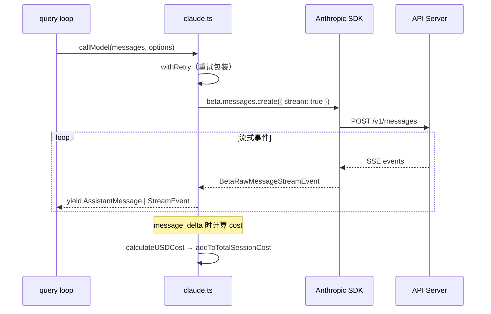
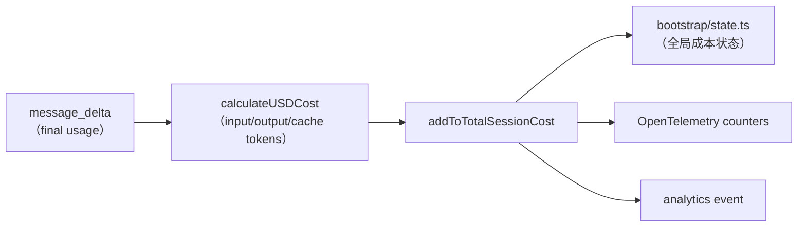

# API 调用、流式处理与模型管理

## API 客户端构建

### 多 Provider 支持

Claude Code 支持多个 API provider，通过环境变量选择：

```typescript
// src/services/api/client.ts
function buildClient(): Anthropic {
    if (CLAUDE_CODE_USE_BEDROCK) return new AnthropicBedrock(...)
    if (CLAUDE_CODE_USE_FOUNDRY) return new AnthropicFoundry(...)
    if (CLAUDE_CODE_USE_VERTEX)  return new AnthropicVertex(...)
    return new Anthropic(...)  // 第一方 API（默认）
}
```

### 认证方式

| Provider | 认证 |
|----------|------|
| 第一方 | API Key 或 OAuth Bearer Token |
| Bedrock | AWS 凭证（自动刷新） |
| Vertex | GCP 凭证（自动刷新） |
| Foundry | Foundry 认证 |

### 请求头

```typescript
// 标准请求头
headers: {
    'x-app': 'cli',
    'User-Agent': `claude-code/${version}`,
    'x-session-id': sessionId,
    // 可选
    'x-client-request-id': requestId,  // 第一方 API
    'x-container-id': containerId,     // CCR 环境
}
```

### 代理支持

```typescript
// src/upstreamproxy/
// 支持 HTTP/HTTPS 代理
// getProxyFetchOptions() 注入到 fetch 配置
```

## 流式调用

### 核心流程



### 为什么使用 Raw Stream

```typescript
// src/services/api/claude.ts
// 使用 beta.messages.create({ stream: true }) 获取 Raw stream
// 而非 BetaMessageStream（高级封装）
// 原因：避免对 tool 参数做重复的 partial JSON 解析
```

### 事件处理

`queryModelWithStreaming` 中的事件处理 switch：

| 事件类型 | 处理 |
|----------|------|
| `message_start` | 初始化消息对象 |
| `content_block_start` | 开始新的内容块（text/tool_use/thinking） |
| `content_block_delta` | 累积内容增量 |
| `content_block_stop` | 完成内容块 |
| `message_delta` | 最终 usage、stop_reason、成本计算 |
| `message_stop` | 消息完成 |

### 构建 AssistantMessage

流式传输过程中逐步构建 `AssistantMessage`：

```typescript
// 每个 content block delta 累积到对应的 block
// text_delta → 累积到 text block
// input_json_delta → 累积到 tool_use block 的 input
// thinking_delta → 累积到 thinking block

// message_delta 提供最终的 usage 信息
// stop_reason: 'end_turn' | 'tool_use' | 'max_tokens'
```

## 重试与容错

### withRetry

```typescript
// src/services/api/withRetry.ts
export async function withRetry<T>(
    fn: (client: Anthropic) => Promise<T>,
    options: RetryOptions,
): Promise<T> {
    // 指数退避重试
    // 处理速率限制（429）
    // 处理服务器错误（5xx）
    // 支持 fallback 模型
}
```

### Idle Watchdog

```typescript
// 防止流式传输挂起
// CLAUDE_ENABLE_STREAM_WATCHDOG=true
// CLAUDE_STREAM_IDLE_TIMEOUT_MS — 空闲超时
// 超时后中止当前请求

// 停滞检测
// STALL_THRESHOLD_MS = 30s — 超过 30s 无 chunk 则记录日志
```

### 非流式降级

当流式调用失败时，可以降级到非流式请求：

```typescript
// executeNonStreamingRequest
// 使用 beta.messages.create（不带 stream: true）
// 单独的超时逻辑（getNonstreamingFallbackTimeoutMs）
```

### VCR（测试用录放）

```typescript
// src/services/vcr.ts
// withStreamingVCR 包装流式调用
// 测试时录制/回放 API 响应
// 回放时也调用 addToTotalSessionCost 保持成本追踪一致
```

## 模型选择

### 解析优先级

```typescript
// src/utils/model/model.ts
export function getMainLoopModel(): string {
    // 优先级（从高到低）：
    // 1. 会话内覆盖（setMainLoopModelOverride）
    // 2. --model 命令行参数
    // 3. ANTHROPIC_MODEL 环境变量
    // 4. settings 中的 model 设置
    // 5. 默认模型（getDefaultMainLoopModel）
}
```

### Provider 映射

同一个逻辑模型在不同 provider 下有不同的 API 字符串：

```typescript
// src/utils/model/configs.ts
// ALL_MODEL_CONFIGS：每个模型的多 provider 映射表
// 如 claude-sonnet-4-20250514 在 Bedrock 下的模型 ID 不同
```

### 模型能力

```typescript
// src/utils/model/modelCapabilities.ts
// 检查模型是否支持特定功能
// 如：思考模式、工具使用、图片等

// src/utils/model/modelAllowlist.ts
// 模型白名单检查
```

### Allowlist

```typescript
// isModelAllowed(model) — 检查模型是否在允许列表中
// 可通过设置配置允许的模型列表
```

## 成本追踪

### 计算流程



### `cost-tracker.ts`

```typescript
// src/cost-tracker.ts
export function addToTotalSessionCost(
    cost: number,
    usage: BetaUsage,
    model: string,
) {
    // 1. 按模型累积 ModelUsage（input/output/cache tokens）
    // 2. 更新全局成本状态（getTotalCostUSD / addToTotalCostState）
    // 3. 增量更新 OpenTelemetry counters
    // 4. 记录 analytics
    // 5. 递归处理 advisor sub-usage
}

export function formatTotalCost(): string {
    // CLI 格式的成本摘要
    // 包含：总成本、持续时间、修改行数、per-model 用量
}
```

### 会话成本持久化

```typescript
// saveCurrentSessionCosts — 保存到项目配置
// getStoredSessionCosts — 从项目配置读取
// restoreCostStateForSession — 恢复会话继续时的成本状态
```

### `costHook.ts`

```typescript
// src/costHook.ts
export function useCostSummary() {
    // React Hook
    // 在 process exit 时打印成本摘要（如果有账单权限）
    // 保存当前会话成本
}
```

## Token 管理

### 估算

```typescript
// src/utils/tokens.ts
// tokenCountWithEstimation — 快速估算消息 token 数
// doesMostRecentAssistantMessageExceed200k — 检查大消息
// finalContextTokensFromLastResponse — 从 API 响应获取精确 token 数
```

### 上下文窗口

```typescript
// src/utils/context.ts
// getContextWindowForModel(model) — 获取模型的上下文窗口大小
// ESCALATED_MAX_TOKENS — 升级后的最大输出 token 数
```

### Token 预算

```typescript
// src/query/tokenBudget.ts
// BudgetTracker — 追踪 agentic 循环的输出 token 预算
// checkTokenBudget — 是否继续（递减回报启发式）
// 与 API 的 task_budget（output_config.task_budget）不同
```

## 关键源文件

| 文件 | 职责 |
|------|------|
| `src/services/api/claude.ts` | 流式/非流式 API 调用核心 |
| `src/services/api/client.ts` | Anthropic SDK 客户端构建 |
| `src/services/api/withRetry.ts` | 重试逻辑 |
| `src/services/api/errors.ts` | 错误类型 |
| `src/services/api/usage.ts` | OAuth 用量查询 |
| `src/services/vcr.ts` | VCR 测试录放 |
| `src/utils/model/model.ts` | 模型选择逻辑 |
| `src/utils/model/configs.ts` | 模型配置映射 |
| `src/utils/model/providers.ts` | Provider 检测 |
| `src/cost-tracker.ts` | 成本追踪 |
| `src/costHook.ts` | 成本摘要 Hook |
| `src/utils/tokens.ts` | Token 估算 |
| `src/utils/modelCost.js` | USD 成本计算 |

## 下一步

前往 [13-config-settings.md](13-config-settings.md) 了解配置体系。

## 动手实验

本章有对应的 Python 实验，通过编码复现上述概念：

> **[实验 12 — 流式 API](experiments/12-流式API实验.md)**
>
> 涵盖内容：SSE 流式处理、JSON 碎片组装、重试、空闲超时
>
> ```bash
> cd experiments && python -m exp_12_streaming_api.main --mock
> ```
