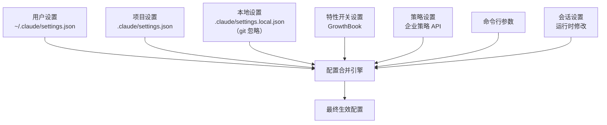

# 配置体系与设置管理

Claude Code 采用分层配置系统，支持从用户级到企业级的多层设置覆盖。

## 分层配置架构



### 来源优先级

```typescript
// src/utils/settings/constants.ts
const SETTING_SOURCES = [
    'userSettings',     // 用户级（最低）
    'projectSettings',  // 项目级
    'localSettings',    // 本地级
    'flagSettings',     // 特性开关
    'policySettings',   // 企业策略
    'cliArg',           // CLI 参数
    'command',          // 命令触发
    'session',          // 会话级（最高）
]
```

对于大多数设置，后面的来源覆盖前面的。但某些安全相关设置（如权限规则），遵循合并而非覆盖的语义。

## 设置文件位置

| 文件 | 位置 | 用途 | Git 追踪 |
|------|------|------|----------|
| 用户设置 | `~/.claude/settings.json` | 个人偏好 | N/A |
| 项目设置 | `.claude/settings.json` | 团队共享配置 | 是 |
| 本地设置 | `.claude/settings.local.json` | 个人本地覆盖 | 否 |
| 管理设置 | `managed-settings.json` + drop-ins | 企业管理 | N/A |

## 设置 Schema

设置使用 Zod 定义 schema，确保类型安全：

```typescript
// src/utils/settings/types.ts（简化示例）
const SettingsSchema = z.object({
    // 权限
    permissions: z.object({
        allow: z.array(PermissionRuleSchema).optional(),
        deny: z.array(PermissionRuleSchema).optional(),
        ask: z.array(PermissionRuleSchema).optional(),
        defaultMode: z.enum(['default', 'plan', 'bypassPermissions', 'acceptEdits']).optional(),
        disableBypassPermissionsMode: z.boolean().optional(),
        additionalDirectories: z.array(z.string()).optional(),
    }).optional(),
    
    // 模型
    model: z.string().optional(),
    
    // 主题
    theme: z.string().optional(),
    
    // MCP 服务器
    mcpServers: z.record(McpServerConfigSchema).optional(),
    
    // ... 更多设置
})
```

## 设置加载与合并

### 主加载器

```typescript
// src/utils/settings/settings.ts
export function loadSettings(): Settings {
    // 1. 读取各来源的设置文件
    // 2. Zod 验证每个来源
    // 3. 按优先级合并
    // 4. 返回最终生效的设置
}

// 管理设置加载（企业）
export function loadManagedFileSettings(path: string): Settings {
    // 支持主文件 + drop-in 目录
    // managed-settings.json + managed-settings.d/*.json
}
```

### 设置缓存

```typescript
// src/utils/settings/settingsCache.ts
// 缓存已加载的设置，避免重复读取
// 支持 per-session 覆盖
// applySettingsChange — 应用运行时设置变更
```

## 项目配置（ProjectConfig）

除了通用设置，还有项目级的运行时配置：

```typescript
// src/utils/config.ts
type ProjectConfig = {
    // 信任对话
    trustDialogAccepted: boolean
    
    // 会话状态
    currentSessionId: string
    
    // 成本追踪
    sessionCosts: { ... }
    
    // 其他运行时状态
}

export function getGlobalConfig(): GlobalConfig { ... }
export function saveGlobalConfig(config: GlobalConfig): void { ... }
export function getCurrentProjectConfig(): ProjectConfig { ... }
```

## MDM / 企业管理设置

### macOS MDM

```typescript
// src/utils/settings/mdm/settings.ts
// 通过 plutil 读取 macOS MDM 配置
// 在 main.tsx 启动时通过 startMdmRawRead() 并行预取

// src/utils/settings/mdm/rawRead.ts
// 启动 plutil 子进程，异步读取 MDM plist
// 与模块加载并行执行（~135ms 节省）

// src/utils/settings/mdm/managedPath.ts
// MDM 管理路径定义
```

### Windows

在 Windows 上使用 `reg query` 读取注册表中的管理配置。

## 远程管理设置

```typescript
// src/services/remoteManagedSettings/
// 从 Anthropic 服务器获取远程管理配置
// 用于企业环境的集中管理

export function loadRemoteManagedSettings(): Promise<void> {
    // HTTP 请求获取远程设置
    // 合并到本地配置
}

export function refreshRemoteManagedSettings(): Promise<void> {
    // 定期刷新
}
```

### 安全检查

```typescript
// src/services/remoteManagedSettings/securityCheck.tsx
// 远程设置变更时的安全验证 UI
```

## ConfigTool — 运行时配置修改

`ConfigTool` 允许 Agent 在运行时修改部分设置：

```typescript
// src/tools/ConfigTool/ConfigTool.ts
export const ConfigTool = buildTool({
    name: 'Config',
    // ...
    
    async call(input, context) {
        // 读取或修改支持的设置项
    }
});

// src/tools/ConfigTool/supportedSettings.ts
// 定义 ConfigTool 可以修改的设置白名单
```

## 设置验证

### 危险设置处理

```typescript
// src/utils/settings/validation.ts
// 验证设置是否安全
// 检测潜在的危险配置

// src/utils/settings/permissionValidation.ts
// 权限规则的语义验证

// src/utils/settings/toolValidationConfig.ts
// 工具相关设置的验证配置
```

### 设置变更检测

```typescript
// src/utils/settings/changeDetector.ts
// settingsChangeDetector — 监视设置文件变更
// 变更时通知应用刷新设置
```

## 环境变量

Claude Code 使用大量环境变量进行配置：

| 环境变量 | 说明 |
|----------|------|
| `ANTHROPIC_API_KEY` | API Key |
| `ANTHROPIC_MODEL` | 指定模型 |
| `CLAUDE_CODE_USE_BEDROCK` | 使用 Bedrock |
| `CLAUDE_CODE_USE_VERTEX` | 使用 Vertex |
| `CLAUDE_CODE_REMOTE` | 远程模式 |
| `CLAUDE_CODE_SIMPLE` | 简单模式 |
| `CLAUDE_CODE_MAX_TOOL_USE_CONCURRENCY` | 工具并发上限 |

```typescript
// src/utils/envUtils.ts
// isEnvTruthy, isBareMode 等环境变量工具函数
```

## 关键源文件

| 文件 | 职责 |
|------|------|
| `src/utils/settings/settings.ts` | 主设置加载器 |
| `src/utils/settings/types.ts` | 设置 Schema（Zod） |
| `src/utils/settings/constants.ts` | 设置来源优先级 |
| `src/utils/settings/settingsCache.ts` | 设置缓存 |
| `src/utils/settings/validation.ts` | 设置验证 |
| `src/utils/settings/mdm/` | MDM 管理设置 |
| `src/utils/config.ts` | 项目/全局配置 |
| `src/services/remoteManagedSettings/` | 远程管理设置 |
| `src/tools/ConfigTool/` | 运行时配置工具 |
| `src/hooks/useSettings.ts` | 设置 React Hook |
| `src/utils/managedEnv.ts` | 环境变量管理 |

## 下一步

前往 [14-compact-context-mgmt.md](14-compact-context-mgmt.md) 了解上下文压缩机制。

## 动手实验

本章有对应的 Python 实验，通过编码复现上述概念：

> **[实验 13 — 配置系统](experiments/13-配置系统实验.md)**
>
> 涵盖内容：分层配置、深度合并、Pydantic 验证
>
> ```bash
> cd experiments && python -m exp_13_config_system.main --mock
> ```
