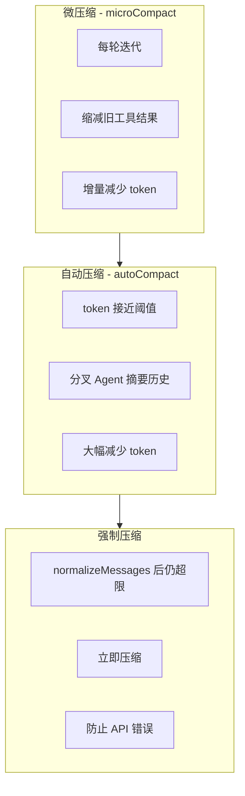
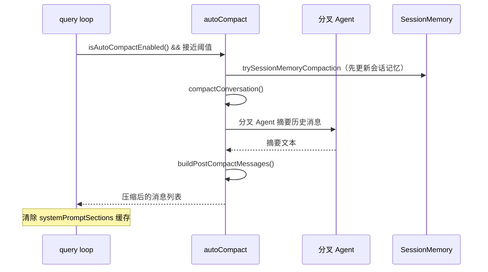

# 长对话上下文压缩

当对话变长时，消息列表会逐渐接近模型的上下文窗口限制。Claude Code 通过多层压缩策略来管理上下文大小。

## 压缩策略概览



## 自动压缩（autoCompact）

### 触发条件

```typescript
// src/services/compact/autoCompact.ts
export function getAutoCompactThreshold(contextWindowSize: number): number {
    // 基于上下文窗口大小计算阈值
    // 预留缓冲区避免 prompt_too_long 错误
    // 返回触发压缩的 token 数阈值
}

export function calculateTokenWarningState(
    usage: Usage,
    contextWindowSize: number,
): AutoCompactTrackingState {
    // 追踪 token 使用量
    // 判断是否需要触发压缩
}
```

### 压缩流程



### `compactConversation` 核心

```typescript
// src/services/compact/compact.ts
export async function compactConversation(
    messages: Message[],
    options: CompactOptions,
): Promise<CompactResult> {
    // 1. 将消息按 API 轮次分组（grouping.ts）
    // 2. 准备 compact prompt（prompt.ts）
    // 3. 启动分叉摘要 Agent
    //    - 使用当前的 systemPrompt + context
    //    - 让 Agent 将历史摘要为精简文本
    // 4. 构建 post-compact 消息
    //    - 用户摘要消息（createUserMessage）
    //    - 系统 compact 边界消息（createSystemMessage）
    // 5. 可选：重新附加技能/计划/deltas（带 token 预算）
    // 6. 剥离图片（节省 token）
    // 7. 返回压缩后的消息列表
}
```

### Post-Compact 处理

```typescript
// src/services/compact/compact.ts
export function buildPostCompactMessages(
    summaryText: string,
    preCompactMessages: Message[],
): Message[] {
    // 1. 创建用户摘要消息（包含摘要文本）
    // 2. 创建 compact 边界标记消息
    // 3. 可选保留：
    //    - 活跃的计划/技能附件
    //    - 最近的文件修改 delta
    //    - 会话记忆引用
    // 4. 应用 token 预算裁剪
}
```

### Compact Prompt

```typescript
// src/services/compact/prompt.ts
export function getCompactPrompt(): string {
    // 指导分叉 Agent 如何摘要：
    // - 保留关键决策和上下文
    // - 保留未完成的任务状态
    // - 保留重要的文件路径和代码引用
    // - 丢弃冗余的工具输出细节
}

export function getCompactUserSummaryMessage(summary: string): UserMessage {
    // 将摘要包装为用户消息
}
```

### 断路器

```typescript
// src/services/compact/autoCompact.ts
// 连续压缩失败时触发断路器
// 避免因压缩失败导致的无限重试
```

## 微压缩（microCompact）

微压缩是一种轻量级的增量压缩，在每轮迭代中运行，不需要调用 LLM。

### 工作原理

```typescript
// src/services/compact/microCompact.ts
export function microcompactMessages(messages: Message[]): Message[] {
    // 对历史消息中的工具结果做选择性缩减：
    // 1. 只处理白名单中的工具（如 Bash, FileRead）
    // 2. 保留最近 N 轮的完整结果
    // 3. 对更早的结果做截断/摘要
    // 4. 保留错误信息和关键输出
}
```

### 与 Prompt Cache 的协调

```typescript
// microCompact 需要考虑 prompt cache：
// - 修改已缓存的消息会使缓存失效
// - 使用时间和缓存标记决定何时安全修改
// - timeBasedMCConfig.ts 配置时间窗口
```

## Reactive Compact（feature-gated）

```typescript
// src/services/compact/reactiveCompact.ts
// feature('REACTIVE_COMPACT') 控制
// 当收到 prompt_too_long 错误时触发的反应式压缩
// 不等待阈值，立即压缩
```

## Snip Compact（feature-gated）

```typescript
// src/services/compact/snipCompact.ts
// feature('HISTORY_SNIP') 控制
// 对历史中的长消息做"剪裁"
// 比全量压缩更轻量
```

## 与会话记忆的集成

Compact 和 SessionMemory 紧密集成：

```typescript
// src/services/compact/sessionMemoryCompact.ts
export async function trySessionMemoryCompaction(
    messages: Message[],
    sessionMemory: SessionMemory,
): Promise<void> {
    // 1. 在 compact 前等待正在进行的记忆提取完成
    // 2. 在 compact 边界保留会话笔记的引用
    // 3. 确保 compact 摘要包含会话记忆的关键信息
    // 4. 防止因 compact 丢失已提取的记忆
}
```

### Compact 后清理

```typescript
// src/services/compact/postCompactCleanup.ts
// compact 完成后的清理工作：
// - 清除 systemPromptSections 缓存
// - 更新 autoCompact 追踪状态
// - 通知 UI 更新
```

## Compact Warning UI

```typescript
// src/services/compact/compactWarningHook.ts
// src/services/compact/compactWarningState.ts
// 当接近上下文窗口时显示警告
// 提示用户可以手动 /compact
```

## `/compact` 命令

用户也可以手动触发压缩：

```typescript
// src/commands/compact/
// /compact — 手动压缩当前对话
// 调用与 autoCompact 相同的 compactConversation()
```

## 上下文管理流程（在 query loop 中）

每轮迭代中的上下文管理顺序：

```
1. applyToolResultBudget — 历史工具结果的 token 预算
2. microcompact — 增量缩减旧工具结果
3. autoCompact 检查 — 是否接近阈值
4. snip（可选）— 剪裁长消息
5. collapse（可选）— 折叠历史
6. normalizeMessagesForAPI — 格式化为 API 格式
7. tokenCountWithEstimation — 最终 token 估算
8. 如果仍超限 → 强制 compact
```

## 关键源文件

| 文件 | 职责 |
|------|------|
| `src/services/compact/autoCompact.ts` | 自动压缩触发与阈值 |
| `src/services/compact/compact.ts` | 压缩核心：compactConversation |
| `src/services/compact/prompt.ts` | Compact prompt 模板 |
| `src/services/compact/microCompact.ts` | 微压缩 |
| `src/services/compact/grouping.ts` | 消息分组 |
| `src/services/compact/sessionMemoryCompact.ts` | 会话记忆集成 |
| `src/services/compact/postCompactCleanup.ts` | 后处理 |
| `src/services/compact/compactWarningHook.ts` | 警告 Hook |
| `src/services/compact/reactiveCompact.ts` | 反应式压缩 |
| `src/services/compact/snipCompact.ts` | Snip 压缩 |
| `src/commands/compact/` | /compact 命令 |

## 下一步

前往 [15-command-system.md](15-command-system.md) 了解斜杠命令系统。

## 动手实验

本章有对应的 Python 实验，通过编码复现上述概念：

> **[实验 14 — 上下文压缩](experiments/14-上下文压缩实验.md)**
>
> 涵盖内容：微压缩、自动压缩、强制压缩、会话记忆
>
> ```bash
> cd experiments && python -m exp_14_context_compaction.main --mock
> ```
