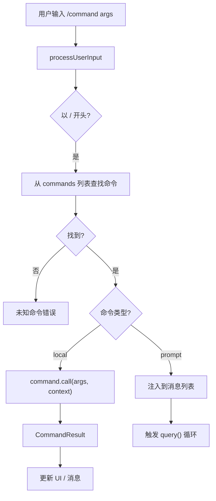

# 斜杠命令系统

斜杠命令（`/command`）是用户在 REPL 中直接触发操作的方式，从 `/compact` 压缩上下文到 `/memory` 管理记忆，覆盖了大量日常操作。

## Command 接口

```typescript
// 命令的核心接口（在 commands.ts 及相关文件中定义）
type Command = {
    name: string                    // 命令名（如 "compact"、"memory"）
    description: string             // 描述
    type: 'local' | 'prompt' | ... // 命令类型
    
    // 执行器（不同类型有不同的执行方式）
    call?(args: string, context: CommandContext): Promise<CommandResult>
    
    // 元信息
    isEnabled?(context: ToolUseContext): boolean  // 动态启用/禁用
    isHidden?: boolean                            // 隐藏（不在帮助中显示）
    aliases?: string[]                            // 别名
    argDescription?: string                       // 参数说明
    
    // 技能专用
    whenToUse?: string             // 何时使用（供 SkillTool 参考）
    loadedFrom?: LoadedFrom        // 来源标记
    source?: 'builtin' | 'plugin' | 'skill' | ...
}
```

### 命令类型

| 类型 | 说明 | 执行方式 |
|------|------|----------|
| `local` | 本地命令，直接执行 | `call()` 函数 |
| `prompt` | 提示命令（技能），注入到对话 | 通过 SkillTool 或消息注入 |

## 命令注册

### `commands.ts` — 注册中心

`src/commands.ts` 是所有命令的汇聚点：

```typescript
// src/commands.ts
export async function getCommands(cwd: string): Promise<Command[]> {
    // 按优先级合并所有来源：
    // 1. Bundled 技能命令
    // 2. 内置插件技能命令（builtinPluginSkillCommands）
    // 3. 磁盘技能命令（getSkillDirCommands）
    // 4. Workflow 命令
    // 5. 插件命令（getPluginCommands）
    // 6. 插件技能（getPluginSkills）
    // 7. 内置斜杠命令（slash commands）
    
    // 动态技能插入
    // isEnabled 过滤
    // 去重（前面的优先）
}
```

### 内置命令加载

内置命令分散在 `src/commands/` 的各个子目录中：

```
src/commands/
├── compact/         # /compact — 上下文压缩
├── memory/          # /memory — 记忆管理
├── config/          # /config — 配置管理
├── review/          # /review — 代码审查
├── doctor/          # /doctor — 环境诊断
├── mcp/             # /mcp — MCP 管理
├── login/           # /login — 登录
├── logout/          # /logout — 登出
├── vim/             # /vim — Vim 模式
├── theme/           # /theme — 主题切换
├── cost/            # /cost — 费用查看
├── diff/            # /diff — 查看变更
├── help/            # /help — 帮助
├── clear/           # /clear — 清除会话
├── resume/          # /resume — 恢复会话
├── exit/            # /exit — 退出
├── ...              # ~50 个命令
```

每个命令目录通常包含：
- `index.ts` — 命令入口（导出 `Command` 对象）
- 可选的辅助文件

## 常用命令分析

### `/compact` — 上下文压缩

```typescript
// src/commands/compact/
// 手动触发上下文压缩
// 调用 compactConversation()
// 选项：可指定压缩到的目标 token 数
```

### `/memory` — 记忆管理

```typescript
// src/commands/memory/
// 查看和管理持久化记忆
// 操作：list, add, edit, remove
```

### `/config` — 配置管理

```typescript
// src/commands/config/
// 查看和修改设置
// 支持 get/set/list 操作
```

### `/review` — 代码审查

```typescript
// src/commands/review/
// 触发 AI 代码审查
// 可指定 diff 范围
// 4 个文件：深度审查逻辑
```

### `/doctor` — 环境诊断

```typescript
// src/commands/doctor/
// 检查环境配置是否正确
// 验证认证、工具可用性等
// 渲染 Doctor 屏幕
```

### `/mcp` — MCP 管理

```typescript
// src/commands/mcp/
// 管理 MCP 服务器连接
// 操作：list, add, remove, reconnect
// 4 个文件
```

### `/resume` — 恢复会话

```typescript
// src/commands/resume/
// 恢复之前的对话会话
// 加载历史消息和状态
```

### `/clear` — 清除会话

```typescript
// src/commands/clear/
// 清除当前会话
// 重置消息列表
// 清除 systemPromptSections 缓存
// 4 个文件（含确认逻辑）
```

### `/plan` — 计划模式

```typescript
// src/commands/plan/
// 进入/退出计划模式
// 设置 PermissionMode 为 'plan'
```

### `/tasks` — 任务管理

```typescript
// src/commands/tasks/
// 查看后台运行的任务
```

### `/skills` — 技能管理

```typescript
// src/commands/skills/
// 查看可用技能列表
```

## 命令执行流程

### 在 REPL 中的执行路径



### 命令队列

命令可以在 Agent 循环运行中被排队：

```typescript
// src/utils/messageQueueManager.ts
// 管理待处理的命令队列
// 在 query loop 的每轮迭代中排空

// getCommandsByMaxPriority — 按优先级排序队列中的命令
// remove — 从队列中移除已消费的命令
// isSlashCommand — 检查是否为斜杠命令
```

### 命令生命周期

```typescript
// src/utils/commandLifecycle.ts
// notifyCommandLifecycle(uuid, 'started')   — 命令开始执行
// notifyCommandLifecycle(uuid, 'completed') — 命令执行完成
// 在 query() 正常返回时通知已消费命令完成
```

## Feature-Gated 命令

某些命令通过特性开关条件加载：

```typescript
// 例如在 commands.ts 中
const assistantCommands = feature('KAIROS')
    ? require('./commands/assistant').default
    : null;
```

### 远程模式命令过滤

```typescript
// commands.ts
export function filterCommandsForRemoteMode(commands: Command[]): Command[] {
    // 远程模式下移除不适用的命令
}
```

## 命令提示与自动补全

在 `PromptInput` 中，用户输入 `/` 时会触发命令补全：

```typescript
// src/components/PromptInput/PromptInput.tsx
// 检测 / 前缀
// 从 getCommands() 获取可用命令列表
// 过滤匹配的命令
// 显示补全建议
```

## 关键源文件

| 文件 | 职责 |
|------|------|
| `src/commands.ts` | 命令注册表：getCommands()、优先级合并 |
| `src/commands/` | ~50 个命令实现（每个一个子目录） |
| `src/utils/messageQueueManager.ts` | 命令队列管理 |
| `src/utils/commandLifecycle.ts` | 命令生命周期通知 |
| `src/utils/processUserInput/processUserInput.ts` | 用户输入解析（含命令识别） |

## 下一步

前往 [16-design-patterns.md](16-design-patterns.md) 阅读关键设计模式与工程实践总结。

## 动手实验

本章有对应的 Python 实验，通过编码复现上述概念：

> **[实验 15 — 命令系统](experiments/15-命令系统实验.md)**
>
> 涵盖内容：斜杠命令、命令注册表、命令队列
>
> ```bash
> cd experiments && python -m exp_15_command_system.main --mock
> ```
