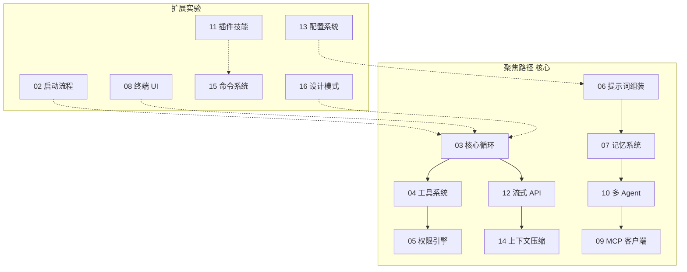

# 实验指南

本目录配套仓库内 `experiments/` 下的 Python 实验，用于**动手复现 Claude Code 源码中的核心设计模式**。实验不追求功能对等，而是抽取架构骨架，便于理解与迁移。

## 环境准备

- **Python**：3.11 或更高版本  
- **虚拟环境与依赖**（在仓库根目录下）：

```bash
cd experiments
python -m venv .venv
source .venv/bin/activate   # Windows: .venv\Scripts\activate
pip install -r requirements.txt
```

主要依赖见 `experiments/requirements.txt`（如 `pydantic`、`rich`、`anthropic`、`openai`、`tenacity` 等）。

## 两条学习路径

### 聚焦路径（9 个核心实验）

理解 Claude Code 主干架构的**最短路径**：Agent 循环 → 工具 → 权限 → 流式 API → 上下文压缩 → 提示词 → 记忆 → 多 Agent → MCP。

### 全面路径（全部 15 个实验）

在聚焦路径基础上增加：**启动流程、终端 UI、插件/技能、配置、斜杠命令、设计模式**等扩展主题，形成完整图谱。

### 路径关系（Mermaid）



## 切换 LLM 提供商

多数实验通过 `shared.utils.setup_argparser` 统一支持三种方式（在 `experiments/` 目录下执行）：

```bash
# 离线 / 无需 API Key
python -m exp_03_core_agent_loop.main --mock

# Anthropic
export ANTHROPIC_API_KEY=sk-ant-...
python -m exp_03_core_agent_loop.main --provider anthropic

# OpenAI 兼容 API
export OPENAI_API_KEY=sk-...
python -m exp_03_core_agent_loop.main --provider openai
```

`--mock` 等价于 `--provider mock`。部分实验（如纯本地演示）不调用真实 API，但命令形式保持一致，便于统一记忆。

## 实验总表

| 实验目录 | 文档 | 路径 |
|---------|------|------|
| `exp_02_startup_flow` | [扩展实验] 启动流程 | [02-启动流程实验.md](./02-启动流程实验.md) |
| `exp_03_core_agent_loop` | **[核心实验]** 核心 Agent 循环 | [03-核心Agent循环实验.md](./03-核心Agent循环实验.md) |
| `exp_04_tool_system` | **[核心实验]** 工具系统 | [04-工具系统实验.md](./04-工具系统实验.md) |
| `exp_05_permission_engine` | **[核心实验]** 权限引擎 | [05-权限引擎实验.md](./05-权限引擎实验.md) |
| `exp_06_prompt_assembly` | **[核心实验]** 提示词组装 | [06-提示词组装实验.md](./06-提示词组装实验.md) |
| `exp_07_memory_system` | **[核心实验]** 记忆系统 | [07-记忆系统实验.md](./07-记忆系统实验.md) |
| `exp_08_terminal_ui` | [扩展实验] 终端 UI | [08-终端UI实验.md](./08-终端UI实验.md) |
| `exp_09_mcp_client` | **[核心实验]** MCP 客户端 | [09-MCP客户端实验.md](./09-MCP客户端实验.md) |
| `exp_10_multi_agent` | **[核心实验]** 多 Agent | [10-多Agent协作实验.md](./10-多Agent协作实验.md) |
| `exp_11_plugin_skill` | [扩展实验] 插件与技能 | [11-插件技能系统实验.md](./11-插件技能系统实验.md) |
| `exp_12_streaming_api` | **[核心实验]** 流式 API | [12-流式API实验.md](./12-流式API实验.md) |
| `exp_13_config_system` | [扩展实验] 配置系统 | [13-配置系统实验.md](./13-配置系统实验.md) |
| `exp_14_context_compaction` | **[核心实验]** 上下文压缩 | [14-上下文压缩实验.md](./14-上下文压缩实验.md) |
| `exp_15_command_system` | [扩展实验] 命令系统 | [15-命令系统实验.md](./15-命令系统实验.md) |
| `exp_16_design_patterns` | [扩展实验] 设计模式 | [16-设计模式实验.md](./16-设计模式实验.md) |

建议先阅读 **[03-核心Agent循环实验.md](./03-核心Agent循环实验.md)**，再按依赖关系扩展。
