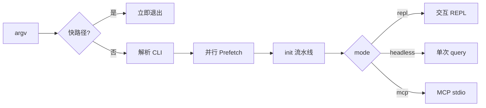

# [扩展实验] 启动流程实验

## 1. 实验目标

演示 Claude Code **从 CLI 入口到模式分发**的启动链：**薄 CLI 快路径**、**并行预取**、**有序初始化**、**懒加载思想**（本实验用注释与结构模拟）、以及 **REPL / headless / MCP** 等模式分发。对应仓库实验：`experiments/exp_02_startup_flow/main.py`。

## 2. 对应源码

| 概念 | Claude Code 参考 |
|------|------------------|
| 早退与版本/帮助 | `src/entrypoints/cli.tsx` |
| 预取与 Commander | `src/main.tsx` |
| 初始化流水线 | `src/init.ts` |

## 3. 架构图



## 4. 核心代码讲解

**快路径**（对应 `cli.tsx` 中无需完整启动的分支）：

```python
def check_fast_paths(argv: list[str]) -> bool:
    if "--version" in argv:
        print("claude-code-experiment v1.0.0")
        return True
    ...
```

**并行预取**（对应 `main.tsx` 中 `Promise.all` 一类并发拉取）：

```python
def run_parallel_prefetch() -> dict[str, Any]:
    with ThreadPoolExecutor(max_workers=4) as executor:
        futures = {executor.submit(fn): name for name, fn in tasks.items()}
        for future in as_completed(futures):
            ...
```

**初始化与模式分发**：

```python
def run_init(prefetch_data: dict[str, Any]) -> dict[str, Any]:
    init_step("Validate environment")
    ...
    return {"initialized": True, **prefetch_data}

async def main() -> None:
    if check_fast_paths(raw_argv):
        return
    ...
    if args.mode == "headless" and args.prompt:
        await launch_headless(state, args.prompt)
```

## 5. 运行方式

在 `experiments/` 目录下：

```bash
python -m exp_02_startup_flow.main --mock
export ANTHROPIC_API_KEY=sk-ant-...
python -m exp_02_startup_flow.main --provider anthropic
export OPENAI_API_KEY=sk-...
python -m exp_02_startup_flow.main --provider openai
```

还可尝试：`--version`、`--mode headless -p "Hello"`、`--mode mcp`。本实验侧重启动链，**不依赖真实 LLM 调用**。

## 6. 练习题

1. 将 `ThreadPoolExecutor` 改为 `asyncio.gather` + `asyncio.to_thread`，观察与 TS 侧异步模型的对应关系。  
2. 为某一 prefetch 任务加入失败重试与降级默认值。  
3. 增加第四种 `mode`（例如仅打印状态后退出），并画出新的状态图。

## 7. 衔接下一实验

启动链结束后进入 **核心 Agent 循环**：[03-核心Agent循环实验.md](./03-核心Agent循环实验.md) 中的 `agent_loop` 即 headless/REPL 内部会反复调用的逻辑核心。

---

### 附录：与 TypeScript 源码的对应关系（速查）

| Python 符号 | 扮演的角色 | TS 侧类比 |
|-------------|------------|-----------|
| `check_fast_paths` | 无重初始化早退 | `cli.tsx` 顶部 flag 处理 |
| `run_parallel_prefetch` | I/O 并行 | `main.tsx` 中并行 await / Promise.all |
| `run_init` | 顺序副作用 | `init.ts` 各步骤 |
| `launch_*` | 模式分发 | REPL / headless / MCP server 启动器 |

### 常见误区

1. **把预取写成严格串行**：会失去真实启动里「能并行就并行」的时序优势；对比日志里总耗时与串行估算即可自证。  
2. **在 CLI 层做重逻辑**：薄入口的职责是解析与分发；重逻辑应落在 init 或后续服务层。  
3. **忽略 fast path**：`--version` 类路径若仍拉起完整子系统，会拖慢脚本与 CI。

### 调试建议

- 在 `run_parallel_prefetch` 中临时打乱任务完成顺序，观察 `as_completed` 与「按名聚合」的鲁棒性。  
- 为 `init_step` 增加失败注入（抛异常），练习 prefetch 结果里 `None` 与降级策略（本实验已打印 warn 占位）。
