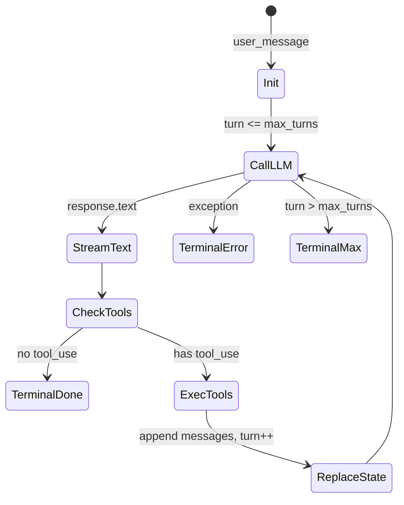

# [核心实验] 核心 Agent 循环实验

## 1. 实验目标

这是**最重要**的实验：用 Python **异步生成器**实现与 `src/query.ts` 同构的 **query 循环**——**不可变状态**、**多轮工具调用**、**终端条件**（完成 / 最大轮次 / 错误）、以及 **消费者侧**按事件流渲染。实验路径：`experiments/exp_03_core_agent_loop/main.py`。

## 2. 对应源码

- **主参考**：`src/query.ts`（`queryLoop`、状态迁移、工具调度与消息追加）
- **配套**：工具定义形态与真实 `Tool` 集成方式在 [04-工具系统实验.md](./04-工具系统实验.md)

## 3. 架构图



## 4. 核心代码讲解

### 4.1 不可变状态与事件

`AgentState` 使用 `frozen=True` 的 dataclass，每轮用 `replace` 生成新快照，避免隐式副作用：

```python
@dataclass(frozen=True)
class AgentState:
    messages: tuple[dict[str, Any], ...]
    turn: int = 1
    max_turns: int = 10
```

事件 `AgentEvent` 将 **text_delta / tool_use / tool_result / terminal** 统一暴露给 UI 或日志层，对应 TS 侧流式消费与状态更新分离。

### 4.2 异步生成器主循环

核心函数 `agent_loop`：**`while True`** 内调用 LLM → 若无 `tool_use` 则 **terminal completed** → 否则执行工具、**拼接消息**、**`replace` 状态**、进入下一轮：

```python
async def agent_loop(
    user_message: str,
    client: UnifiedLLMClient,
    max_turns: int = 10,
) -> AsyncIterator[AgentEvent]:
    state = AgentState(
        messages=({"role": "user", "content": user_message},),
        max_turns=max_turns,
    )
    yield AgentEvent(type="state_update", data={"turn": state.turn, "status": "started"})

    while True:
        if state.turn > state.max_turns:
            yield AgentEvent(type="terminal", data={"reason": TerminalReason.MAX_TURNS.value, ...})
            return
        response = await client.chat(messages=list(state.messages), tools=list(TOOLS.values()))
        if not response.has_tool_use:
            yield AgentEvent(type="terminal", data={"reason": TerminalReason.COMPLETED.value, ...})
            return
        ...
        state = replace(
            state,
            messages=tuple(new_messages),
            turn=state.turn + 1,
            transition=TransitionReason.NEXT_TURN,
        )
```

### 4.3 消费者：REPL 拉取事件

```python
async for event in agent_loop(query, client, max_turns=5):
    if event.type == "text_delta":
        ...
    elif event.type == "terminal":
        ...
```

这与 Ink/终端层 **订阅异步迭代** 的模式一致：核心循环不直接操作 UI，只 **yield 事实**。

## 5. 运行方式

```bash
cd experiments
python -m exp_03_core_agent_loop.main --mock
export ANTHROPIC_API_KEY=sk-ant-...
python -m exp_03_core_agent_loop.main --provider anthropic
export OPENAI_API_KEY=sk-...
python -m exp_03_core_agent_loop.main --provider openai
```

Mock 场景使用 `scenario="agent_loop_calculator"`，便于稳定演示工具调用路径。

## 6. 练习题

1. 增加第三种终端原因 **ABORTED**（用户取消），并在 `async for` 消费者中支持中断。  
2. 将 `execute_tool` 替换为与 `exp_04` 相同的 **Registry + validate**，观察循环与工具层的边界。  
3. 记录每轮 **token 估算**并写入 `state_update`，为 [14-上下文压缩实验.md](./14-上下文压缩实验.md) 做铺垫。

## 7. 衔接下一实验

循环内调用的工具需要 **协议、校验、注册与批处理**：[04-工具系统实验.md](./04-工具系统实验.md)。

---

### 深入：工具轮次中的消息形状

当模型返回 `tool_use` 时，实验将 **assistant 文本** 与 **tool_result** 依次追加（简化版；真实 API 可能使用 **content blocks** 数组）。核心不变量是：**每一条 `tool_result` 必须携带可关联的 `tool_use_id`**，否则多工具并行时会错乱。

```python
for tool_use in response.tool_uses:
    ...
    new_messages.append({
        "role": "tool_result",
        "tool_use_id": tool_use.id,
        "content": result,
    })
```

### 深入：错误与终端

- **网络 / SDK 异常**：直接 `terminal` + `ERROR`，避免无限重试吞掉状态（重试策略属于 [12-流式API实验.md](./12-流式API实验.md) 层）。  
- **`max_turns`**：防止工具死循环；生产应配合 **用户取消** 与 **预算**。

### 深入：与流式的关系

本实验 `client.chat` 返回 **完整 `LLMResponse`**，便于教学；若接流式，应把 **partial 文本** 映射为 `text_delta` 事件，**finalize** 后再进入工具分支，逻辑与 `StreamAssembler` 对齐。

### 迷你对照表：`query.ts` ↔ `agent_loop`

| TS 概念 | Python 实验 |
|---------|-------------|
| 状态快照替换 | `dataclasses.replace` |
| 终止枚举 | `TerminalReason` |
| 工具执行 | `execute_tool` |
| UI 解耦 | `yield AgentEvent` |
